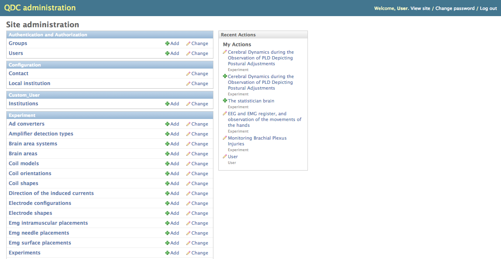
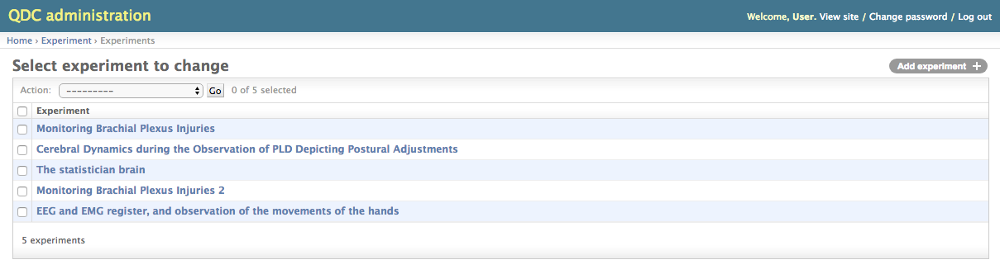
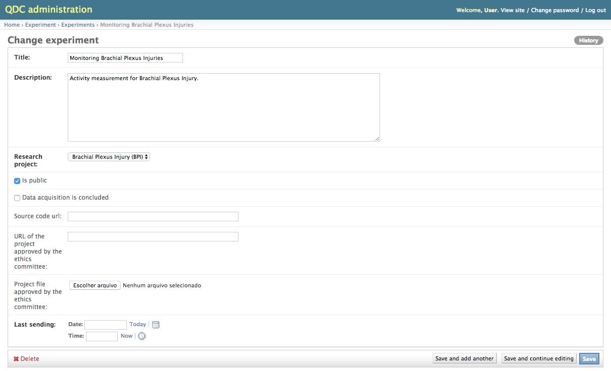
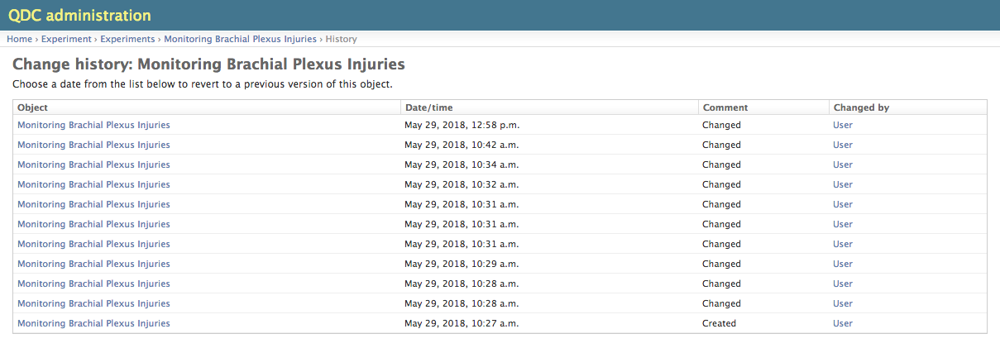

.. _administration-interface:

Interface de Administración
========================

Algunos de los datos almacenados en la base de datos no se cambian con frecuencia y no están destinados a ser accedidos por todos los usuarios. Para estos casos, el administrador debe utilizar la interfaz de administración.

.. _log-in-screen:

Pantalla de Log in
-------------

Para ingresar a la interfaz de administración, debe escribir "/admin" después de la URL base de NES. Se mostrará una pantalla de inicio de sesión. Solo los usuarios que tienen la bandera "Miembro del personal" pueden iniciar sesión (consulte `Users`_).

.. _home-screen:

Pantalla de inicio
-----------

Después de iniciar sesión, la pantalla de inicio mostrará una lista de tablas seleccionadas, que incluye tablas que almacenan :ref:`data that are read-only <read-only-data>` para la mayoría de los usuarios, y :ref:`tables whose changes are tracked <historical-records>` y almacenado en tablas auxiliares.

.. _users:

Usuarios
-----

Aunque es posible editar la mayoría de los datos del usuario utilizando la interfaz NES normal, algunos datos solo se pueden cambiar a través de la interfaz de administración.:

* **Active** flag: Indica si el usuario tiene acceso a NES.
* **Miembro del personal** indicador: Indica si el usuario tiene acceso a la interfaz de administración.
* **Superusuario** flag: Indica si el usuario tiene acceso a todas las funcionalidades del sistema.
* **Permisos del usuario**: Una lista de permisos que el usuario tiene sin importar los grupos en los que se encuentra.

.. _read-only-data:

Datos de solo lectura
--------------
Algunas tablas almacenan datos que son de solo lectura para la mayoría de los usuarios y, por lo tanto, solo se pueden editar mediante la interfaz de administración. Estas tablas son:

* Grupo de usuarios / Roles
* Frecuencia de alcohol
* Periodo alcohólico
* Cantidad de cigarrillos
* Tono carne
* Género
* Estado civil
* Pago
* Religión
* Escolarización
* Tipos de estímulos

.. _historical-records:

Registros Historicos
------------------
Algunas tablas almacenan datos cuyos cambios se rastrean. Solo puede ver los cambios realizados en estas tablas mediante la interfaz de administración. Estas tablas son:

* Experimentos
* Respuesta a cuestionarios de experimentos
* Participantes
* Datos demográficos sociales
* Datos de historia social

Para ver los cambios realizados en uno de los registros, primero haga clic en el nombre de la tabla. Si hace clic en el vínculo a la tabla de experimentos, por ejemplo, verá la lista de todos los experimentos registrados actualmente.

A continuación, haga clic en el nombre del registro cuyos cambios desea ver. Supongamos que desea ver cambios en el experimento llamado "Umbral táctil y sensación referida en BPI".

Entonces, haga click en el boton `History`, en la esquina superior derecha de la pantalla.

Cada línea de esta lista representa una versión del registro. Al hacer clic en uno de los vínculos de la primera columna (el nombre del experimento, en este caso), verá información sobre este registro en un momento específico.