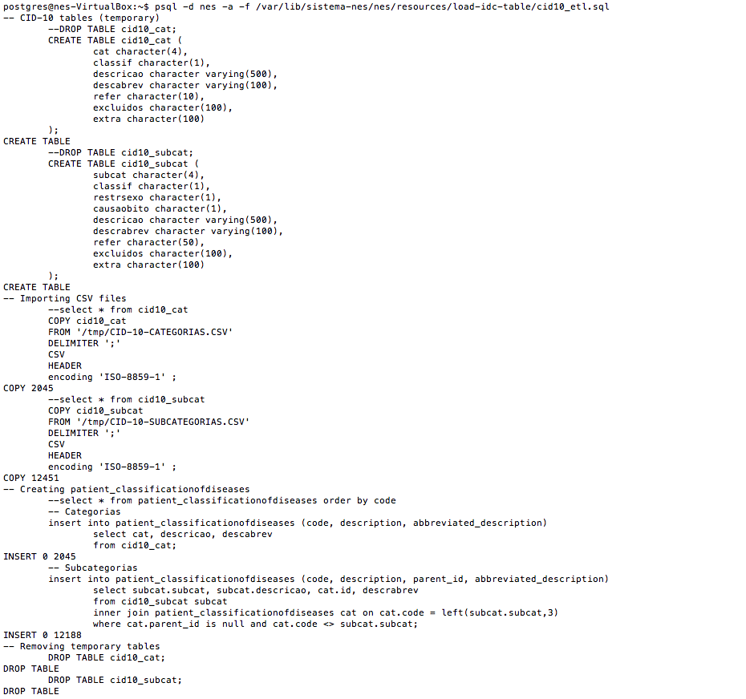

.. _loading-icd-data-3.0:

Loading ICD data (3.0)
======================

In order to load ICD (International Code Diseases) data, you will have to pay attention to different languages. In this version, only Portuguese and English versions can be installed. You have to install both of them.

.. _before-loading-icd-data:

Before loading ICD data
-----------------------

Before loading ICD, you have to guarantee that all migrations have been applied. First of all, 

Activate virtualenv::

    cd /var/www/nes-system/
    
    source bin/activate

Change path to::
 
    cd /var/www/nes-system/nes/patientregistrationsystem/qdc

Update migrations::

    python manage.py migrate

Deactivate virtualenv::

    deactivate

.. _loading-icd-data-in-portuguese:

Loading ICD data in Portuguese
------------------------------

Go to Github nes/resources/load-idc-table/ directory and see the instructions to load ICD data:

load-icd-table directory: how to load icd (International classification of diseases) table to NES.

#.  Unzip CID10CSV.zip. It contains the `international classification of diseases <http://www.datasus.gov.br/cid10/V2008/cid10.htm>`_ provided by Brazilian government;

#.  Copy CID-10-CATEGORIAS.CSV and CID-10-SUBCATEGORIAS.CSV to /tmp directory;

#.  Run the postgres script inside the file cid10_etl.sql in NES database.

Commands to execute steps defined above are::

    cd /var/www/nes-system/nes/resources/load-idc-table/

    cp CID10CSV.zip /tmp/

    unzip CID10CSV.zip

Enter PostgreSQL::

    sudo su - postgres

Inside postgres shell::

    psql -d nes -a -f /var/www/nes-system/nes/resources/load-idc-table/cid10_etl.txt

If everything ran correctly, you should see the following information:

Leave PostgreSQL::

    exit

.. _update-for-translation-pt:

Update for translation
----------------------
Activate virtualenv::

    cd /var/www/nes-system/
    
    source bin/activate

Change path to::
 
    cd /var/www/nes-system/nes/patientregistrationsystem/qdc

Update translation data::

    python manage.py update_translation_fields

Deactivate virtualenv::

    deactivate
    
.. _loading-icd-data-in-english:

Loading ICD data in English
---------------------------
#. You will have to download zip file from WHO (World Health Organization), but before of it, you have to go to `Classifications Download Area <http://apps.who.int/classifications/apps/icd/ClassificationDownloadNR/login.aspx?ReturnUrl=%2fclassifications%2fapps%2ficd%2fClassificationDownload%2fdefault.aspx>`_ and register;

#. Download the "ICD-10 2016 version" file and unzip it (icdClaML2016ens.xml);

#. Update version in English.

.. _update-for-translation-en:

Update for translation
----------------------
Activate virtualenv::

    cd /var/www/nes-system/
    
    source bin/activate

Change path to::
 
    cd /var/www/nes-system/nes/patientregistrationsystem/qdc

Update translation data::

    python manage.py import_icd --en <directory_from_file>/icdClaML2016ens/icdClaML2016ens.xml

Deactivate virtualenv::

    deactivate