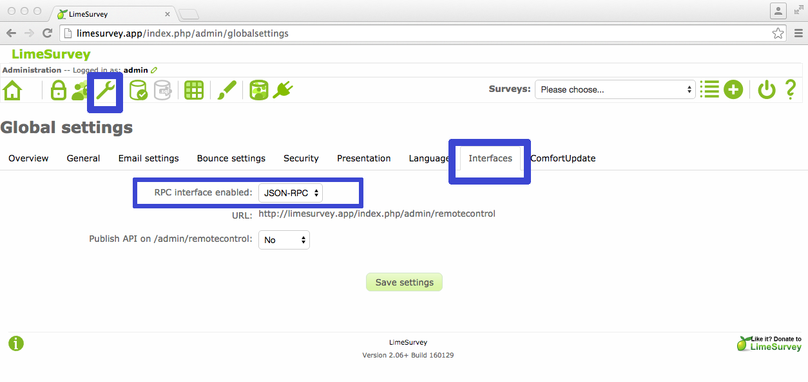

.. _guidelines-to-integrate-nes-and-limesurvey:

Directrices para integrar NES y LimeSurvey
==========================================

Después de la instalación de NES y LimeSurvey, hay algunos pasos específicos que deben realizarse antes de poder usarlos juntos, como se explica a continuación.

1. Cambiar el archivo ``settings_local.py``. Si siguió los pasos de instalación descritos :ref:`aquí <tutorial-to-install-the-latest-version-of-nes>`, Este archivo debe estar en ``/usr/local/nes-system/nes/patientregistrationsystem/qdc/qdc/settings_local.py``.

   Abra el archivo ``settings_local.py`` y edite las lneas al respecto de LimeSurvey. Usted necesita usuario con privilegios de administrador aquí::

        # LimeSurvey configuration
        LIMESURVEY = { 
            'URL_API': 'http://example.limesurvey.server.com',
            'URL_WEB': 'http://example.limesurvey.server.com',
            'USER': 'limesurvey_admin_user',
            'PASSWORD': 'limesurvey_password'
        }

2. Cambiar las configuraciones de LimeSurvey.

   Log in como administrador en LimeSurvey/admin page.

   Vaya a LimeSurvey y en ``Global Settings`` y luego al tabulador de ``Interfaces`` y en la opción ``RPC interface enabled`` , cambie a ``JSON-RPC`` y click en el boton ``save settings`` .

3. Compruebe si la configuración de integración funciona.

Haga clic en el enlace Cuestionarios en el menú del sistema NES, si todo es correcto, ya puede insertar cuestionarios, de lo contrario verá una alerta que dice `"LimeSurvey unavailable. System running partially"`.

Si ya tiene un cuestionario incluido en LimeSurvey, puede ir a :ref:`questionnaires` para ver cómo usarlo.

Recuerde verificar si las condiciones presentadas en :ref:`how-to-integrate-nes-and-limesurvey-questionnaire` la página está configurada correctamente.