.. _how-to-integrate-nes-and-limesurvey-questionnaire:

Cómo integrar el cuestionario de NES y LimeSurvey
=================================================

Un cuestionario creado en LimeSurvey solo se puede utilizar en el sistema NES si tiene ciertas propiedades, definidas en los tiempos de creación y activación del cuestionario. Estas propiedades son:

* El cuestionario debe tener 'Persistencia de respuesta basada en tokens'_
* El cuestionario debe tener un 'Grupo de preguntas ocultas llamadas NESIdentification'_
* El cuestionario debe utilizar 'Control de acceso basado en tokens'_

Para asignar estas tres propiedades a un cuestionario, siga las instrucciones presentadas en las siguientes secciones.

.. _token-based-response-persistence:

Persistencia de la respuesta basada en tokens
--------------------------------
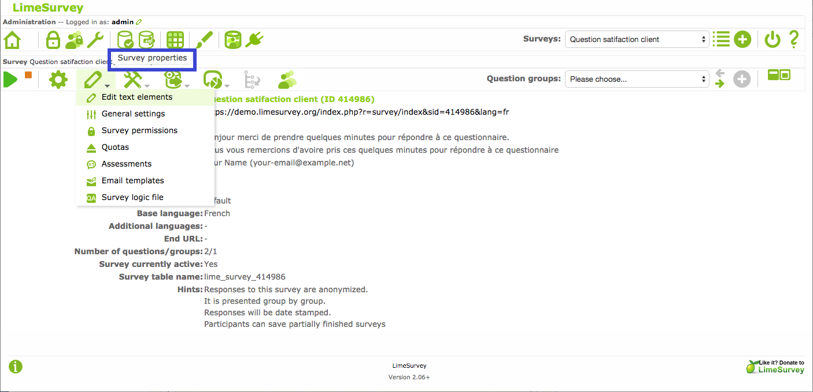

* Abrir el cuestionario para editarlo en LimeSurvey (``Survey Properties|Edit text elements``)

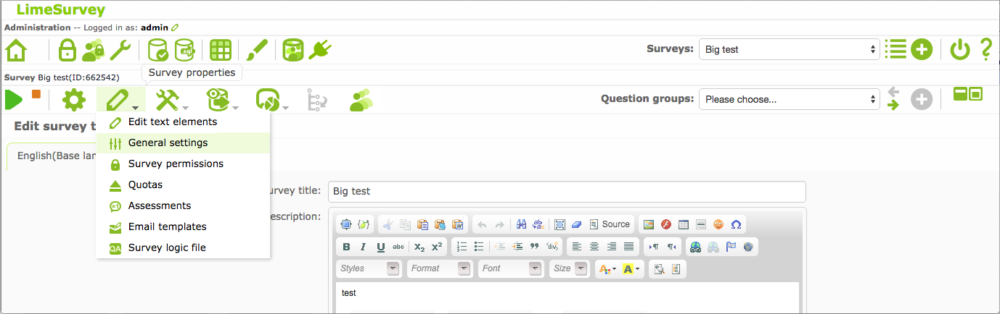

* Enter ``General Settings` menu, and then ``Tokens`` tab 

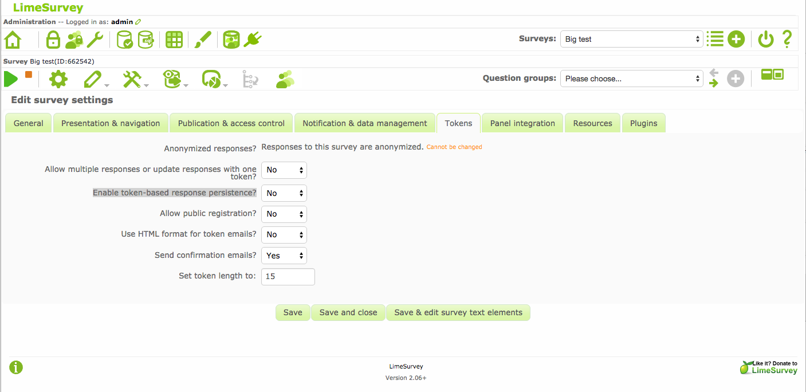

* Seleccionar ``Yes`` para la opción ``Enable token-based response persistence?``
* Click en el boton ``Save`` que se encuentra en el pie de la pagina.

.. _group-of-hidden-questions-called-nesidentification:

Grupo de preguntas ocultas llamadas ``NESIdentification``
------------------------------------------------------

Este grupo debe contener tres preguntas con los códigos y tipos definidos a continuación:

* Número de identificación del participante → código de pregunta: ``subjectid``; tipo de pregunta: ``numerical input``;
* Número de identificación responsable → código de pregunta: ``responsibleid``; tipo de pregunta: ``numerical input``;
* Fecha de adquisición → código de pregunta: ``acquisitiondate``; tipo de pregunta: ``date/time``.

Puede incluir fácilmente este grupo de preguntas en un cuestionario a través de la funcionalidad de `Group Import` disponible en LimeSurvey. Para importar el ``NESIdentification` agrupar a un cuestionario, siga estos pasos:

* Descargar el archivo `NESIdentification.lsg <https://raw.githubusercontent.com/neuromat/nes/DEV-0.2.1/resources/NESIdentification.lsg>`_;

* Abrir el cuestionario para editarlo en LimeSurvey (``Survey Properties|Edit text elements``);

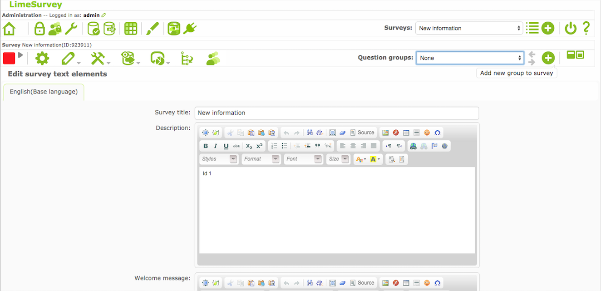

* Enter ``Add new group to survey`` menú y luego ``Import question group`` tab;

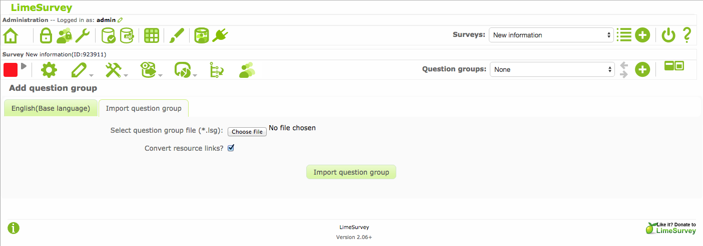

* En el campo ``Select question group file (*.lsg)`` , seleccione ``NESIdentification.lsg`` archivo descargado antes;
* Haga clic en el botón ``Import question group`` en la parte inferior de la página.

.. _token-based-access-control:

Control de acceso basado en tokens
--------------------------
* Para un cuestionario que se ha activado:
* Abrir el cuestionario para editarlo en LimeSurvey (``Survey Properties|General Settings``)

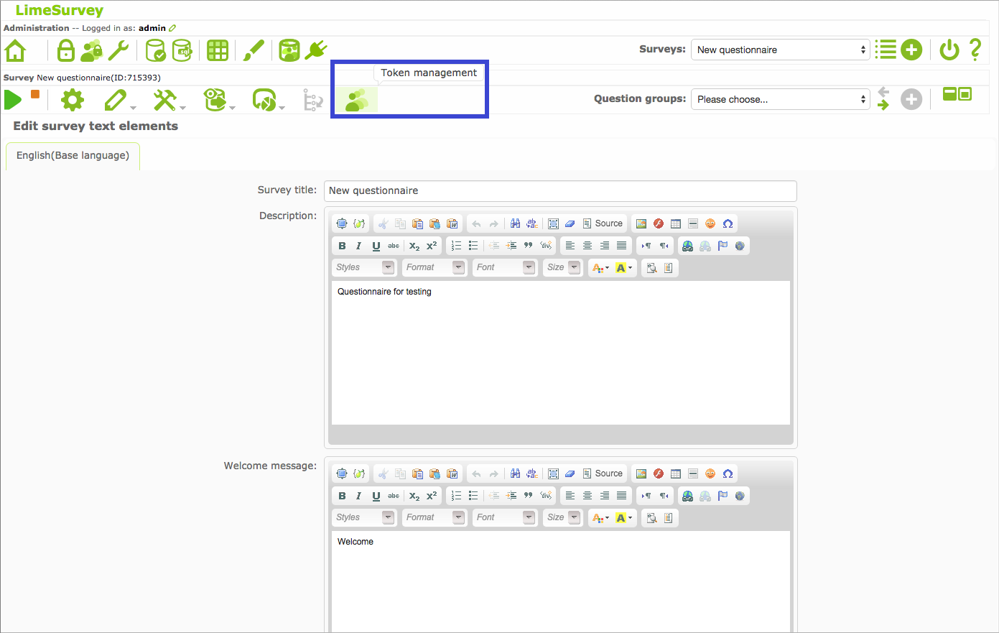

* Ingrese al menú "Administración de tokens" y luego haga clic en el botón ``Initialise tokens`` button;

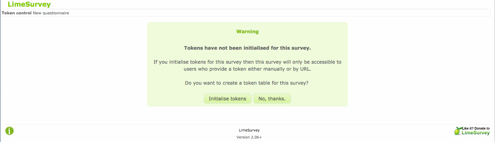

* En la siguiente pantalla, haga clic en el botón ``Continue`` ;

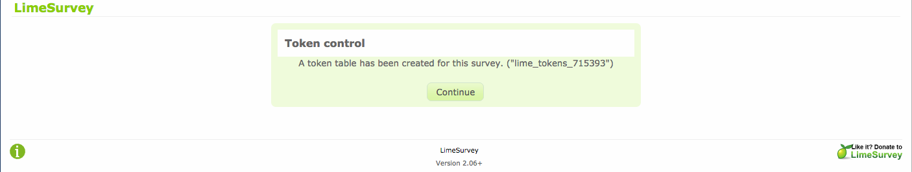

* Para un cuestionario que aún no se ha activado, el uso de tokens para controlar el acceso al cuestionario se puede habilitar cuando se activa el cuestionario:

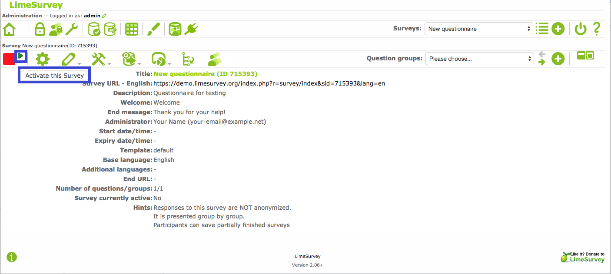

* Una vez que el cuestionario esté listo para su uso, introduzca el ``Activate this Survey`` y, a continuación, haga clic en el icono ``Save / Activate survey`` 

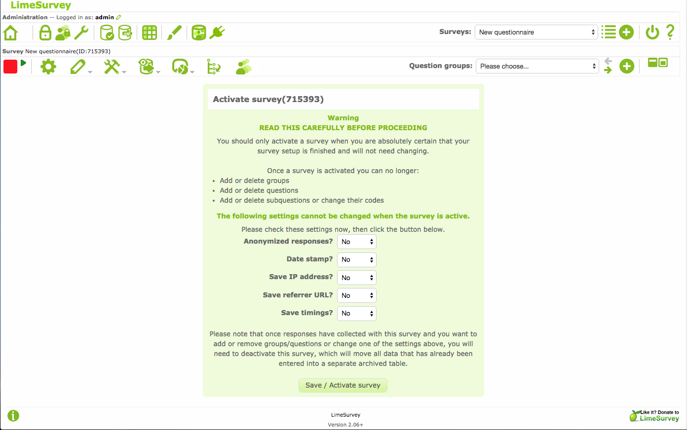

* En la siguiente pantalla, haga clic en el botón ``Switch to closed-access mode`` 

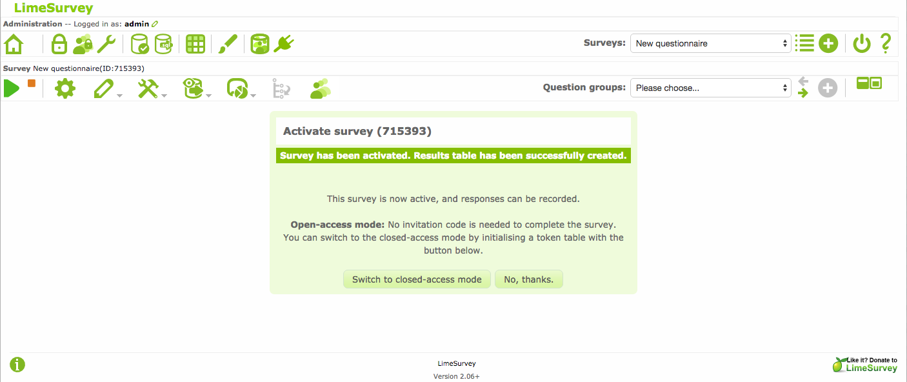

* En la siguiente pantalla, haga clic en el botón ``Initialise tokens`` 

* En la siguiente pantalla, haga clic en el botón ``Continue`` 

