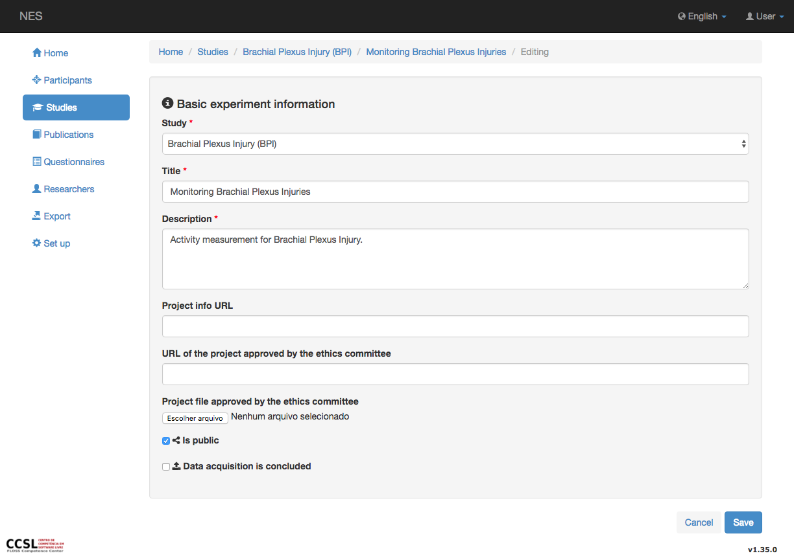
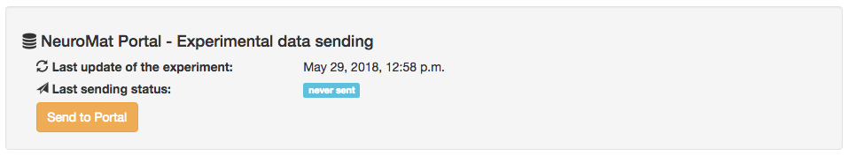
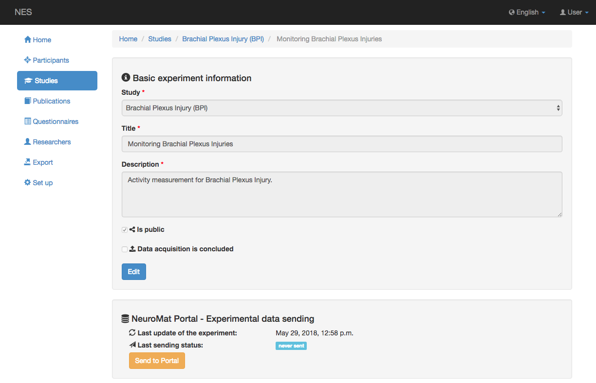

.. _how-to-send-experiment-data-from-nes:

How to send experiment data from NES
====================================

To send experiment data from NES to NeuroMat Open Database is necessary to update the NES local configuration and the experiment configuration.

.. _system-configuration:

System configuration
--------------------
A system configuration must to be performed before sending experiment data from NES to the Neuromat Open database, to do this update the settings.py file of the NES local installation with the lines below::

    PORTAL_API = {

        'URL': '', 
        'PORT': '',
        'USER': '',
        'PASSWORD': ''
    }

#. **URL:** it refers the url base of the NeuroMat open database site.
#. **PORT:** it refers the port used by the Neuromat site.
#. **USER:** user on the portal
#. **PASSWORD:** password of the user on the portal

Example::

    PORTAL_API = {

        'URL': 'http://portal-dev.numec.prp.usp.br/',
        'PORT': '80',
        'USER': '',
        'PASSWORD': ''
    }

.. _experiment-configuration:

Experiment configuration
------------------------
To send experiment data from NES, each experiment must to be setting as public. This can be done in the experiment page, edit this page and click in the option "Is public". The figure below shows the experiment page in edition mode. 

After change the experiment to "Is public", it will appear a section to send experiment data, as the figure shown below. Now the researcher can click on the "Send to portal" button and their experiment data will be schedule to be send to NeuroMat open database.

Also there are others information that will be relevant in the moment of evaluation of the experiment by the trustees and we recomend to fill:

#. Project info URL: if the url exists, in this field type the url of the project to which the experiment belongs.
#. URL of the project approved by the ethics committee: in this field, type the url that refers the ethics committee.
#. Project file approved by the ethics committee: here is upload the file of the approval by the ethics committe.
#. Data acquisition is concluded: this field is to indicate if the data acquisition of all participant in the experiment is completed.

.. _resend-experiment-data:

Resend experiment data
----------------------
NES allows researchers to resend new data added in an experiment that was sent to the open NeuroMat database. 

When a new data is added the experiment page will be updated and the resend button appeared in the "NeuroMat Portal - Experimental data sending" section, as shown the figure below. 

