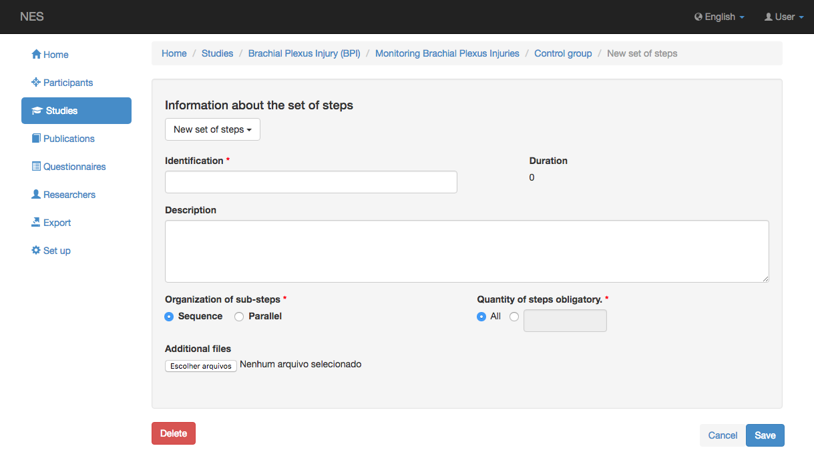
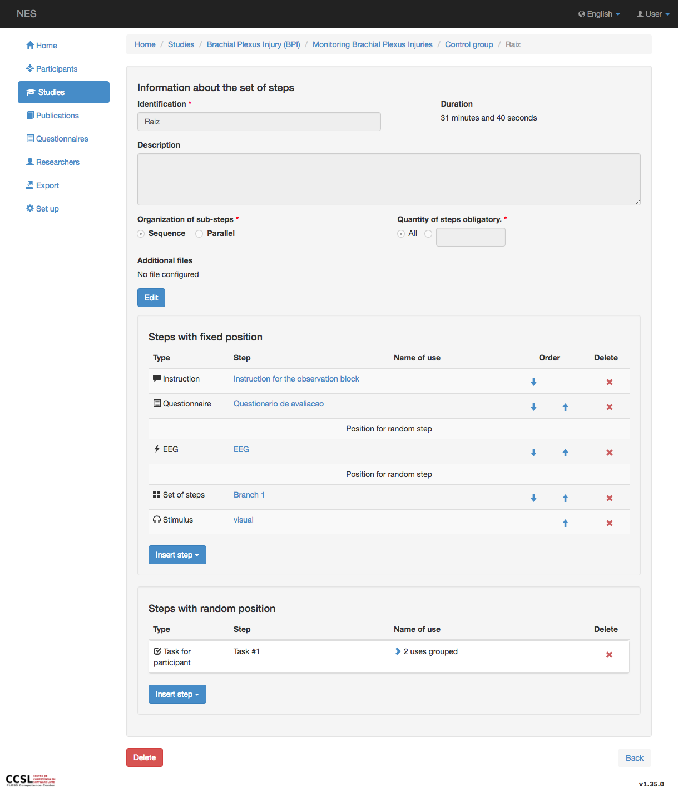
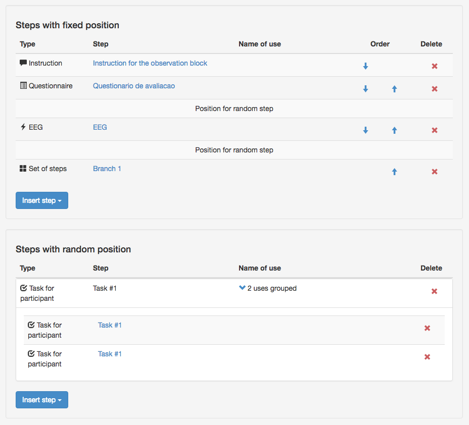
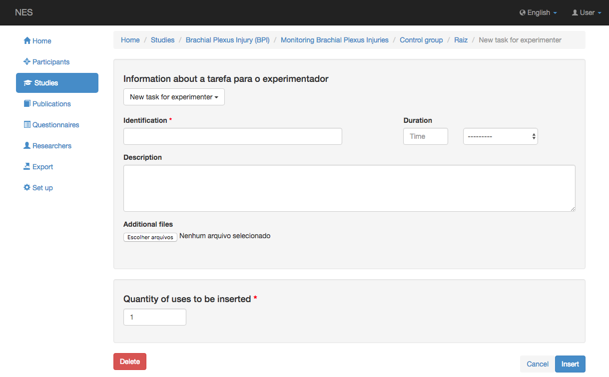
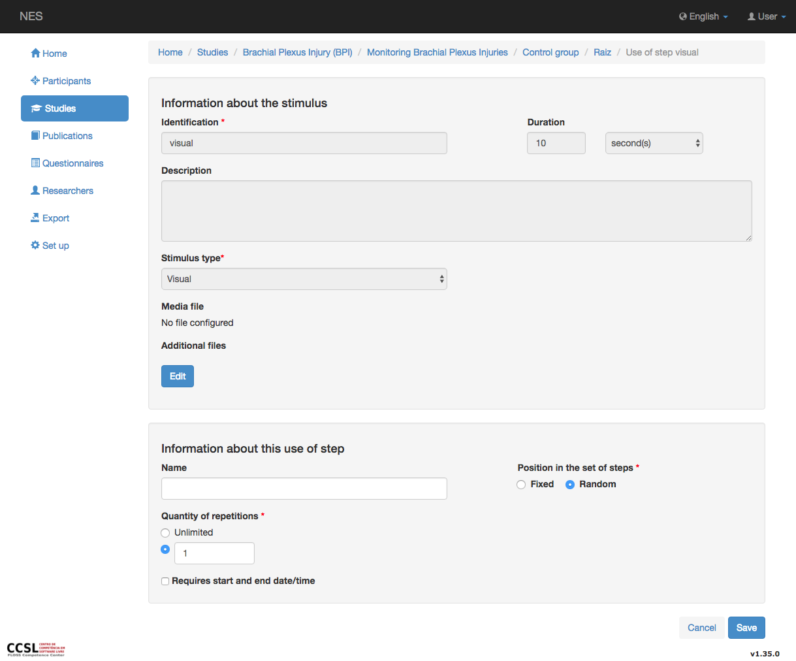

.. _configuring-an-experimental-protocol:

Configuración de un protocolo experimental
====================================

Cada grupo de participantes puede tener un protocolo experimental, que se compone de pasos. Los detalles sobre los diferentes tipos de pasos se dan en :ref:`managing-steps-for-experimental-protocol`.

.. _creating-and-editing-a-set-of-steps:

Creación y edición de un conjunto de pasos
-----------------------------------

Un `conjunto de pasos` contiene:

* Una identificación (obligatoria);
* Una descripción;
* Una duración;
* Un tipo de organización de sus subencapes (obligatorio);
* Una serie de subencapes obligatorios (obligatorios); y
* Una lista de sub-pasos.

Sin embargo, al crear un nuevo conjunto de pasos o actualizar uno existente, la pantalla no solicita los subcapos. Puede agregar subcapos mientras visualiza un conjunto de pasos. Los posibles tipos de organización de los sub-pasos son: `In a sequence`, lo que significa que los pasos se ejecutarán uno tras otro en el orden que definió, o `In parallel`, lo que significa que todos los pasos se ejecutarán al mismo tiempo. No puede editar la duración de un conjunto de pasos, ya que este valor se calcula automáticamente. Si el conjunto de pasos es secuencial, la duración se define como la suma de la duración de cada subcapa del conjunto, de lo contrario, es decir, un conjunto paralelo de pasos, se define como la duración del subescalo más largo del conjunto. El número de subcapos obligatorios indica si todos los subcapos deben ejecutarse mientras se ejecuta el conjunto de pasos (este es el comportamiento predeterminado), o si solo se debe ejecutar un subconjunto, cuyo tamaño debe indicarse en el campo de texto.

.. _visualizing-a-set-of-steps:

Visualisando un conjunto de pasos
--------------------------

La pantalla para visualizar un conjunto secuencial de pasos mostrará dos secciones relacionadas con sus subcapos. El primero, llamado `Steps with fixed position`, enumera el uso de pasos que son un subescalo del conjunto en el orden en que deben ejecutarse. Si el conjunto utiliza un paso en una posición aleatoria dentro de la secuencia, este paso no aparece en esta sección. En su lugar, esta sección contendrá una línea para cada paso con una posición aleatoria, de modo que pueda indicar la posición exacta de los pasos fijos en relación con las posiciones reservadas a los pasos aleatorios. El paso aleatorio en sí se enumera en la segunda sección, llamada `Steps with random position`. Puede definir si el uso de un paso tiene una posición fija o aleatoria mientras `inserting a use of a step` en el conjunto de pasos, o mientras `editar un uso de un paso. Si el conjunto de pasos contiene solo un subpaso posicionado al azar, la sección para usos posicionados fijos no mostrará un marcador de posición para cada subnodo posicionado al azar, en su lugar, solo informará que no hay un uso posicionado fijo del paso.

La pantalla para visualizar un conjunto paralelo de pasos mostrará solo una sección relacionada con sus subcapos, sin un título. En este caso, el uso de los pasos se enumera alfabéticamente, considerando primero el tipo, luego la identificación y luego el nombre de uso.

Para reducir el uso de espacio en la pantalla, cuando aparece más de un uso del mismo paso (no el mismo tipo de paso), la interfaz crea automáticamente un `accordion <https://en.wikipedia.org/wiki/Accordion_(GUI)>`_ para agruparlos e indicar cuántos usos del paso se agregan en él. Al hacer clic en el acordeón se expande, mostrando todos los usos dentro de él. Varios marcadores de posición para usos aleatorios de los pasos también se agregan en un acordeón. 

Cada uso del paso con posición fija contiene botones :arrow_up: y :arrow_down: para que pueda cambiar el orden en el que se debe ejecutar el paso. Los acordeones que agrupan subescapos fijos también muestran los botones de flecha. Si usas las flechas de los acordeones moverás todos los usos de los pasos que se agreguen con él. Tenga en cuenta que si mueve un solo paso o un acordeón en la dirección de un segundo acordeón, solo se saltará un elemento del segundo acordeón. Por lo tanto, el paso saltado ya no será parte del segundo acordeón. Solo los usuarios autorizados verán los botones de flecha.

Cada subescalo de un conjunto de pasos mostrará un botón :x:, que le permite eliminar este uso del paso del conjunto. Esta operación no elimina el paso de NES. Aún podrás encontrarlo en la lista de pasos del experimento. Solo los usuarios autorizados verán los botones :x:. Recuerde: para eliminar un paso del sistema, incluidos los conjuntos de pasos, debe hacer clic en el botón * Eliminar *, mientras visualiza el paso que desea eliminar. Sin embargo, este botón sólo es visible para los usuarios que tienen permiso para actualizar el experimento.

.. inserting-a-use-of-a-step:

Inserción de un uso de un paso
-------------------------

Para insertar un paso en el conjunto de pasos, debe hacer clic en el boton `Insertar paso`  y elija el tipo de paso que desea incluir en la lista desplegable. Un conjunto secuencial de pasos tiene dos botones `Insertar paso`, uno en la sección para el subescalo posicionado fijo y el otro en la sección para el subescalo posicionado al azar. A continuación, verás una pantalla que permite la creación de un nuevo paso o la reutilización de uno ya creado. Las opciones predeterminadas son la creación de un nuevo paso. En este caso tienes que rellenar los campos para el tipo de paso que estás creando.

Si desea reutilizar un paso existente, haga clic en la lista desplegable que se muestra justo debajo del título de la primera sección de la pantalla. Se mostrará una lista con los pasos existentes del tipo que desee. Después de seleccionar uno, la pantalla mostrará la información al respecto, sin darle la opción de editarlo.

.. image:: ../../_img/reuse_step.png

La segunda sección de la pantalla le permite especificar el número de usos del paso que desea incluir. Esto es solo un atajo que evita la necesidad de incluir un uso a la vez. Todos los usos se incluirán al final de la lista de subcapos. A continuación, puede reordenarlos como desee.

.. _editing-a-use-of-a-step:

Edición de un uso de un paso
-----------------------

La identificación de un paso que se muestra en la lista de subcapos es un enlace a una pantalla que permite actualizar la información sobre el uso del paso. Un uso del paso puede tener un nombre, que es útil para diferenciar dos o más usos del mismo paso. Si el paso se utiliza en un conjunto secuencial de pasos, podrá cambiar el tipo de posición que tiene en la secuencia desde `Fixed` a `Random` o viceversa. También puede establecer el número de veces que desea que se repita este paso. El valor predeterminado para este campo es uno.

Si cambia el número de repeticiones a `Unlimited`, o si establece un valor mayor que uno, se mostrará un nuevo campo, lo que le permitirá establecer el intervalo entre repeticiones. El intervalo puede ser `Indefinido` o puede establecerse por un valor y una unidad.

.. image:: ../../_img/edit_use_of_step_with_interval.png

Observe que establecer el número de repeticiones no es lo mismo que insertar múltiples usos del mismo paso, como se explicó en la sección anterior. Es preferible incluir un solo uso y especificar el número de repeticiones, porque permitirá que su conjunto de pasos sea más limpio y porque le permite especificar un intervalo entre repeticiones sin la necesidad de incluir explícitamente pasos de pausa. Debe usar varios usos del mismo paso si desea que se intercales con otros pasos.