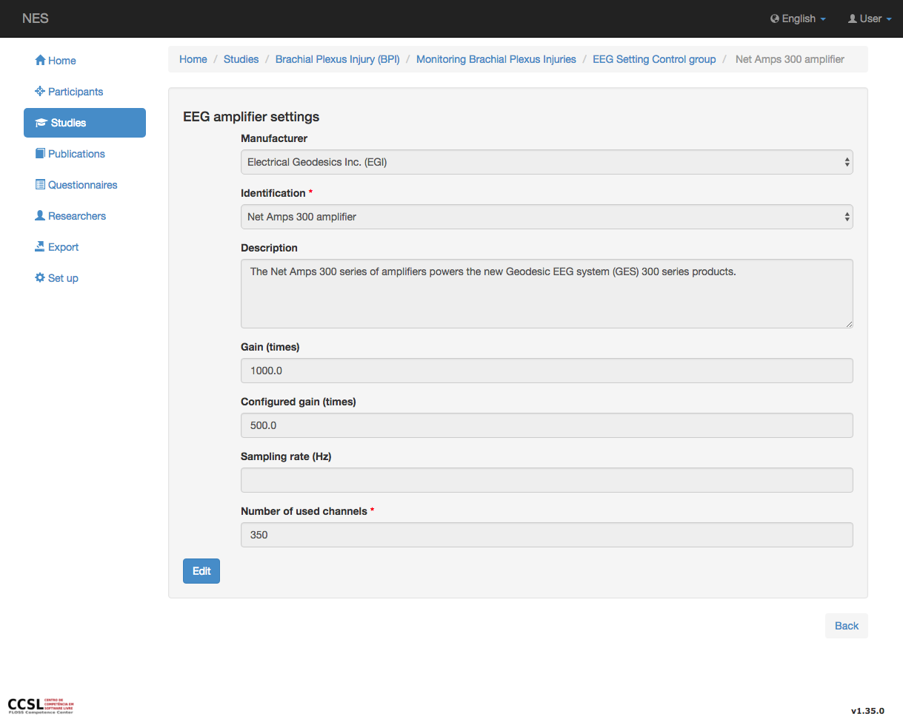

.. _eeg-amplifier-settings:

Configuración del amplificador EEG
======================

Las señales deben amplificarse para hacerlas compatibles con dispositivos como pantallas, grabadoras o convertidores A / D. Los amplificadores adecuados para medir estas señales tienen que satisfacer requisitos muy específicos. Tienen que proporcionar amplificación selectiva a la señal fisiológica, rechazar las señales de ruido e interferencia superpuestas, y garantizar la protección contra daños a través de sobretensiones de voltaje y corriente tanto para pacientes como para equipos electrónicos. La página de configuración del amplificador EEG permite registrar la configuración sobre el amplificador EEG utilizado en el experimento. La información registrada aquí es:

* :ref:`manufacturer`: El nombre del fabricante del amplificador;
* :ref:`amplifier`: Nombre del modelo del amplificador. Cuando se selecciona la identificación, se muestran algunas informaciones sobre el amplificador, como la descripción y la ganancia.;
* **Configured gain:** En este ítem se registra la ganancia utilizada en el experimento. Un amplificador multiplica un voltaje de entrada por una constante que generalmente se encuentra en el rango de hasta 1000000. El factor de amplificación se conoce como ganancia y puede expresarse como Vout / Vin. La unidad de la ganancia es el decibelio (dB): dB = 20 X log(Vout/Vin);
* **Sampling Rate:** Número de muestras discretas que se toman de los voltajes continuos por alguna unidad de tiempo. La unidad utilizada aquí es hercios (Hz), que representa el número de muestras por segundo; y
* **Number of used channels**.

.. nota:: Si el fabricante y/o la identificación no existen, debe añadirse en el modulo :ref:`equipment-set-up` .

