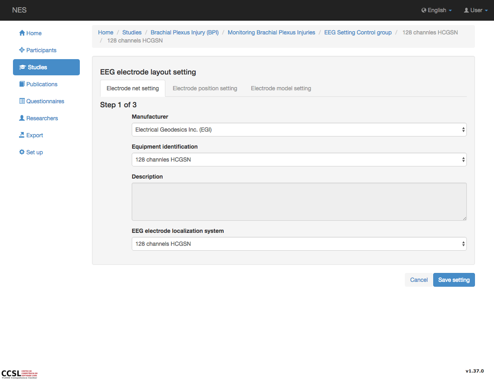
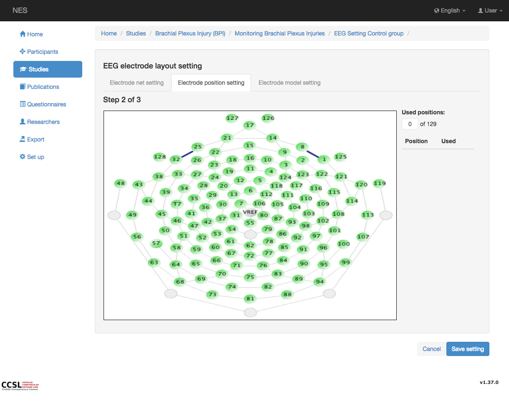
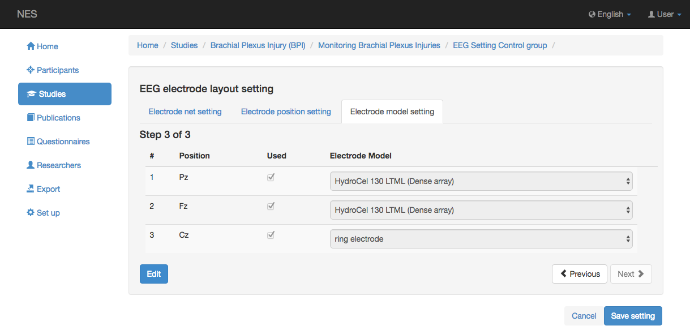

.. _eeg-electrode-layout-settings:

Configuración del diseño del electrodo EEG
=============================

La configuración del diseño del electrodo implica la información relacionada con la configuración del electrodo utilizada en la adquisición de datos brutos de EEG.

Ajuste de la red de electrodos
---------------------

Esta pestaña permite registrar información sobre el sistema de electrodos utilizado en la adquisición de datos brutos de EEG. 
- :ref:`manufacturer`: el fabricante del sistema de electrodos utilizado en el experimento actual.
- :ref:`Equipment identification <eeg-electrode-net-cap>`: el nombre de la red de electrodos utilizada en este experimento.
- :ref:`eeg-electrode-localization-system`: el sistema de colocación física y las designaciones de electrodos en el cuero cabelludo. Este sistema puede ser estandarizado (por ejemplo, Federación Internacional en Electroencefalografía y Neurofisiología Clínica) como el sistema 10-20, el sistema 10-10, el sistema 10-5 o puede ser un diseño patentado de un fabricante específico.

.. nota:: Si el fabricante deseado, la identificación y / o el sistema de localización de electrodos no existen, deben agregarse en el modulo :ref:`equipment-set-up` .

Ajuste de la posición del electrodo
--------------------------

En esta pestaña es posible ver el mapa de imagen del sistema de electrodos seleccionado. En el lado derecho de la página se muestran las posiciones de los electrodos utilizadas en el experimento. Las posiciones se etiquetan con el nombre de referencia del sistema seleccionado.  
En el modo de edición es posible cambiar la posición del electrodo utilizado haciendo clic en la casilla de verificación para activar o desactivar la posición seleccionada. El mapa de la imagen cambiará mostrando las opciones realizadas. 

.. nota:: Si el mapa de imagen deseado no existe, debe agregarse en el modulo :ref:`equipment-set-up` en el elemento Sistema de localización de electrodos. 

Ajuste del modelo de electrodo
-----------------------

Esta pestaña muestra una lista con las posiciones de los electrodos y el modelo de electrodo utilizado en cada posición. En el modo de edición es posible cambiar el modelo de un electrodo específico.

.. nota:: Si el modelo de electrodo deseado no existe, este debe agregarse en el modulo :ref:`equipment-set-up`  en el item :ref:`electrode-model`.

