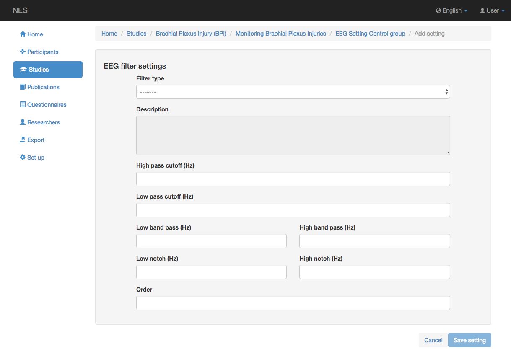

.. _eeg-filter-settings:

Configuración del filtro EEG
===================

El hecho de que las diferencias de potencial fluctúen en función del tiempo implica que las señales de EEG grabadas tienen una cierta banda. Para la mayoría de las investigaciones de EEG, la señal grabada se encuentra entre 1 Hz y 70 Hz. La información se perderá si la respuesta de frecuencia del canal de grabación es más estrecha que el rango de frecuencia de la señal de EEG. Si el rango de frecuencia del canal de grabación es más amplio que la banda de la señal EEG, el ruido en los datos grabados contendrá información irrelevante adicional. Los canales de grabación EEG están equipados con filtros ajustables de paso alto y paso bajo mediante los cuales la respuesta de frecuencia se puede restringir a la banda de frecuencia de interés.
Esta configuración permite registrar la información sobre el filtro utilizado en cada experimento. La información que se puede registrar son las siguientes:

* :ref:`filter-type`: Una vez que se almacenan los datos, se puede utilizar el filtrado digital. Es posible elegir entre el filtrado lineal (FIR, IIR) o nuevos métodos de filtrado no lineal. La elección debe hacerse de acuerdo con los objetivos puestos en el procesamiento de la señal.;
* Corte de paso alto (Hz): es un filtro que pasa señales con una frecuencia superior a una cierta frecuencia de corte y atenúa las señales con frecuencias inferiores a la frecuencia de corte;
* Corte de paso bajo (Hz): es un filtro que pasa señales con una frecuencia inferior a una cierta frecuencia de corte y atenúa las señales con frecuencias superiores a la frecuencia de corte;
* Paso de banda baja (Hz): un filtro de paso de banda es un dispositivo que pasa frecuencias dentro de un cierto rango y rechaza (atenúa) frecuencias fuera de ese rango. Este campo representa el valor más bajo de este rango;
* Paso de banda alta (Hz): un filtro de paso de banda es un dispositivo que pasa frecuencias dentro de un cierto rango y rechaza (atenúa) frecuencias fuera de ese rango. Este campo representa el valor más alto de este rango;
* Low Notch (Hz): también llamado filtro de parada de banda o filtro de rechazo de banda es un filtro que pasa la mayoría de las frecuencias inalteradas, pero atenúa las de un rango específico a niveles muy bajos. Es lo opuesto a un filtro de paso de banda. Un filtro de muesca es un filtro de parada de banda con una banda de parada estrecha. Este es el valor más bajo de este rango;
* High Notch (Hz): complementario a Low Notch, este es el valor más alto de este rango.
* Orden: es el retardo máximo, en muestras, utilizado en la creación de cada muestra de salida. De manera específica, el orden del filtro es la duración (efectiva) de la respuesta al impulso. Su unidad de medida es entera

.. nota:: Si el tipo de filtro no existe, debe agregarse en el cuadro :ref:`equipment-set-up` .

