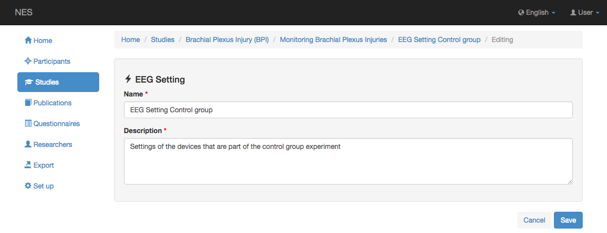
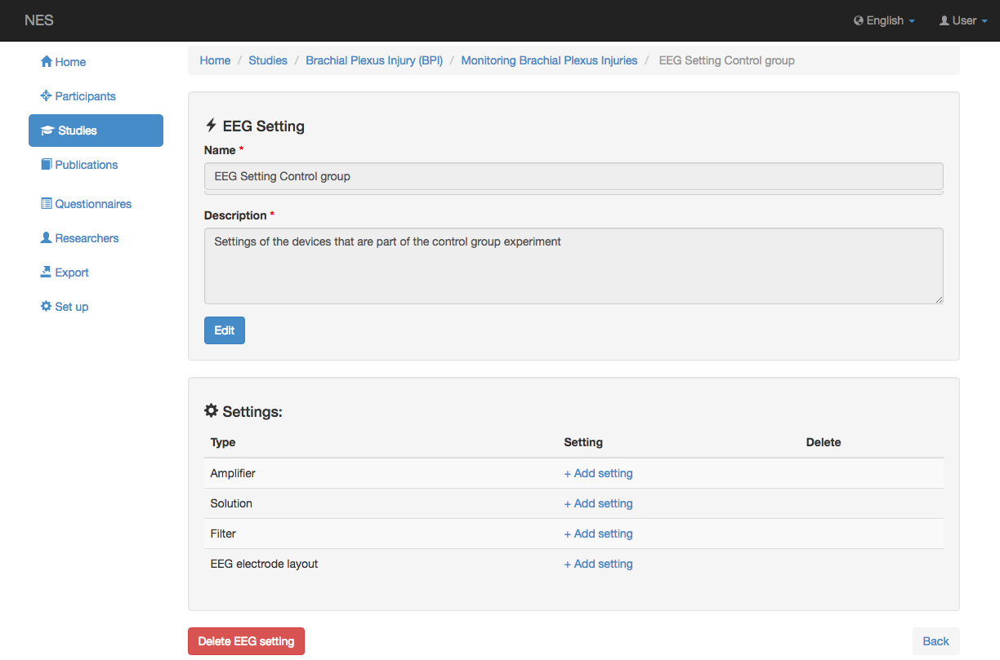
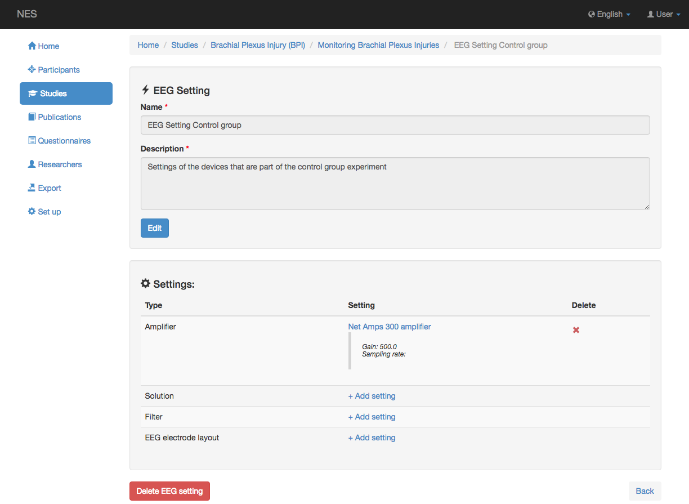

.. _eeg-settings:

Configuración de EEG
============

NES permite registrar toda la información relacionada con la configuración y los parámetros de los equipos y materiales que intervienen en la adquisición de datos brutos de EEG. Los ajustes que se contemplan en esta funcionalidad son:

* :ref:`eeg-amplifier-settings`
* :ref:`solution-settings`
* :ref:`eeg-filter-settings`
* :ref:`eeg-electrode-layout-settings`

El ajuste del EEG se basa en las pautas de Información Mínima propuestas por la comunidad de Neurociencia en MINI `[Gibson, F. et al: Minimum information about a neuroscience investigation (MINI):electrophysiology. Nat. Precedings. (2008)]` y MINEMO `[Frishko, G. et al: Minimal Information for Neural Electromagnetic Ontologies (MINEMO): A standards-compliant method for analysis and integration of event related potentials (ERP) data. Standards in genomic sciences. 5.2, 211-223 (2011)`. Estas directrices son listas de verificación que definen la información mínima que un investigador necesita informar al publicar los resultados de un experimento.

La configuración de EEG ofrece las siguientes funcionalidades:

.. _add-eeg-setting:

Agregar configuración de EEG
---------------

Para agregar una nueva configuración de EEG, debe registrar el nombre y alguna descripción sobre la configuración registrada. Ambas informaciones son obligatorias.

.. _edit-eeg-setting:

Editar configuración de EEG
----------------

Cuando se agrega una configuración de EEG, se muestra la información registrada. La configuración se muestra en un formulario de lista debajo de la información de configuración de EEG y cada elemento de la lista corresponde a una configuración de EEG específica.
En esta página es posible editar el nombre y la descripción de la configuración actual de EEG, agregar una configuración de EEG específica para un equipo o material y / o eliminar todas las configuraciones de EEG para el experimento actual, haciendo clic en el boton _Delete EEG Setting_ .

.. _visualize-eeg-setting:

Visualizar la configuración de EEG
---------------------

Cuando se agrega una configuración de EEG, la lista muestra la información principal sobre la configuración de EEG registrada. Una configuración específica de EEG se puede eliminar en cualquier momento. 

