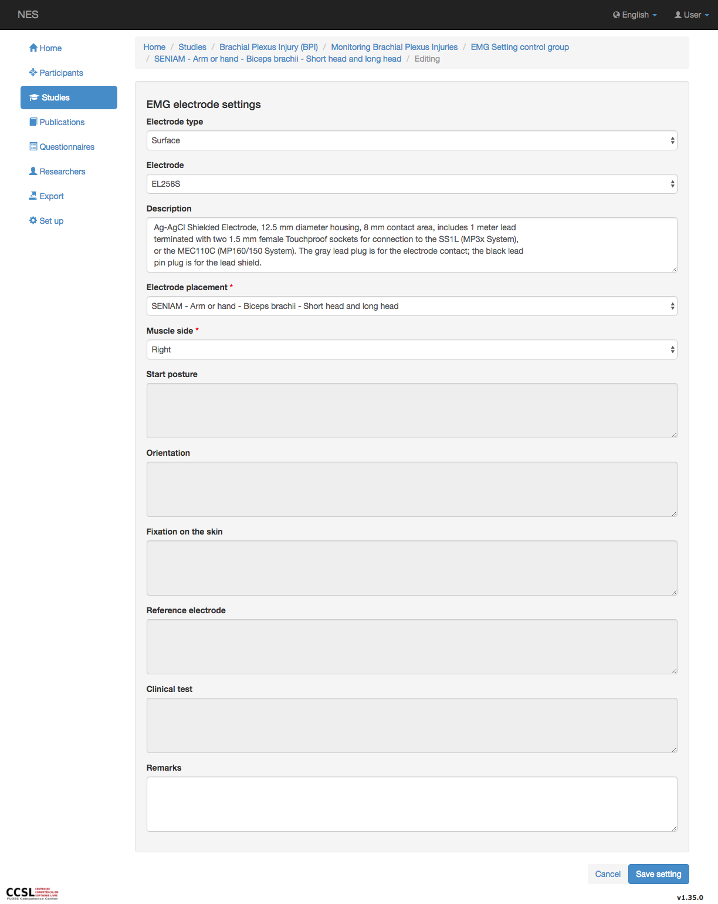
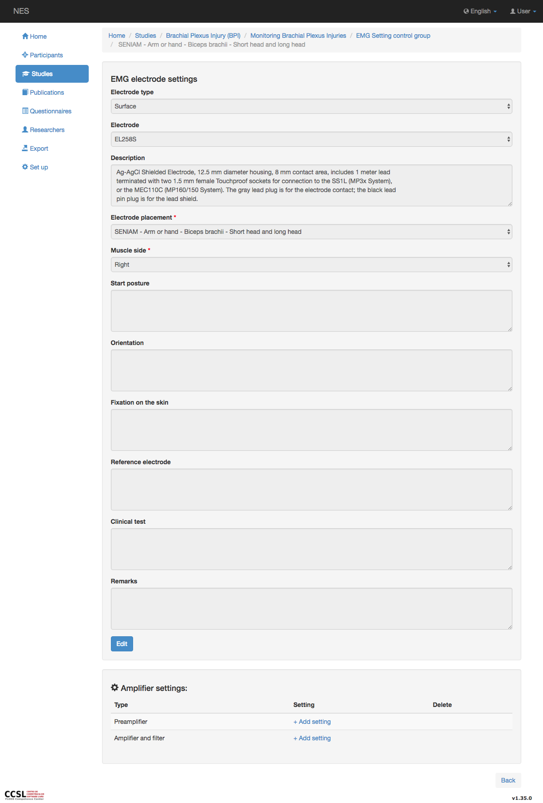
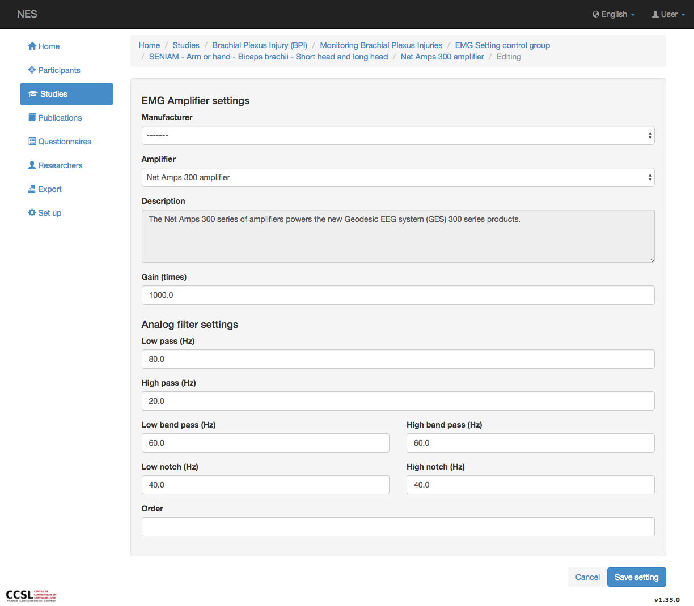
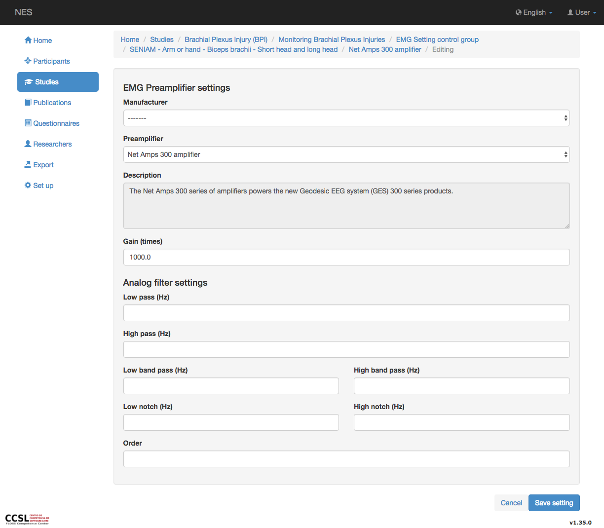

.. _emg-electrode-settings:

Configuración del electrodo EMG
======================

El menú de configuración del electrodo le permite registrar el tipo de electrodo utilizado en el experimento EMG como fabricante, el modelo, los detalles de colocación y otras observaciones que considere relevantes para describir el electrodo. Además, puede describir el amplificador y/o la configuración del preamplificador utilizado con el electrodo.
Los campos que forman parte de esta configuración son:

* Tipo de electrodo: indica si el electrodo es superficial, intramuscular o aguja.
* Modelo de electrodo: en este campo debe seleccionar el modelo de electrodo utilizado, este modelo se define en :ref:`electrode-model` .
* Colocación del electrodo: aquí se selecciona el sistema utilizado en la colocación del electrodo, este sistema se define en el :ref:`electrode-placement-system` . El sistema muestra detalles sobre la postura de inicio, la orientación, la fijación en la piel, el electrodo de referencia y la prueba clínica.
* Observaciones: aquí puede registrar información adicional sobre el experimento.

En la imagen de abajo se muestra una captura de pantalla de este menú:

.. _emg-amplifier-settings:

Configuración del amplificador EMG
----------------------

Cada electrodo funciona con un amplificador o preamplificador, la descripción de esta configuración se encuentra en las siguientes secciones:

La página de configuración del amplificador EMG permite registrar la configuración sobre el amplificador EMG utilizado en el experimento.

* :ref:`manufacturer`: El nombre del fabricante del amplificador.
* :ref:`Identification <amplifier>`: Nombre del modelo del amplificador. Cuando se selecciona la identificación, se muestran algunas informaciones sobre el amplificador, como la descripción y la ganancia.
* Ganancia establecida: En este ítem se registra la ganancia utilizada en el experimento. Un amplificador multiplica un voltaje de entrada por una constante que generalmente se encuentra en el rango de hasta 1000000. El factor de amplificación se conoce como ganancia y puede expresarse como Vout / Vin. La unidad de la ganancia es el decibelio (dB): dB = 20 X log(Vout/Vin).
* Configuración del filtro analógico: en este ajuste puede registrar la configuración utilizada para el filtro analógico.

.. nota:: Si el fabricante y/o la identificación no existen, deberá añadirse en el :ref:`equipment-set-up` .

Configuración del preamplificador EMG
--------------------------
La página de configuración del preamplificador EMG permite registrar la configuración sobre el amplificador EMG utilizado en el experimento. La información registrada aquí es:

* :ref:`fabricante`: El nombre del fabricante del amplificador.
* :ref:`Identificacion <amplifier>`: Nombre del modelo del amplificador. Cuando se selecciona la identificación, se muestran algunas informaciones sobre el amplificador, como la descripción y la ganancia.
* Ganancia establecida: En este ítem se registra la ganancia utilizada en el experimento. Un amplificador multiplica un voltaje de entrada por una constante que generalmente se encuentra en el rango de hasta 1000000. El factor de amplificación se conoce como ganancia y puede expresarse como Vout / Vin. La unidad de la ganancia es el decibelio (dB): dB = 20 X log(Vout/Vin).
* Configuración del filtro analógico: en este ajuste puede registrar la configuración utilizada para el filtro analógico.

.. nota:: Si el fabricante y/o la identificación no existen, deberá añadirse en el :ref:`equipment-set-up` .

