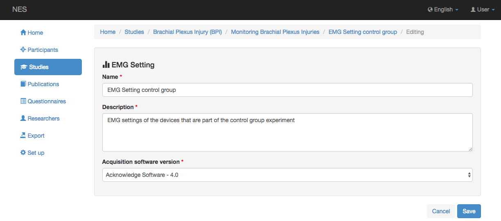
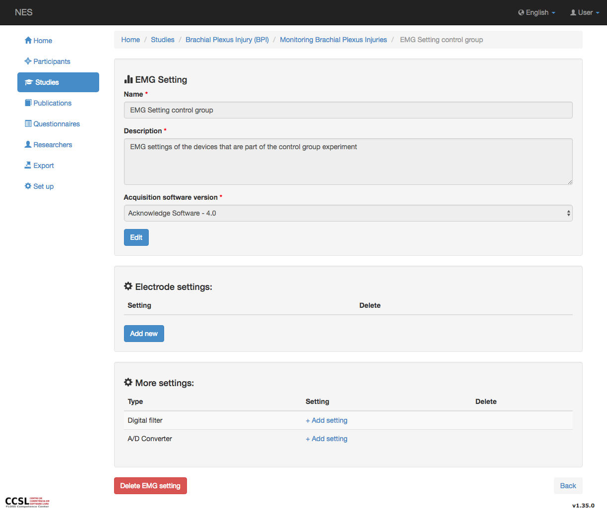
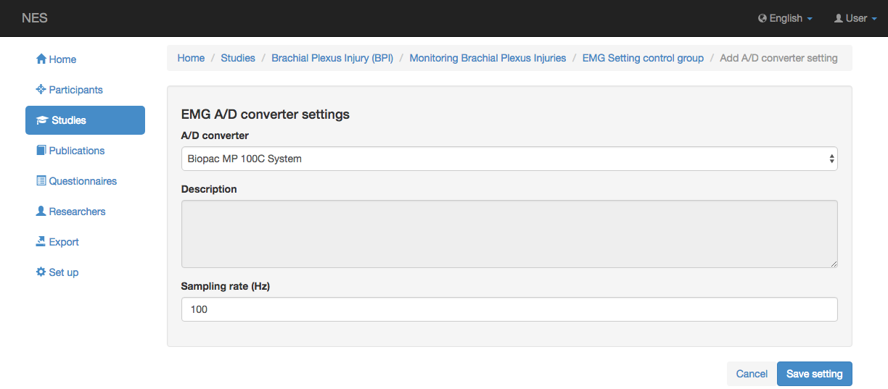

.. _emg-settings:

Configuración de EMG
============

NES permite registrar toda la información relacionada con la configuración y los parámetros de los equipos y materiales que intervienen en la adquisición de datos brutos de EMG. En los experimentos EMG, los ajustes principales son los electrodos, el convertidor A/D y los filtros digitales que se utilizan en el experimento. En la imagen de abajo se muestra una captura de pantalla para registrar una nueva configuración de EMG: 

Los campos que componen la nueva pantalla de configuración de EMG son:

* Nombre: el nombre de la configuración (obligatorio).
* Descripción: una descripción sobre la configuración de EMG (obligatorio).
* Versión del software de adquisición: el nombre y la versión del software que se utiliza para la adquisición de los datos (obligatorio).

Después de guardar la nueva configuración de EMG, se mostrará el menú para registrar la configuración de los dispositivos utilizados en el experimento EMG. La siguiente imagen muestra esta pantalla:

Los ajustes que forman parte de los experimentos EMG son:

* :ref:`emg-electrode-settings`
* :ref:`emg-digital-filter-settings`
* Convertidor EMG A/D: En la configuración del convertidor EMG A/D (imagen de abajo) puede registrar el modelo y la frecuencia de muestreo configurada en el experimento EMG, otros detalles sobre el modelo del convertidor A/D se pueden ver en el :ref:`a-d-converter configuration.

