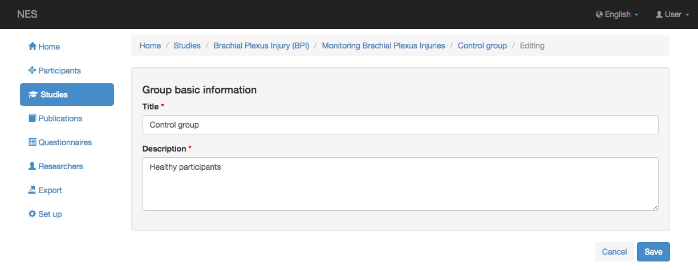
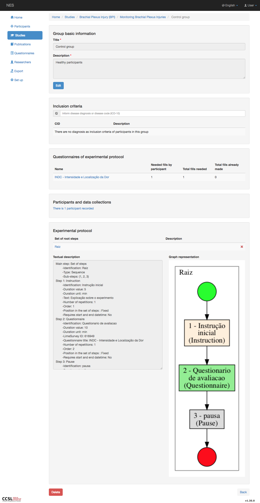
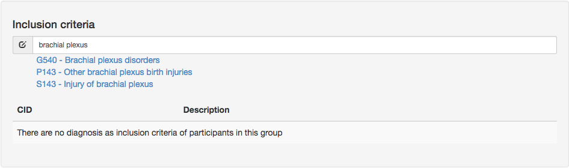
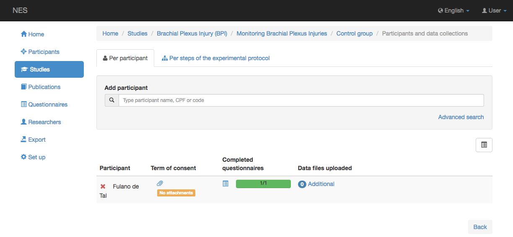
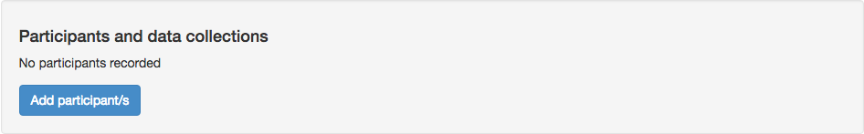
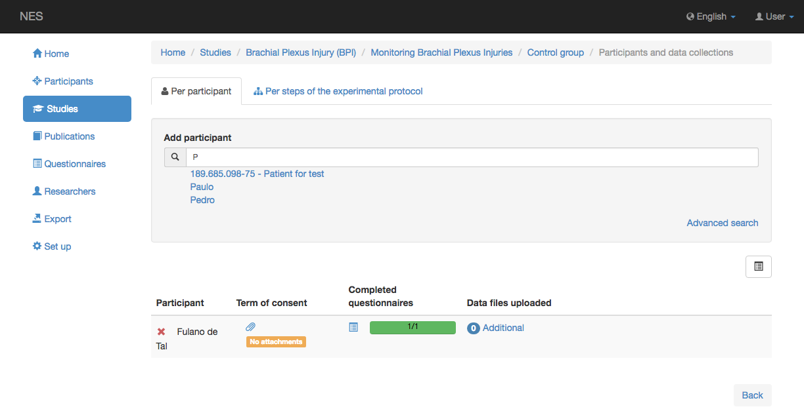
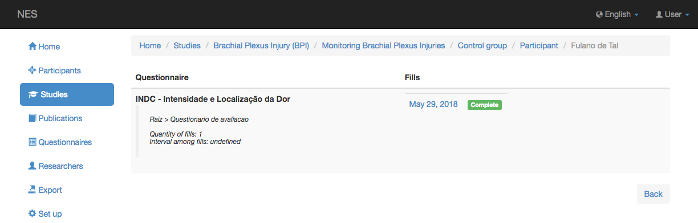
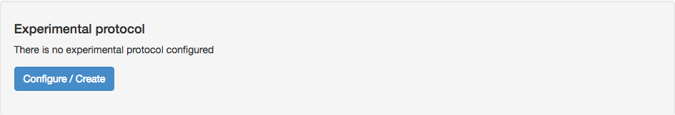

.. _group-of-participants:

Group of Participants
=====================

Participants of the experiments are organized into groups.

.. _creating-and-editing-a-group:

Creating and Editing a Group
----------------------------
A group contains:

* A title (obligatory);
* A description (obligatory);
* One or more diagnosis of diseases specified using the International Classification of Diseases (ICD) as inclusion criteria;
* A list of participants; and
* An experimental protocol.

However, while creating a new group, the screen asks only for the title and description. Those are also the fields that can be updated if you click the `Edit` button in the visualization screen. Inclusion criteria and experimental protocol can be added while visualizing a group. Only authorized users can update a group, which means the owner of the study of the experiment of this group or users with permission to change studies from others (See :ref:`permissions` for more information).

.. _visualizing-a-group:

Visualizing a Group
-------------------
While in the screen for visualizing an experiment, you can see more information about an existing group by clicking on its title in the list of groups. While viewing a group, you can delete it by clicking the `Delete` button. However, this button is visible only for the users that have permission to update the group.

.. _inclusion-criteria:

Inclusion Criteria
------------------

Researchers may include one or more diagnosis to be used as inclusion criteria for participants in the group. This information is only informative. The system does not verify if participants included in the group have the specified disease. To include a new diagnosis, you should type the name or part of the name of the disease or the ICD code. A drop down list of suggestion will be shown for you to select one of the diagnosis from the list. To remove an inclusion criteria, you simply click the :x: button associated to it. Again, only users that have permission to update a group can add or remove inclusion criteria. Non-authorized users can't see the text field.

.. _questionnaires-of-the-experimental-protocol:

Questionnaires of the Experimental Protocol
-------------------------------------------

To help users visualizing data already collected from participants of the group, the screen that shows detailed information about a group has a specific section that summarizes the number of fills for each questionnaire of the experimental protocol. Each line shows the identification of the questionnaire, the number of fills needed per participant, the total number of fills needed for the group and the total number of fills already done. Clicking on the identification of the questionnaire, you can see a screen showing detailed information about the questionnaire and a list of participants. The list includes a graphical representation of the number of fills already done by the participant in relation to the number of fills needed from the participant and the date of each started or finished fill. The date is a link to a page that allows you to finish the fill, in case of an uncompleted fill, or a page that shows the answers, in case of a completed fill. See :ref:`managing-a-questionnaire-fill` for more details.

.. listing-and-inserting-participants:

Listing and Inserting Participants
----------------------------------

A group can have an unlimited number of participants. If no participant has yet been registered in the group, you will see a `Add participant/s` button. 

If at least one participant was registered, you will see a link whose text informs the number of participants already registered. Both this link and the `Add participant/s` button will take the user to a screen that allows a participant to be registered and lists the participants already registered. If you do not have the [[permission | Permissions]] to add a participant to a group, you will only see a message informing the number of participants already registered.

To register a new participant, you should type the name or the CPF of the participant. While the user types, the system suggests participants that match the typed term. Suggestions are given since the first character typed. Each suggestion is a link. By clicking the link, you include the participant in the list of registered participants.

The list of registered participants includes a link (:paperclip:) to a screen that allows you to attach / visualize the file that stores the term of consent signed by the participant, and a graphical representation of the number of questionnaires already completed (all the required fills have been done) by the participant in relation to the number of questionnaires included in the experimental protocol.

.. _visualizing-a-participant:

Visualizing a Participant
-------------------------

Clicking the name of the participant takes you to a screen that shows all the fills of this participant. If you have the :ref:`permissions` to remove a participant from the group, you will also see a `Delete` button.

.. _experimental-protocol:

Experimental Protocol
---------------------

If no experimental protocol has yet been configured in the group, you will see a `Configure / Create` button. If you click this button, NES will show the screen for creating or reusing a component that will become the root of the experimental protocol of the group. The root of an experimental protocol will always be a `set of steps`. If you do not have the :ref:`permissions` to change the study, you will only see a message informing that no experimental protocol was configured.

If the root of the experimental protocol has already been configured, you will see a link whose text informs the identification of the set of steps that is the root of the experimental protocol of the group. If you click this link, NES will show the visualization screen for this set of steps. If you have the :ref:`permission` to change the study, you will also see a :x: button that can be used to unset the experimental protocol.

You find more information about this topic in :ref:`configuring-an-experimental-protocol`.