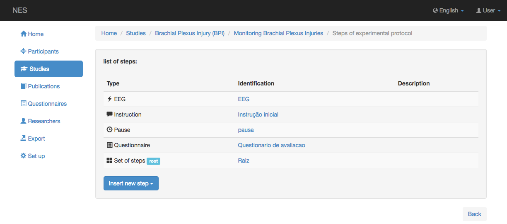
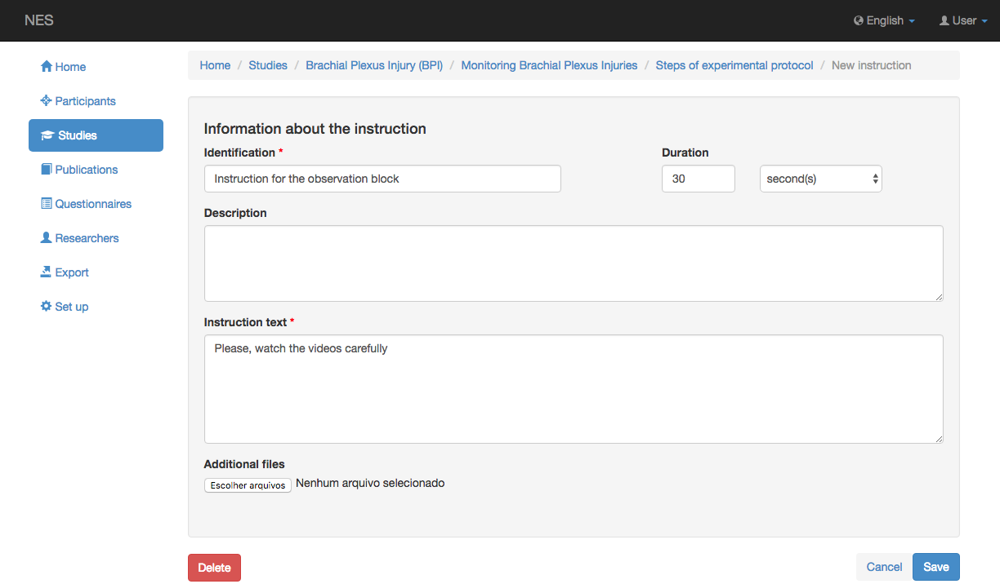
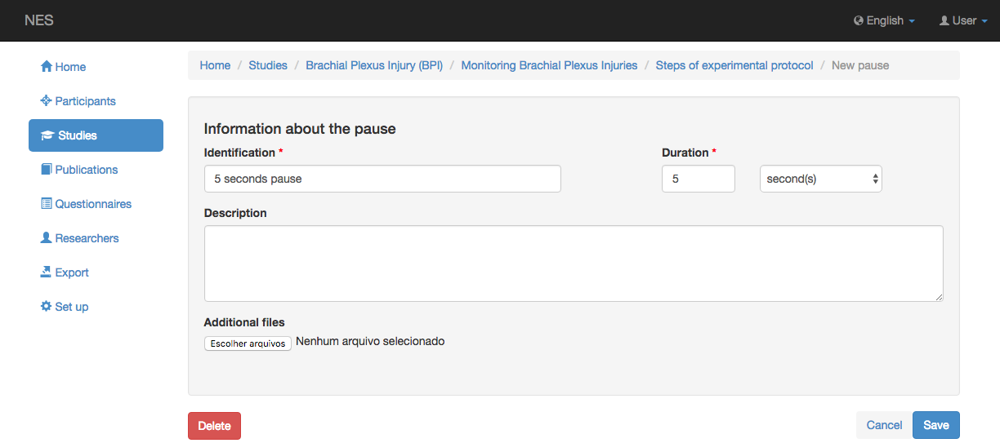
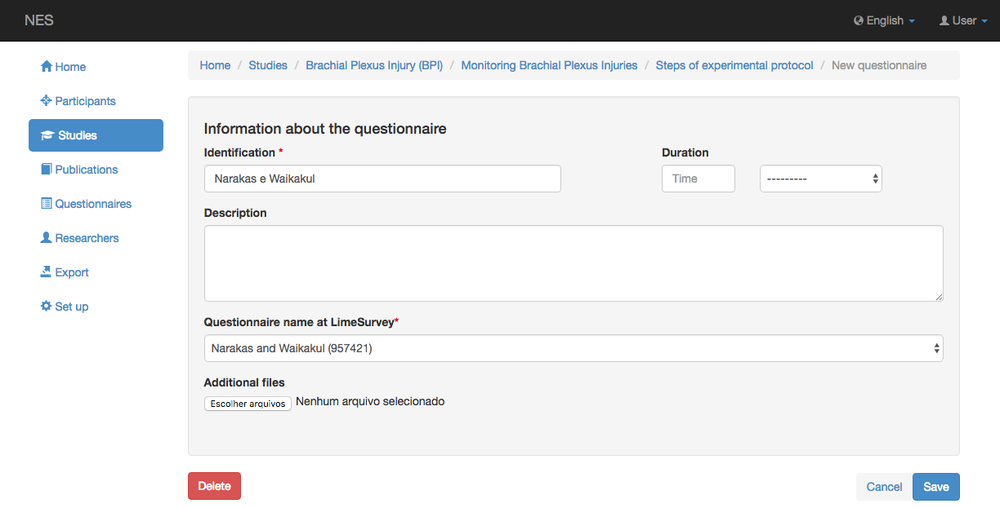
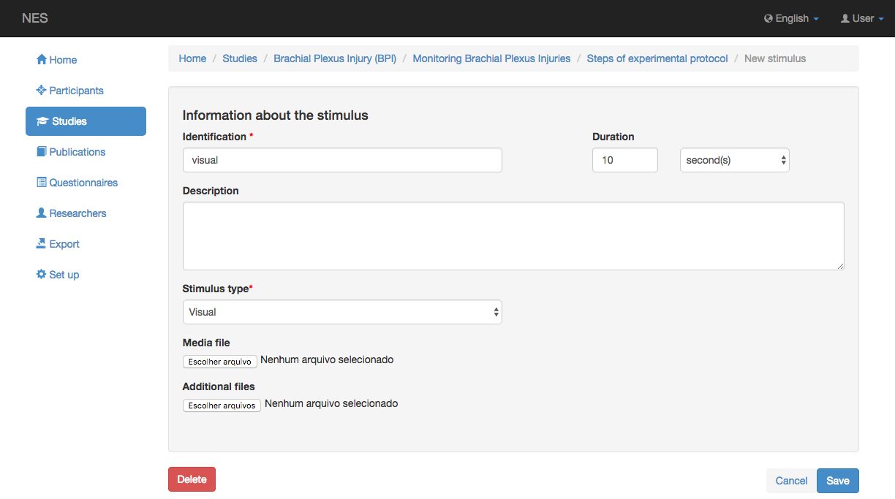
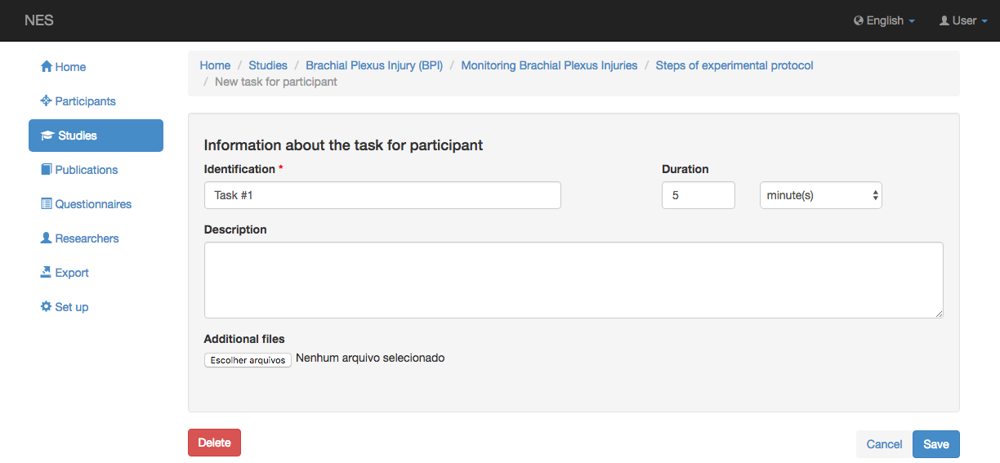
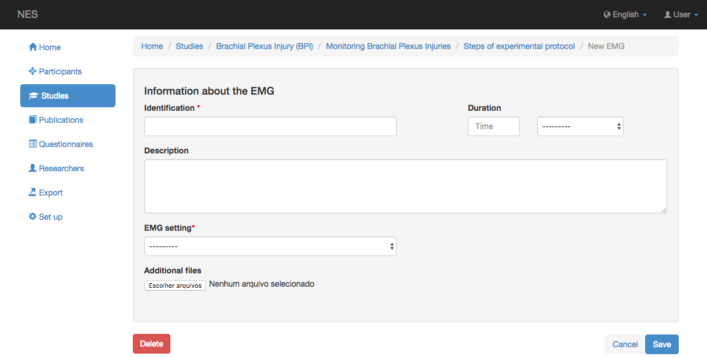
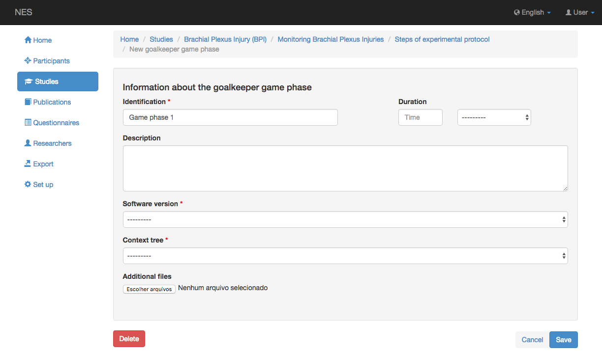

.. _managing-steps-for-experimental-protocol:

Administración de pasos para el protocolo experimental
========================================

Un protocolo experimental se compone de pasos. Se puede usar un solo paso más de una vez en el mismo experimento. El protocolo de un experimento se define organizando los usos de los pasos de una manera que determina el momento en el que deben suceder. Esto se hace dentro de cada grupo de participantes, porque el protocolo experimental de un grupo puede ser diferente del protocolo experimental de otro grupo. NES permite registrar los siguientes tipos de pasos:

.. _list-of-steps:

Lista de pasos
-------------

Todos los pasos ya creados para especificar los protocolos de los experimentos se enumeran al hacer clic en el botón `Manage` mientras visualiza un :ref:`experiments`. También se enumeran los pasos que aún no están en uso en ninguna parte del experimento.

Desde esta pantalla, puede crear nuevos pasos haciendo clic en el botón `Insert New Step`  y elegir uno de los tipos disponibles. Todos los tipos tienen al menos una identificación, y pueden tener una descripción y una duración, que se compone de un valor y una unidad. Las unidades posibles son: milisegundo, segundo, minuto, hora, día, semana, mes y año. Desde esta pantalla también se puede ver/editar información de un paso concreto haciendo clic en el enlace que muestra su identificación. Mientras ve / edita un paso, puede eliminarlo haciendo clic en el botón *Eliminar* . Sin embargo, este botón sólo es visible para los usuarios que tienen :ref:`permissions` para actualizar el experimento. Si quita un paso, también está eliminando todos los usos de este paso.

Consulte las siguientes secciones para conocer las especificidades de cada tipo de paso:

.. _instruction-step:

Instrucción
-----------

Una `instruction` contiene:

* Una identificación (obligatoria);
* Una descripción;
* Una duración;
* El texto de la instrucción (obligatorio); y
* Archivos adicionales.

:ref:`Back to top <managing-steps-for-experimental-protocol>`

.. _pause-step:

Pausa
-----

Una `pause` contiene:

* Una identificación (obligatoria);
* Una descripción; y
* Una duración (obligatoria); y
* Archivos adicionales.

:ref:`Back to top <managing-steps-for-experimental-protocol>`

.. _questionnaire-step:

Cuestionario
-------------

Un `questionnaire` contiene:

* Una identificación (obligatoria);
* Una descripción;
* Una duración;
* El nombre de un cuestionario en LimeSurvey (obligatorio); y
* Archivos adicionales.

:ref:`Back to top <managing-steps-for-experimental-protocol>`

.. _set-of-steps:

Conjunto de pasos
------------

El `set of steps` es un tipo especial de paso, porque se utiliza para agregar usos de otros pasos de una manera que define el momento en el que deben suceder. Así, te explicamos acerca de un `set of steps` en detalle en :ref:`configuring-an-experimental-protocol`.

:ref:`Back to top <managing-steps-for-experimental-protocol>`

.. _stimulus-step:

Estimulo
--------

Un `stimulus` contiene:

* Una identificación (obligatoria);
* Una descripción;
* Una duración;
* Un tipo (obligatorio);
* Un archivo multimedia que contiene el archivo del estímulo; y
* Archivos adicionales.

El tipo de estímulo puede ser uno de los tipos registrados en la base de datos NES. El :ref:`script-for-creating-initial-data` incluye los siguientes tipos: Auditivo, Olfativo, Visual, Somatosensorial, Interoceptivo y Gustativo.

:ref:`Back to top <managing-steps-for-experimental-protocol>`

.. _task-step:

Tarea para el experimentador o Tarea para el sujeto
-------------------------------------------------

Ambos, una `task for the experimenter` o una `task for the subject` contienen:

* Una identificación (obligatoria);
* Una descripción;
* Una duración; y
* Archivos adicionales.

:ref:`Back to top <managing-steps-for-experimental-protocol>`

.. _eeg-step:

EEG
---

Un paso `EEG`  representa que un `Electroencephalography <https://en.wikipedia.org/wiki/Electroencephalography>`_ se realizará en este momento del experimento. La configuración de este paso debe registrarse previamente y define cómo se configuran todos los equipos de EEG. Un paso de EEG contiene:

* Una identificación (obligatoria);
* Una duración;
* Una descripción; y
* Una configuración de EEG (obligatoria).

:ref:`Back to top <managing-steps-for-experimental-protocol>`

.. _emg-step:

EMG
---

Un paso `EMG` representa que un `Electromyography <https://en.wikipedia.org/wiki/Electromyography>`_ se realizará en este momento del experimento. Un paso de EMG contiene:

* Una identificación (obligatoria);
* Una duración;
* Una descripción; y
* Una configuración EMG (obligatoria).

:ref:`Back to top <managing-steps-for-experimental-protocol>`

.. _tms-step:

TMS
---

Un paso `TMS` representa que una `Transcranial Magnetic Stimulation <https://en.wikipedia.org/wiki/Transcranial_magnetic_stimulation>`_ se realizará en este momento del experimento. Un paso de TMS contiene:

* Una identificación (obligatoria);
* Una duración;
* Una descripción; y
* Una configuración TMS (obligatoria).

:ref:`Back to top <managing-steps-for-experimental-protocol>`

.. _goalkeeper-game-phase:

Fase de juego del portero
---------------------

Un paso `Goalkeeper game phase` representa que una `Goalkeeper game phase <http://game.numec.prp.usp.br>`_ se realizará en este momento del experimento. Un paso de fase de juego de porteros contiene:

* Una identificación (obligatoria);
* Una duración;
* Una descripción;
* La versión de software del juego Goalkeeper utilizada en el experimento (obligatorio); y
* El árbol de contexto (obligatorio).

:ref:`Back to top <managing-steps-for-experimental-protocol>`

.. _generic-data-collection:

Recopilación de datos genéricos
-----------------------

Una `Generic data collection` contiene:

* Una identificación (obligatoria);
* Una descripción;
* Una duración; y
* Un tipo (obligatorio).

El tipo de recopilación de datos genéricos puede ser uno de los tipos registrados en la base de datos NES. Pueden ser de los siguientes tipos: medidas cinemáticas, estabilometría, tiempo de respuesta, medidas psicofísicas, respuesta verbal, escala psicométrica, grabación de unidades y grabación multiunidad.

.. image:: ../../_img/generic_data_step.png

:ref:`Back to top <managing-steps-for-experimental-protocol>`