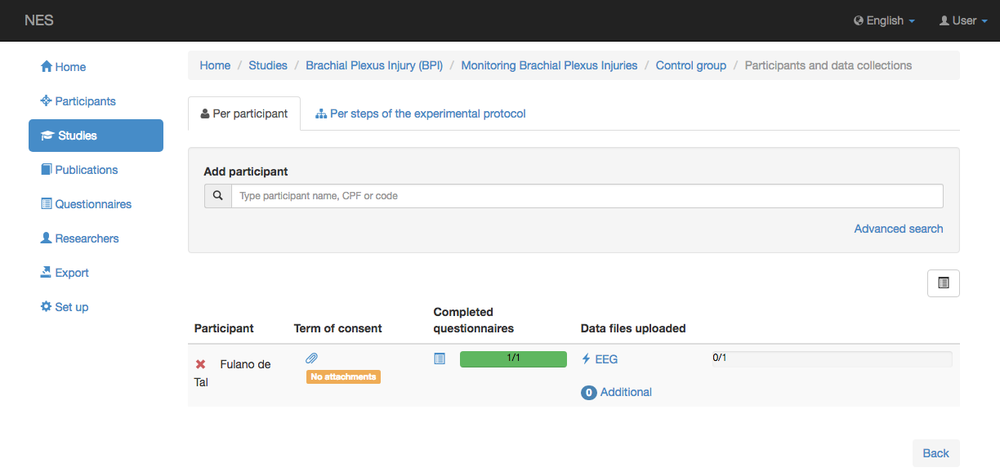
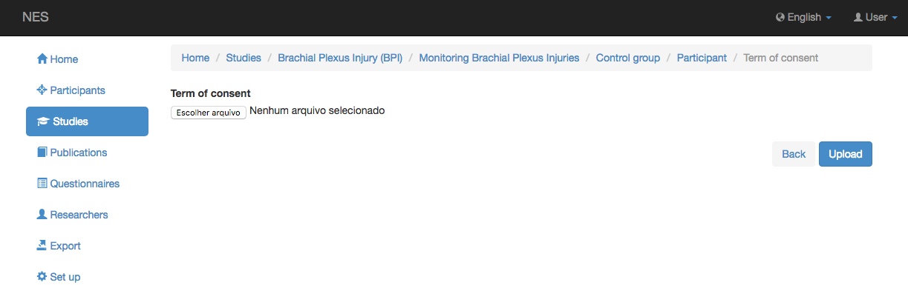
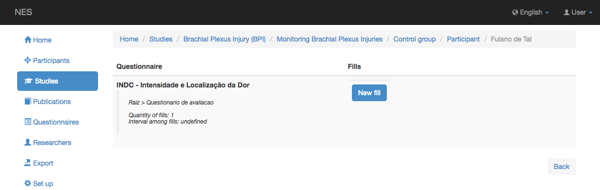
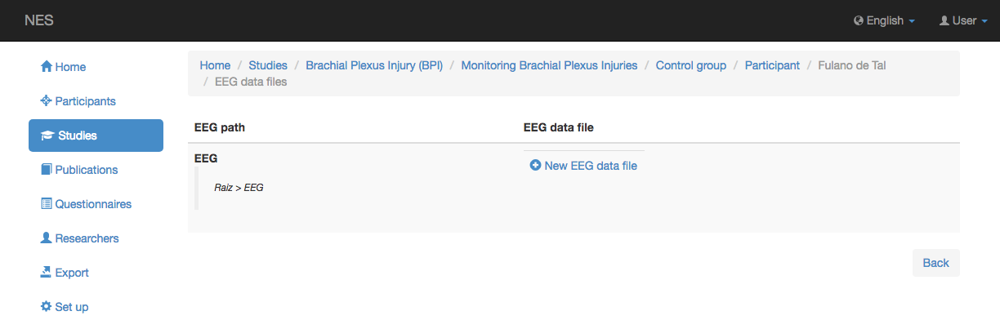
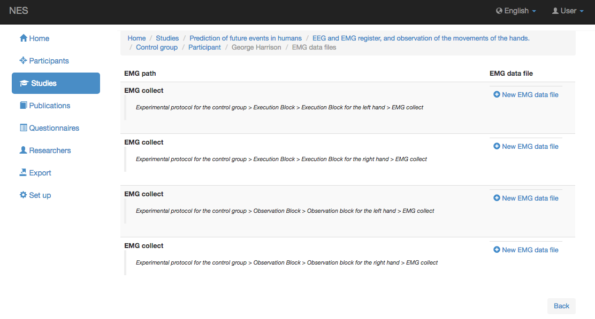
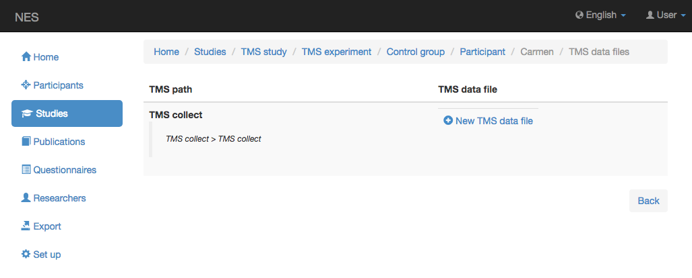
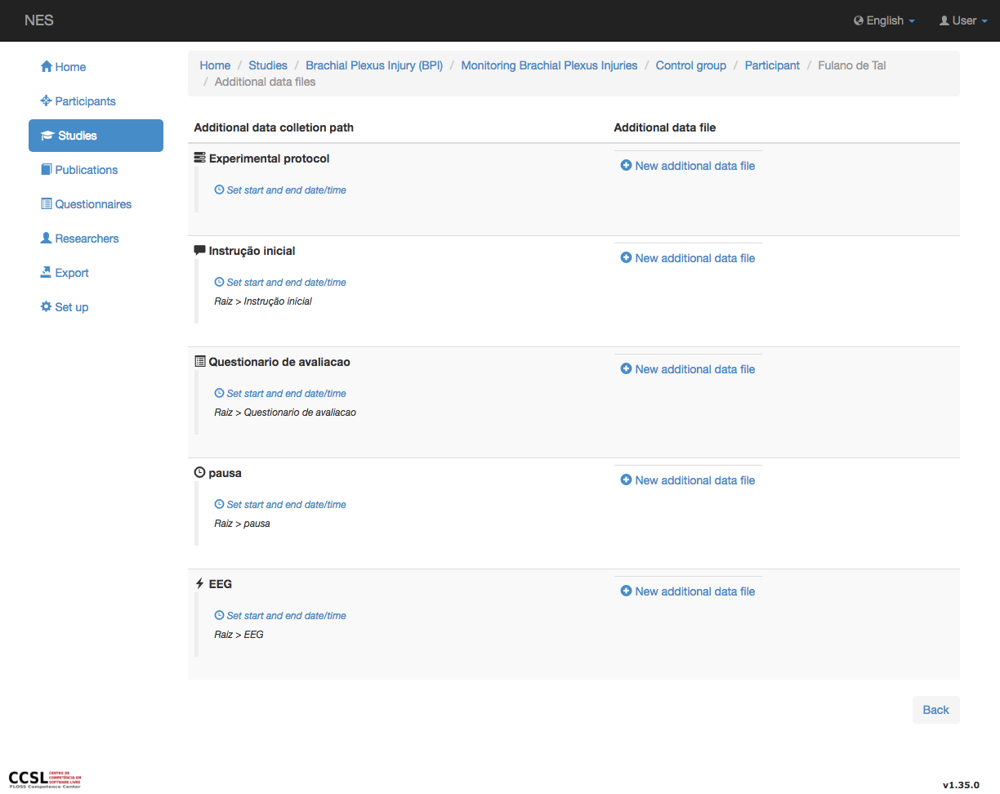

.. _raw-data-and-additional-files:

Datos sin procesar y archivos adicionales
=============================

NES permite adjuntar archivos de cada participante en varios tipos de formatos de datos. Estos pueden ser datos en bruto obtenidos de la recopilación de EEG, EMG o TMS, o archivos adicionales relacionados con cada paso del protocolo experimental.
Una vez determinado el grupo de participantes y su protocolo experimental, el sistema mostrará, cada participante por fila, como se muestra en la imagen de abajo. La lista de participantes inscritos incluye un enlace (representado por el clip) a una pantalla que permite adjuntar el fichero que almacena el plazo de consentimiento firmado por el participante. En caso de que el protocolo experimental incluya cuestionarios, una columna denominada `Completed questionnaires` se muestra con un enlace para rellenar los cuestionarios y una representación gráfica del número de cuestionarios cumplimentados para ese participante. Si se incluyen en el protocolo experimental, las colecciones de datos EEG, EMG, TMS y Generic se muestran en la última columna, así como un enlace para adjuntar archivos adicionales. Esta pantalla se muestra en la imagen de abajo. 

Encontrará más detalles sobre las pantallas para adjuntar archivos en los siguientes temas:

.. _attach-term-of-consent:

Adjuntar plazo de consentimiento
----------------------

La siguiente imagen muestra la pantalla que permite adjuntar el fichero que almacena el plazo de consentimiento firmado por el participante:

.. _attach-questionnaire-file:

Adjuntar archivo de cuestionario
-------------------------

La siguiente imagen muestra la pantalla para adjuntar el cuestionario rellenado por el participante. Si el cuestionario no se completa, verá un botón "Nuevo relleno" que conduce a una pantalla que le permite completar el cuestionario: 

.. _attach-eeg-raw-file-format:

Adjuntar formato de archivo RAW EEG
--------------------------

La siguiente imagen muestra la pantalla para adjuntar el archivo RAW EEG. En esta pantalla verá una fila por cada paso de EEG definido en el protocolo experimental. NES permite validar los archivos EEG de tipo 'formato binario raw'.

.. _attach-emg-raw-file-format:

Adjuntar formato de archivo raw EMG
--------------------------

La siguiente imagen muestra la pantalla para adjuntar el archivo RAW EMG. En esta pantalla verá una fila por cada paso EMG definido en el protocolo experimental.

.. _attach-tms-raw-file-format:

Adjuntar formato de archivo RAW TMS
--------------------------

* [[Nueva descripción del archivo de datos TMS | Nuevo archivo de datos TMS]]

.. _attach-additional-files:

Adjuntar archivos adicionales
-----------------------

La siguiente imagen muestra la pantalla para adjuntar archivos adicionales. En esta pantalla verás una fila por cada paso definido en el protocolo experimental que no era EEG, EMG o TMS. Para cada archivo adicional es posible registrar la hora de inicio y finalización.

