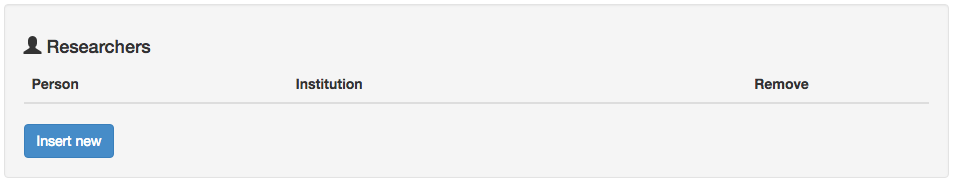

.. _researchers-of-an-experiment:

Investigadores de un experimento
============================

Los investigadores que participan en un estudio pueden no estar involucrados en todos los experimentos, siendo necesario atribuirlos por experimento. Para agregar investigadores a un experimento, deben estar registrados en el sistema NES. Para ello, puedes visitar :ref:`researchers menu <researchers>`. Para agregar investigadores a un experimento, debe hacer clic en el boton `Insert new` en la sección `Researchers` .

Se mostrará una lista con todos los investigadores registrados en NES. Puede marcar la casilla de verificación de cada investigador para atribuirlos al experimento o puede hacer clic en `Select all` para seleccionarlos todos. Una vez que seleccione a los investigadores para ese experimento, puede hacer clic en el botón `Save` .

.. image:: ../../_img/researcher_list.png

El nombre y la institución de los investigadores del experimento aparecerán en la sección Investigadores. Para eliminar uno de ellos, puede hacer clic en el icono |delete icon| en la misma sección y haga clic en el botón `Delete` en la ventana de confirmación que aparece.

.. image:: ../../_img/researcher_remove.png