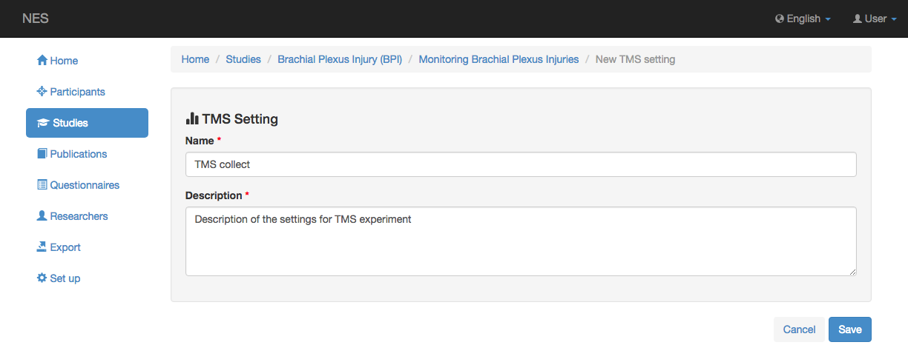
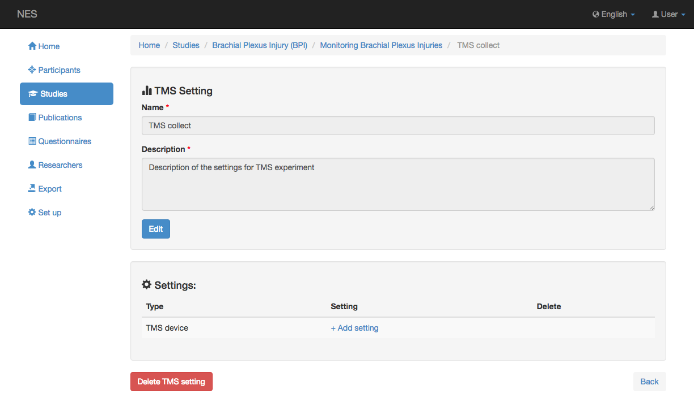

.. _tms-settings:

TMS Settings
==================

NES allows to register all the information related to settings and parameters of the equipments and materials involving in the acquisition of TMS raw data. 

After save the new setting you can register the TMS devices and the placement settings used in the experiment. 

.. _tms-device-setting

TMS Device setting
------------------

The TMS device setting has the following features:

* :ref:`manufacturer`;
* :ref:`tms-device`;
* :ref:`coil-model`;
* Pulse stimulus type.

The screenshot for adding a TMS device setting is shown below

.. image:: ../../../_img/tms_settings_tms_device_settings.png