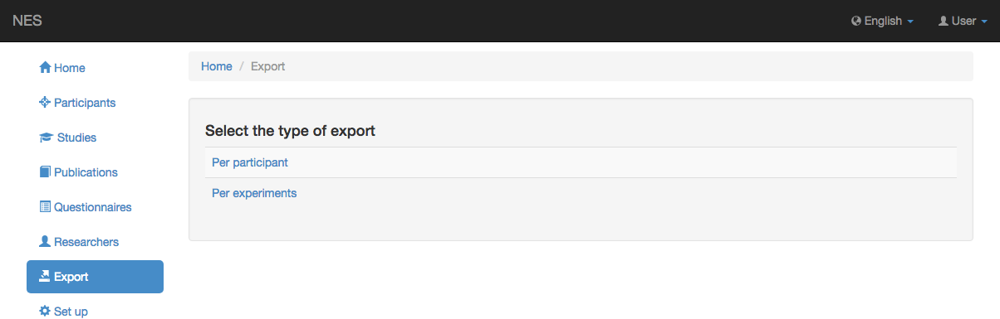
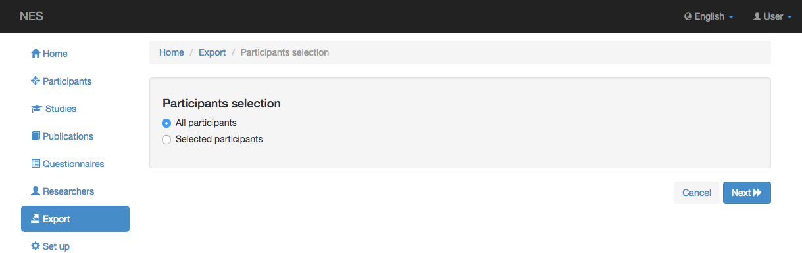
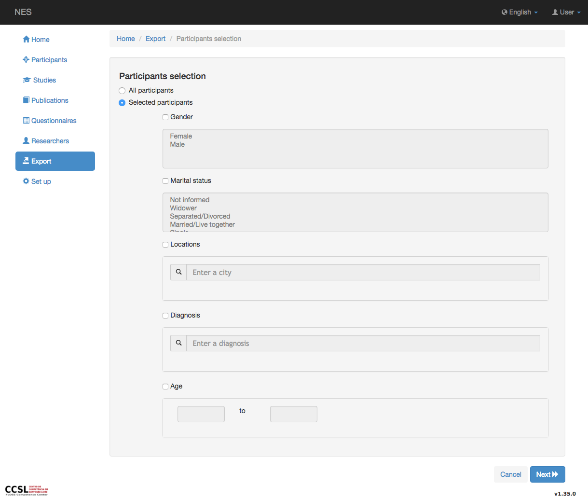

.. _export:

Exportar
======

La exportación es una forma de transferir datos de cuestionarios NES y LimeSurvey (conectados a NES) a archivos en formato "csv" (valores separados por comas). Se crea un archivo comprimido con varios tipos de datos, como cuestionario, participante y diagnóstico. 

Solo usuarios que tienen :ref:`permissions` Para ejecutar la exportación, puede ver esta opción en el menú.

NES ofrece dos tipos de exportación:

* :ref:`Per participant <export-participant-data>`
* :ref:`Per experiment <export-experiment-data>`

Para cada tipo de exportación, puede filtrar el grupo de participantes cuyos datos desea exportar. 

Los participantes pueden ser filtrados por género, estado civil, ubicaciones, diagnóstico y edad. Como se muestra en la imagen de abajo.

.. toctree::
   :maxdepth: 1
   :titlesonly:
   :hidden:

   exportparticipantdata
   exportexperimentdata