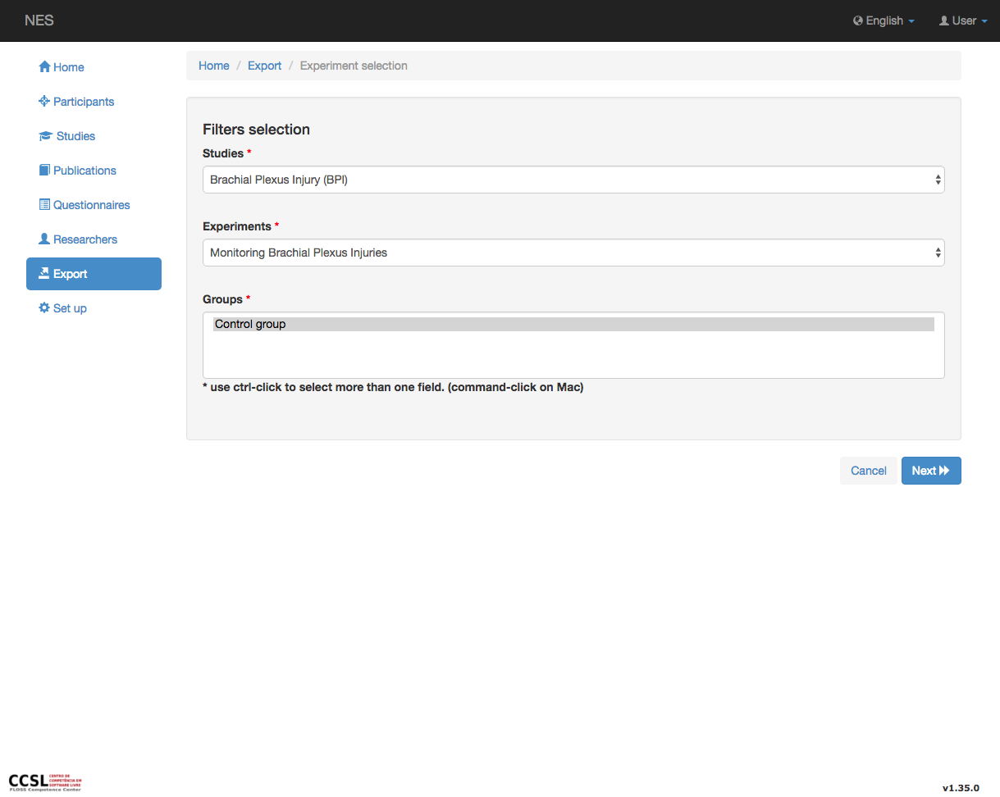
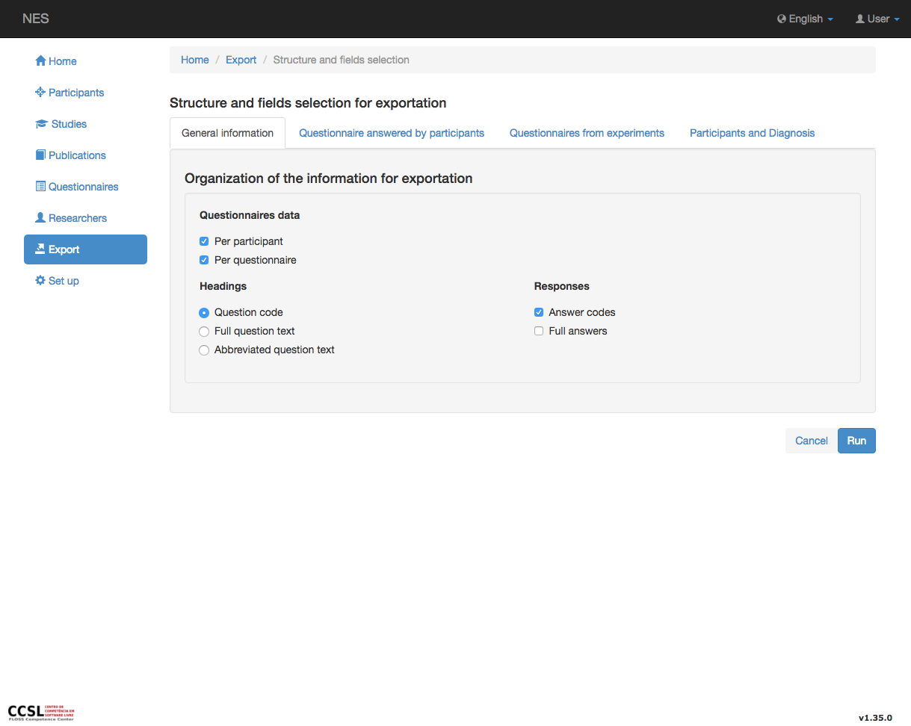
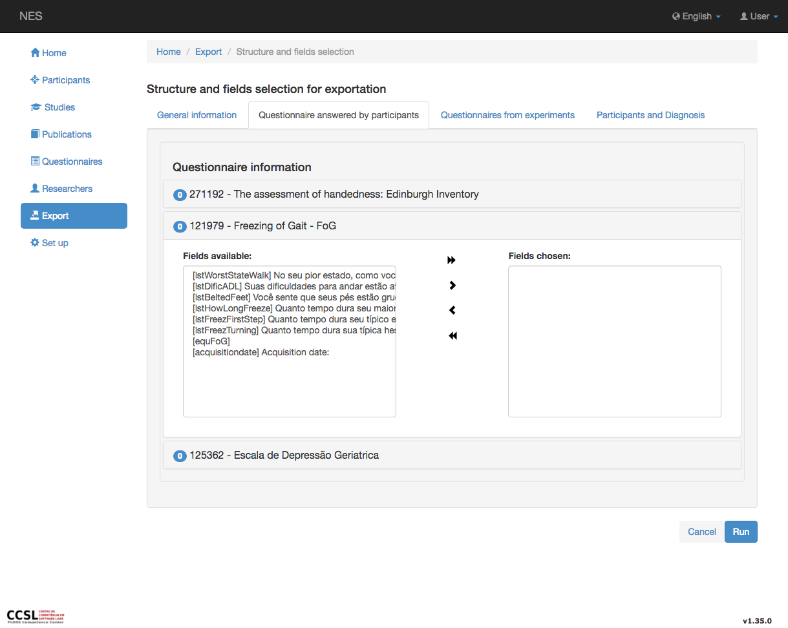

.. _export-experiment-data:

Exportar datos del experimento
======================
Para exportar datos de experimentos, debe seleccionar el estudio, el experimento y los grupos cuyos datos puede exportar.
La siguiente imagen muestra estas opciones.

El siguiente paso muestra cuatro pestañas de información para seleccionar los datos que se exportarán.

Las pestañas se dividen en: `General Information`_, `Questionnaire Answered by Participants`_ , `Questionnaire from Experiments`_ y `Participants and Diagnosis`_

.. _general-information-export-experiment:

Información General
-------------------

En esta sección, se configura la estructura del directorio donde se almacenará el cuestionario, los encabezados de evaluación del cuestionario y el formato de respuestas que se exportará a partir de la información de LimeSurvey.
Estas opciones solo tienen sentido si configura al menos un cuestionario para exportar. Ver :ref:`general-information-export-participant` en `Export participant data` para obtener más detalles de esta sección.

.. _questionnaire-answered-by-participants-export-experiment:

Cuestionario respondido por los participantes
--------------------------------------

Se presenta una lista de cuestionarios de evaluación que contienen la información seleccionada de los filtros (primeras páginas, como se muestra aquí) que los seleccionan. Un círculo en azul (contador azul) presenta la cantidad de campos seleccionados en cada cuestionario. Al principio, como no hay elementos seleccionados, se presenta cero. Ver :ref:`questionnaire-information-export-participant` en `Export participant data` para obtener más detalles de esta sección.

.. _questionnaire-from-experiments-export-experiment:

Cuestionario de Experimentos
------------------------------

En esta pestaña se presenta una lista de cuestionarios del experimento seleccionado. Al igual que la pestaña anterior, un círculo en azul (contador azul) presenta la cantidad de campos seleccionados en cada cuestionario. Al principio, como no hay elementos seleccionados, se presenta cero. Esta sección debe gestionarse como la anterior.

.. image:: ../../_img/export_tab_experiment_questionnaire.png

.. _participants-and-diagnosis-export-experiment:

Participantes y diagnóstico
--------------------------

Puede ver :ref:`participants-export-participant` y :ref:`general-information-export-participant` at `Export participant data` to see details about this tab.

.. image:: ../../_img/export_experiment_tab_participants_diagnosis.png

:ref:`Back to Export <export>`