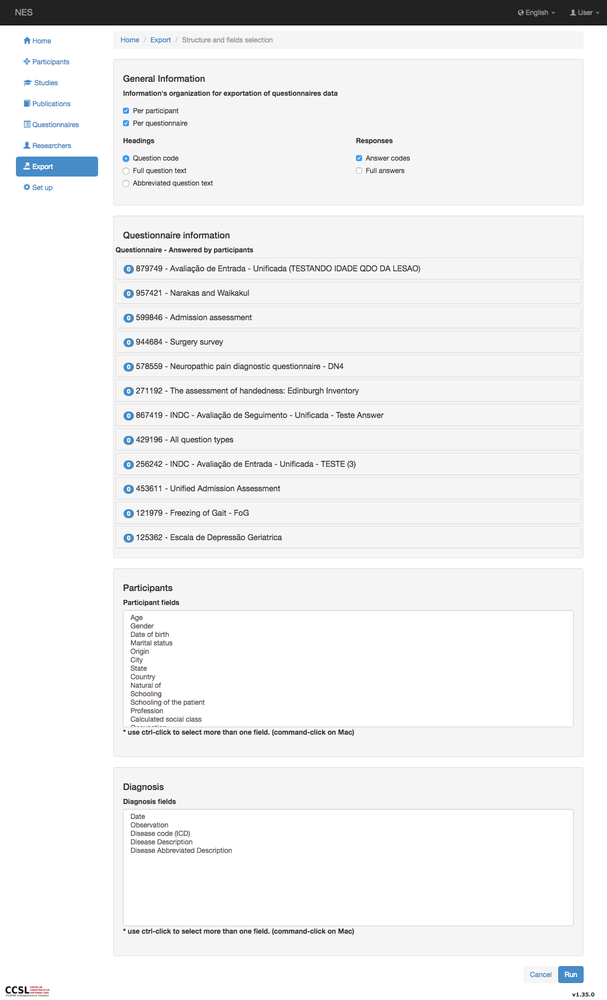
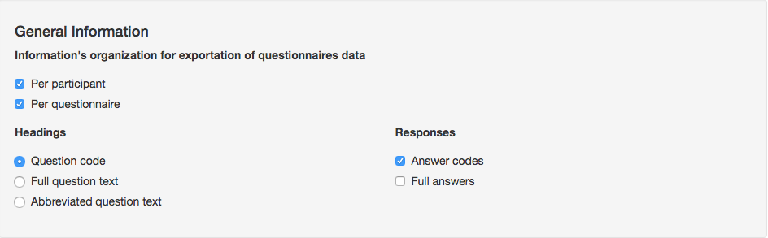
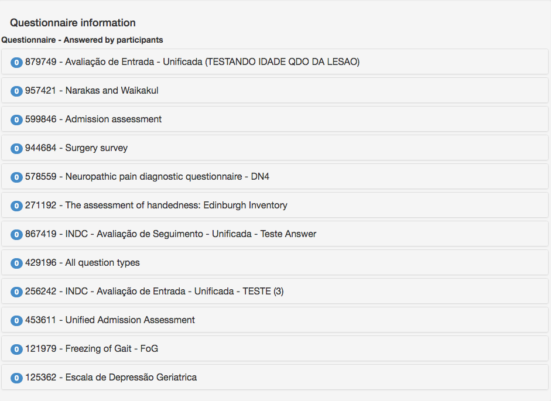
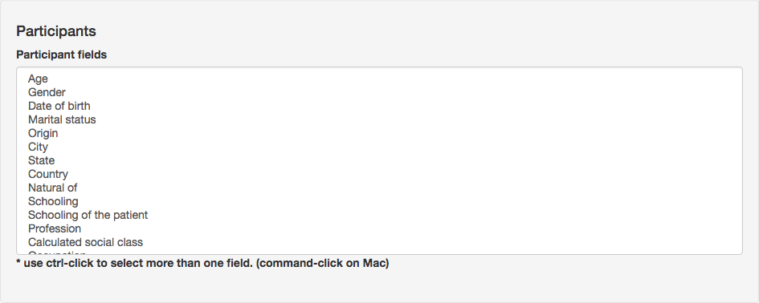
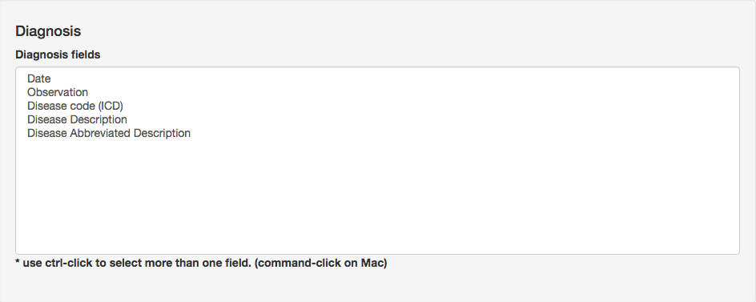
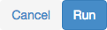

.. _export-participant-data:

Exportar datos del Participante
=======================

En la exportación por participante, puede filtrar de qué participantes desea obtener los datos. Puede elegir entre todos los participantes o filtrarlos por género, estado civil, ubicaciones, diagnóstico y / o edad. Se muestra una lista de los participantes que pasan por el filtro. Haciendo clic en el botón `Next` , vaya a la `Structure and fields selection` como puedes ver en la imagen de abajo:

.. _general-information-export-participant:

Informacion General
-------------------

En esta sección, puede configurar la estructura del directorio donde se almacenarán los cuestionarios, los encabezados de evaluación de los cuestionarios y el formato de respuestas que se exportarán a partir de la información de LimeSurvey.
Estas opciones solo tienen sentido si configura al menos un cuestionario para exportar.

Estructura de directorios para el cuestionario de evaluación. Puede elegir una o ambas opciones marcadas. No debe dejar todas las opciones sin marcar.  Todos ellos están marcados por defecto.

Los datos de evaluación de un cuestionario contienen 2 tipos de información: encabezados, que se presentan en la primera línea de exportación, y respuestas, que contiene las líneas con los campos seleccionados de la evaluación del cuestionario. 

Hay 3 tipos de encabezados:

* Código de pregunta; 
* Texto completo de la pregunta;
* Texto abreviado de la pregunta (se presenta el texto parcial de la pregunta);

Solo se puede comprobar una opción.

Los tipos de respuestas para la exportación son:

* Códigos de respuesta;
* Respuestas completas;

Se pueden marcar una o ambas opciones. No debe dejar todas las opciones sin marcar.  

.. _questionnaire-information-export-participant:

Los archivos de formato se pueden elegir en dos tipos:

* CSV (valores separados por comas);
* TSV (TabSeparated Values);

Solo se puede comprobar una opción.

Información del cuestionario
-------------------------

Una lista de cuestionarios de evaluación que contienen la información seleccionada de los filtros (primeras páginas, como se muestra :ref:`here <export>` que los selecciona se presenta. 
Un círculo en azul (contador azul) presenta la cantidad de campos seleccionados en cada cuestionario. Al principio, como no hay elementos seleccionados, se presenta cero en todos ellos.

Para seleccionar los campos para un cuestionario específico, haga clic en el enlace del cuestionario y en una lista doble con campos desplegables: `Fields available` y `Fields chosen` Listas. Hay muchas maneras de seleccionar los campos:

* Haga doble clic en un campo específico desde `Fields available` ;
* haga clic en un campo y arrastre hacia arriba o hacia abajo para seleccionar muchos campos continuos y continuar con el siguiente procedimiento (elemento a continuación); 
* elija el campo (s) de `Fields available` enumere y use el botón con el icono de flecha izquierda (|questionnaire_left_arrow_export|) para transferirlos al `Fields chosen` . Puede elegir más de un campo haciendo clic y manteniendo presionada la tecla control(Windows/Linux)/command(Mac) muchas veces;
* haga clic en la flecha doble izquierda (|questionnaire_double_left_arrow_export|) Para transferir todos los campos desde `Fields available` a `Fields chosen` ; 

.. image:: ../../_img/questionnaire_selecting_fields_export.png

De la misma manera, puede usar la flecha derecha (|questionnaire_right_arrow_export|) y flecha doble derecha (|questionnaire_double_right_arrow_export|) Para transferir campos desde `Fields chosen` a  `Fields available` . También puede seleccionar campos de `Fields chosen` lista utilizando el mismo mecanismo presentado anteriormente.

Tan pronto como se inserta/elimina un nuevo elemento del `Fields chosen` , el contador azul (|questionnaire_fields_counter_export|) actualiza su valor. 

.. _participants-export-participant:

Participantes
------------

En la sección `Participants` , puede seleccionar uno o más campos de participantes para exportar. Puede utilizar los siguientes procedimientos para seleccionar los campos:

* haga clic en un campo y arrastre hacia arriba o hacia abajo para seleccionar muchos campos continuos;
* elija más de un campo manteniendo presionada la tecla control (Windows / Linux) / comando (Mac) y haciendo clic en cada campo. También puede anular la selección del campo haciendo clic en un campo seleccionado una vez más mientras mantiene presionada la tecla control(Windows/Linux)/command(Mac).

Por favor, preste atención a no presionar y soltar teclas, o la selección puede perderse y debe reiniciarla.

No todos los campos de participantes están disponibles, porque existe una preocupación sobre la anonimización de los datos. 

.. _diagnosis-export-participant:

Diagnostico
---------

El mismo procedimiento utilizado con la lista de participantes debe utilizarse en la lista de diagnóstico.

.. _executing-a-export-export-participant:

Ejecutando una exportación
------------------

Después de seleccionar los campos que se exportarán, haga clic en el boton `Run` para iniciar el proceso. Se generará un archivo comprimido y se descargará en su máquina. Este archivo comprimido puede contener uno o más archivos csv.

También puede hacer clic en `Cancel` para cancelar el proceso de exportación (solo si el proceso de exportación aún no se ha iniciado).

:ref:`Back to Export <export>`