.. _medical-evaluation:

Medical Evaluation
==================

Medical Evaluation is the tab where you can view or add new participant's diagnosis and exams.

.. _medical-evaluation-tab:

Medical Evaluation Tab
----------------------

You can visit the :ref:`participants` page to understand how to navigate between tabs.

.. _viewing-medical-evaluation:

Viewing Medical Evaluation
``````````````````````````

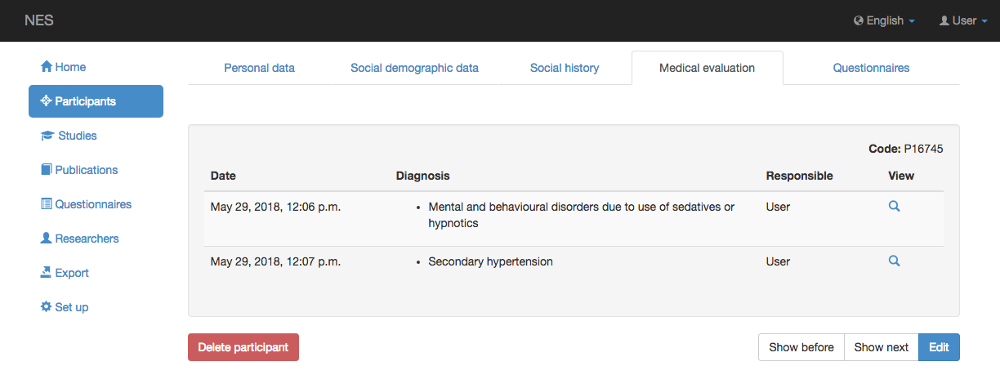

In this screen you can see a list, sorted by date, where each line represents a medical evaluation registered for the participant. Each line shows the date and responsible of the evaluation. To see details about the medical evaluation, namely diagnosis and exams, click on the magnifying glass button.

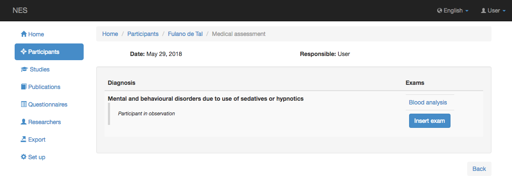

You can click each exam link in order to see exam details, that contains the following information:

* Date;
* Performed in (Place where exam was held in);
* Description;
* CRM (Doctor ID on a Brazilian Regional Council of Medicine);
* Doctor's name; and
* Attachments - files with information about the exam (Results).

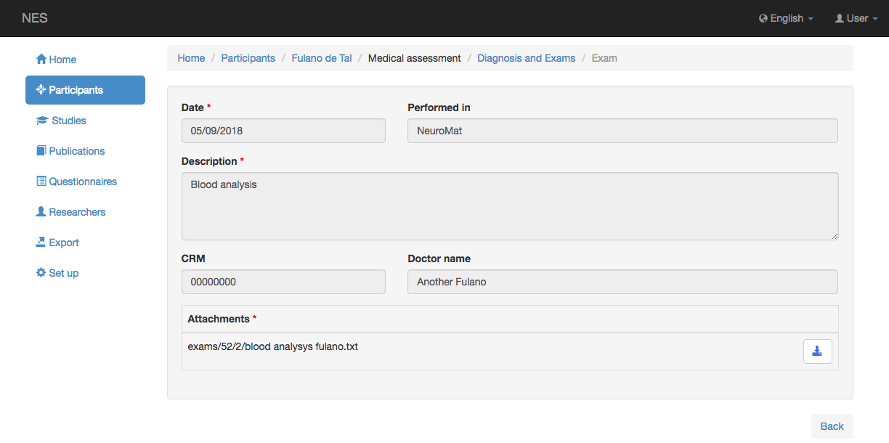

You can click on the |download icon| icon to download the attached file.


.. _creating-and-editing-medical-evaluation:

Creating and Editing Medical Evaluation
```````````````````````````````````````

Clicking `Edit` button enters the :ref:`edition mode <creating-and-editing-a-participant>` and allows the creation of a new medical evaluation. Unless for the bottom buttons, the behavior of this edition is the same as `Viewing Medical Evaluation`_ and it does not allow changing the data. 

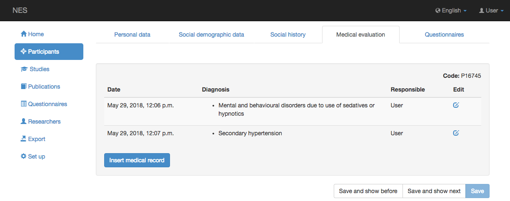

.. _including-a-new-diagnosis:

Including a New Diagnosis
`````````````````````````

You have to have the right :ref:`permissions` to add a new medical evaluation. 

When you click `Add new medical evaluation` button, you'll see the following:

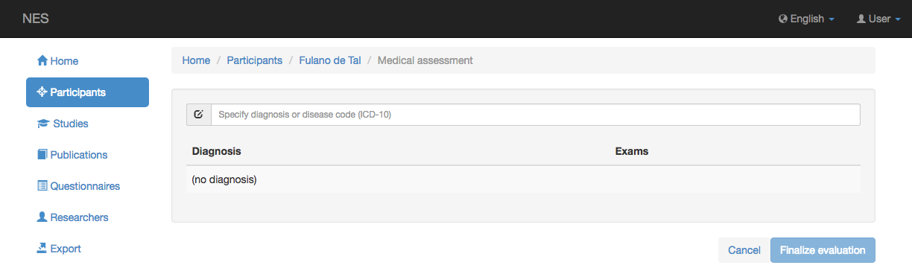

In order to include a diagnosis, you must type at least three characters of the word and will see a list of possible diagnosis, where you can click the correct link. Or you can type the corresponding ICD-10 code and then click on it.

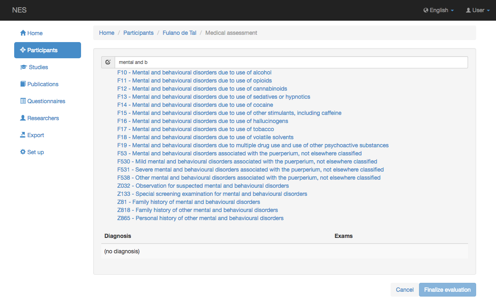

The more letters you type, the more specific the suggestion list will be.

After selecting one of the suggestions, the diagnosis is shown.

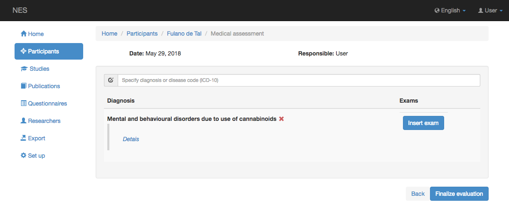

You can include as many diagnosis as necessary.

.. _deleting-the-selected-diagnosis:

Deleting the Selected Diagnosis
```````````````````````````````

If you choose to delete a diagnosis, a pop-up will be shown asking your confirmation.

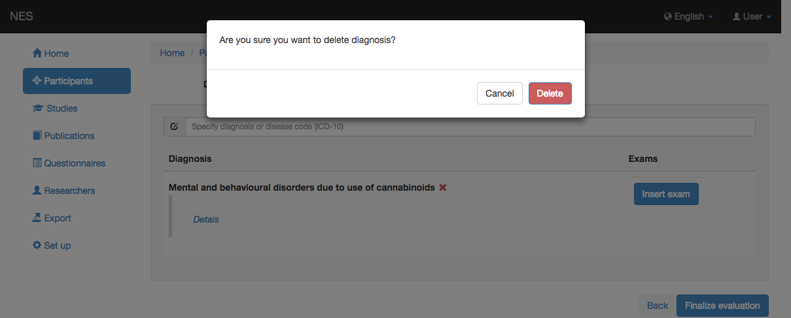

.. _including-diagnosis-details:

Including Diagnosis Details
```````````````````````````

Clicking the Details link, a new pop-up window shows up, allowing you to include information in the optional Observation and Date text fields.

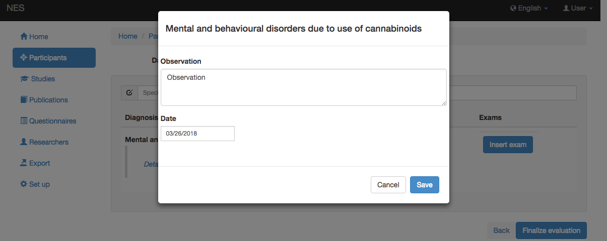

After saving, the provided information is shown in the left side of the diagnosis section.

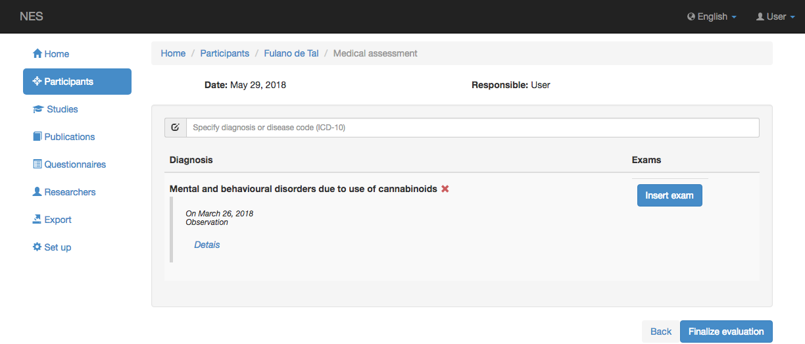

.. including-a-new-exam:

Including a New Exam
````````````````````

Click the `Add new Exam` button to include exam information related to the selected diagnosis, and enter the following information: 

* Date (obligatory);
* Performed in (place where exam was made);
* Description (obligatory);
* CRM (Doctor's ID);
* Doctor's name; and
* Attachments - files with information about the exam (results) (obligatory).

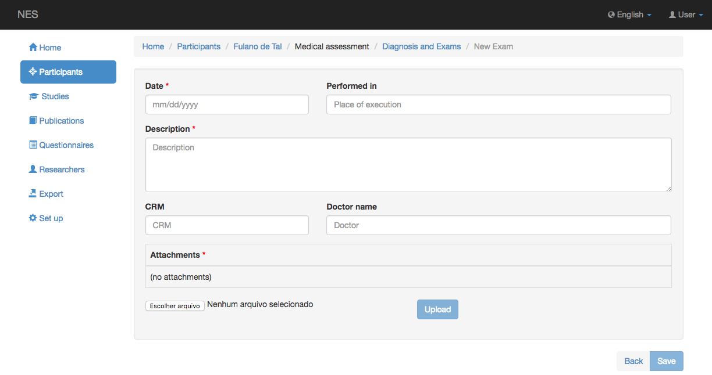

Click on `Choose File` to choose the file with information about the exam. Click on the `Open` button to select the file.

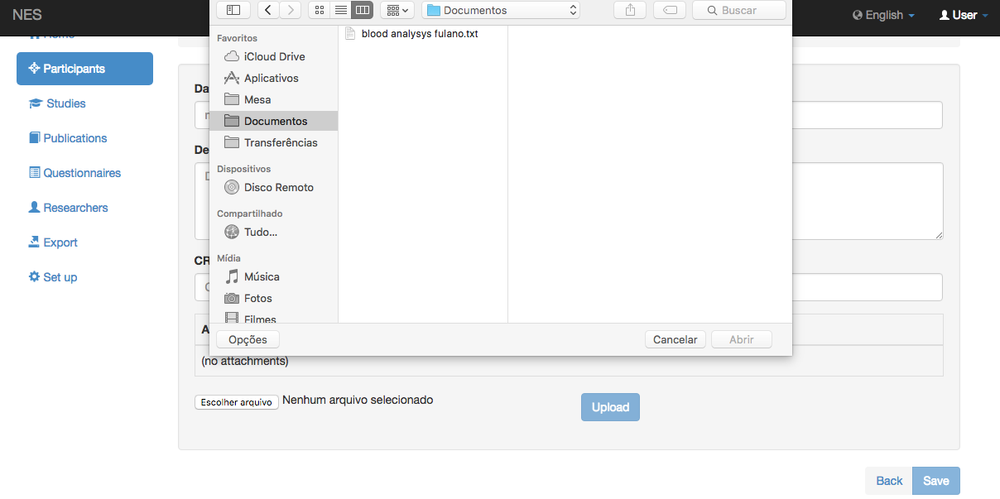

You will see the name of file close to the button. 

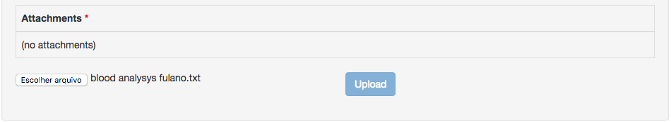

Click the `Save` button at the bottom right of the page to include the file as an attachment. A message to confirm the file attachment is presented (in green, on the top right of the screen) and the file will be inserted into the attachment area. You can include as many files as necessary.

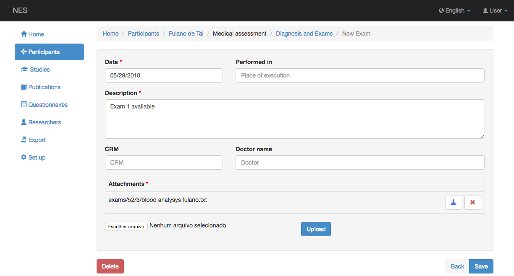

Now you can either download the file (by clicking the |download icon| icon)  or delete it (by clicking the |delete icon| icon).

.. |delete icon| image:: ../../_img/delete_icon.png

To go back to the page of the diagnosis you may click in the `Back` button. There you will see the attached exam.

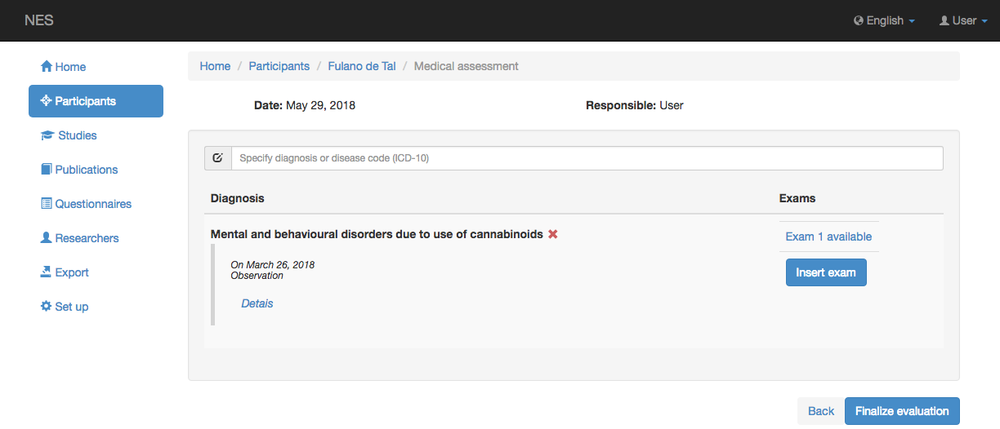

You can include more exams if necessary.

.. note:: It is important to note that, once you click `Finalize evaluation`, you will not to be able to edit information again. So, pay attention to this, and only click that button when you are really sure about the diagnosis and exams you entered.