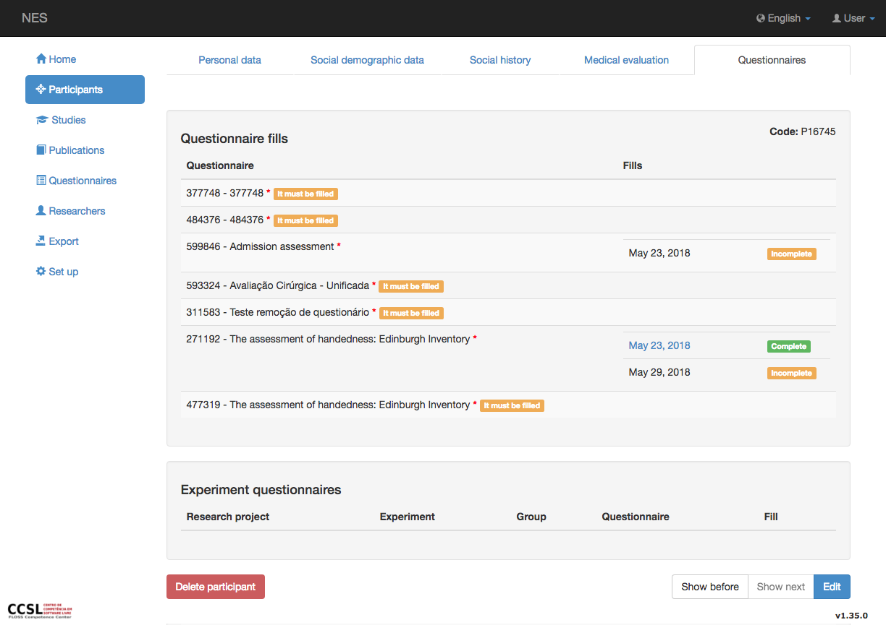
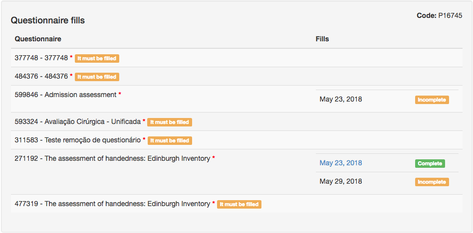
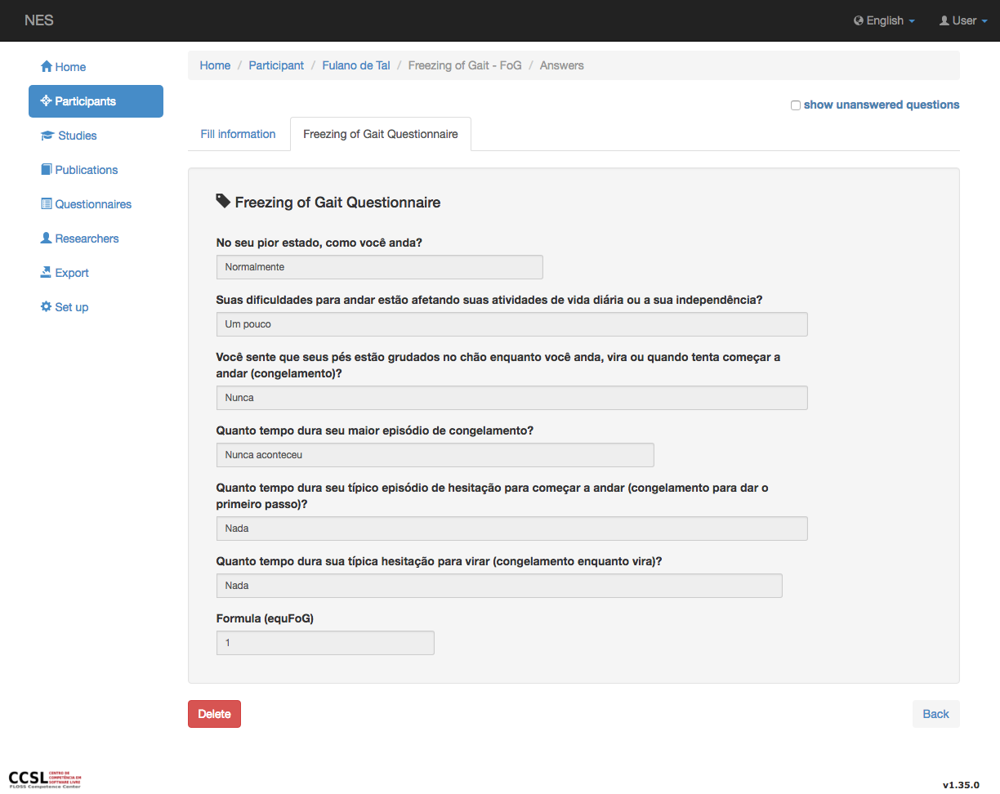
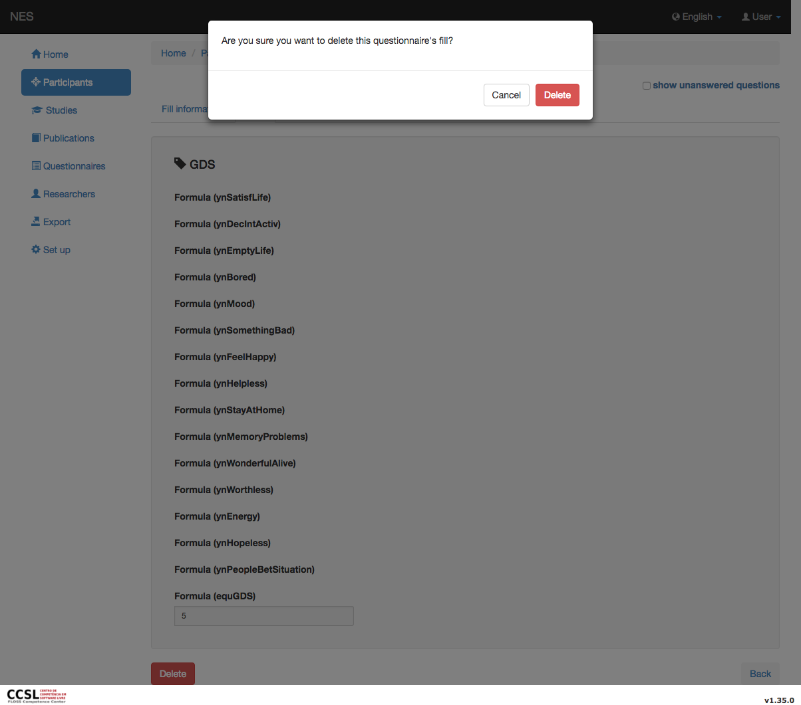
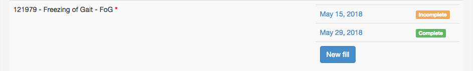
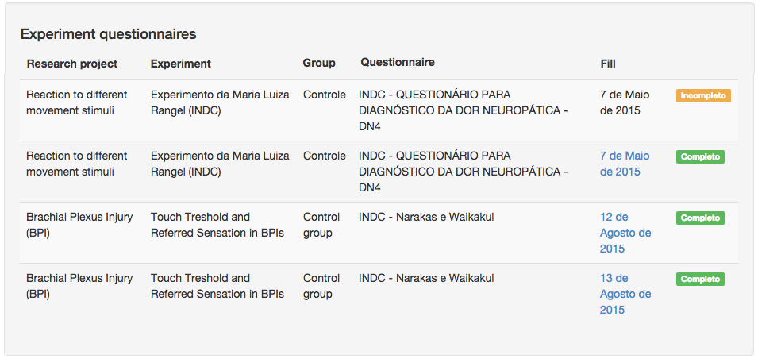
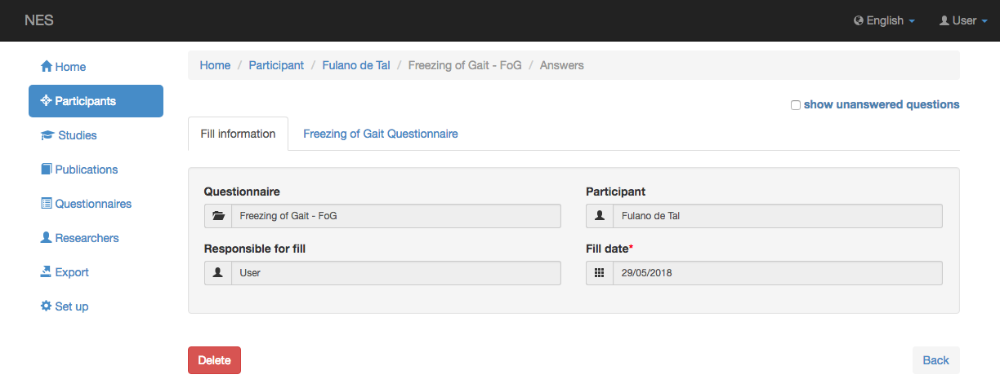
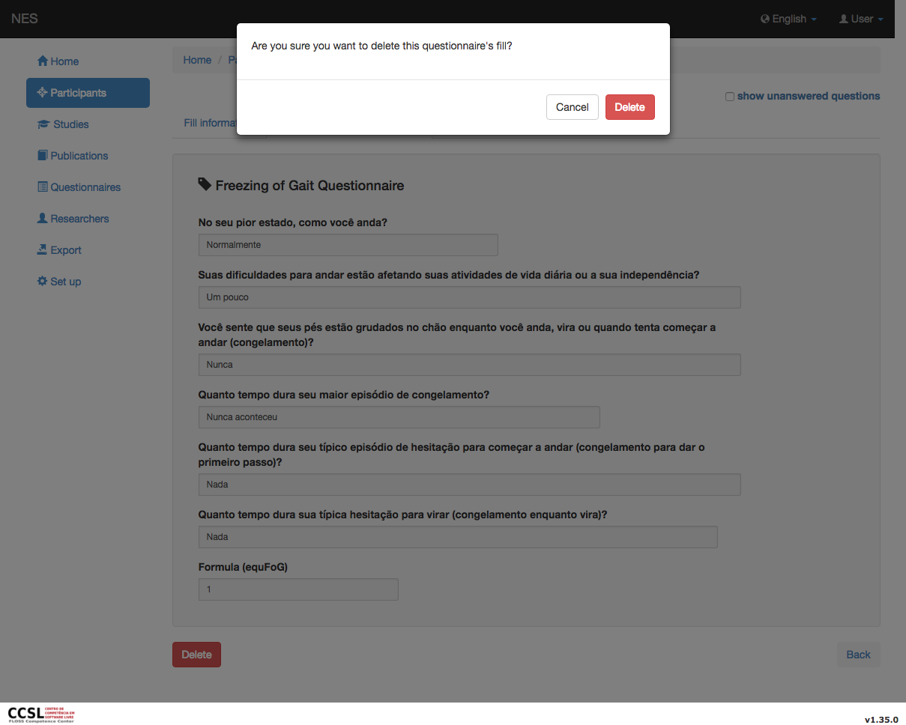

.. _participant-questionnaires:

Cuestionarios para participantes
==========================

Cuestionarios es la pestaña donde puede ver o agregar las respuestas de los participantes a los cuestionarios (rellenos).

.. _participant-questionnaires-tab:

Ficha Cuestionarios de participantes
------------------------------

Puede visitar :ref:`Participants`  para entender como navegar entre las fichas.



Estos tipos de cuestionarios se discuten en el :ref:`questionnaires` .

.. _list-of-questionnaire-fills:

Lista de cumplimentaciones de cuestionarios
```````````````````````````

Esta sección muestra una lista de todos los cuestionarios que el participante ya ha llenado y los que el participante aún tiene que responder. 



En esta lista se ven 3 campos diferentes por línea:

* Cuestionario - el nombre del cuestionario;
* Rellenos: la fecha en que el participante completó el cuestionario (el valor predeterminado es la fecha en que comenzó a dar las respuestas);
* Mensaje - este es un indicador que informa si el participante completó el cuestionario. El mensaje es amarillo si el cuestionario está incompleto y aún tiene que ser llenado, y es verde si el participante completó el cuestionario al menos una vez. 

Como ejemplo, en la imagen de arriba, ves 2 cuestionarios:

* el primer cuestionario tiene 3 rellenos, los dos primeros rellenos se completan y el tercero está incompleto
* el segundo cuestionario no se ha rellenado antes, por lo que no hay información de rellenos, sino el mensaje que informa una falta de relleno (en amarillo).  

.. _viewing-a-participant-questionnaire:

Visualización de un cuestionario
```````````````````````

Si el cuestionario está completamente cumplimentados (mensaje verde), el campo `Fills`  se convierte en un enlace que te lleva a la pantalla que muestra las respuestas dadas por el participante.



.. _deleting-a-participant-questionnaire:

Eliminación de un cuestionario
````````````````````````

Mientras visualiza un cuestionario, si tiene derecho :ref:`permissions`, Puede eliminar el cuestionario haciendo clic en el botón rojo `Delete`.



Haga clic en `Delete` para confirmar la eliminación del cuestionario o `Cancel` si no desea eliminarlo.

.. _answering-a-questionnaire:

Responder a un cuestionario
`````````````````````````

Al entrar en el :ref:`edition mode <creating-and-editing-a-participant>` se pueden tomar diferentes acciones:

* Si el estado de llenado está completo (mensaje verde) - puede ver el relleno del cuestionario (ver `Viewing a Questionnaire`_). En este caso, no podrá cambiar el relleno del cuestionario.

* Si el estado de relleno está incompleto (mensaje amarillo) - puede hacer clic en el campo `Fill` enlace y acceda al cuestionario una vez más (ver `Editing a Questionnaire`_).

* Comience un nuevo relleno - puede ver `Including a New Fill`_, para más información.

.. _editing-a-questionnaire:

Edición de un cuestionario
```````````````````````

Hacer clic en el enlace con la fecha de inicio del cuestionario rellenando un cuestionario incompleto le llevará a un `Fill information` página donde se pueden ver datos sobre el participante y el responsable de rellenar el cuestionario; Haciendo clic en `Continue filling` te llevará a una página donde podrás rellenar el cuestionario.

.. _including-a-new-fill:

Incluyendo un nuevo relleno
````````````````````

Un boton `New fill` está disponible para usuarios con derecho :ref:`permissions`. Puedes incluir tantos rellenos como quieras.



Por favor vea :ref:`managing-a-questionnaire-fill` para ver los procedimientos para iniciar y continuar un cuestionario, rellene o qué hacer después de cerrar la pestaña LimeSurvey.

.. _list-og-experiment-questionnaires:

Lista de cuestionarios de experimentos
`````````````````````````````````



Esta lista es un poco diferente de la lista de cuestionarios que se completa, porque muestra información sobre cuestionarios que son específicos utilizados dentro de los experimentos.

La sección de cuestionarios de experimentos enumera los siguientes campos (ordenados por fecha):

* :ref:`Research project <studies>`
* :ref:`experiments`
* :ref:`group-of-participants`
* :ref:`Questionnaire <managing-steps-for-experimental-protocol>`
* Rellenar (fecha en que se llenó un cuestionario)
* mensaje (indicador que informa si el participante rellenó el cuestionario, como se explica `here <list-of-questionnaire-fills>`_)

Incluso si estás en el :ref:`edition mode <creating-and-editing-a-participant>` solo puedes ver información aquí. Si desea agregar/continuar/quitar un relleno de cuestionario de experimento, consulte :ref:`questionnaires-of-the-experimental-protocol`.

.. _viewing-a-questionnaire-of-experiment:

Visualización de un cuestionario de experimento
`````````````````````````````````````

Cuando el cuestionario esté completamente lleno, un enlace en el `Date` el campo está habilitado y puede ver los detalles del relleno del cuestionario.



Esta imagen muestra 2 pestañas diferentes: 

* Completar información: nombre del cuestionario, participante que respondió el cuestionario, responsable de completarlo y fecha en que se completó el cuestionario.
* Detalles del cuestionario: esto cambia de un cuestionario a otro. Muestra las respuestas al cuestionario específico.

.. _deleting-a-questionnaire-of-experiment:

Eliminación de un cuestionario de experimento
``````````````````````````````````````

Puede eliminar un cuestionario de experimento si tiene derecho. Clic `Delete` y aparecerá un mensaje de confirmación:



Haga clic en cualquiera de los dos en el botón `Delete` para confirmar la eliminación del cuestionario o en el botón `Cancel` si no desea eliminarlo.