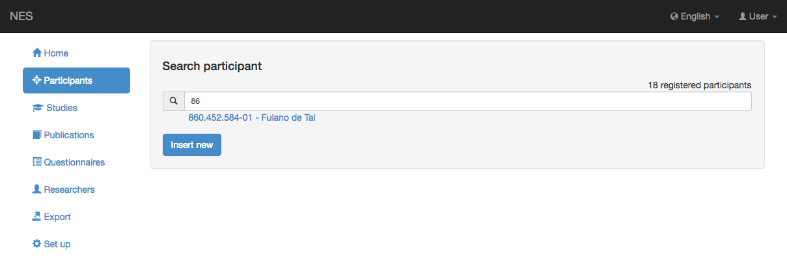
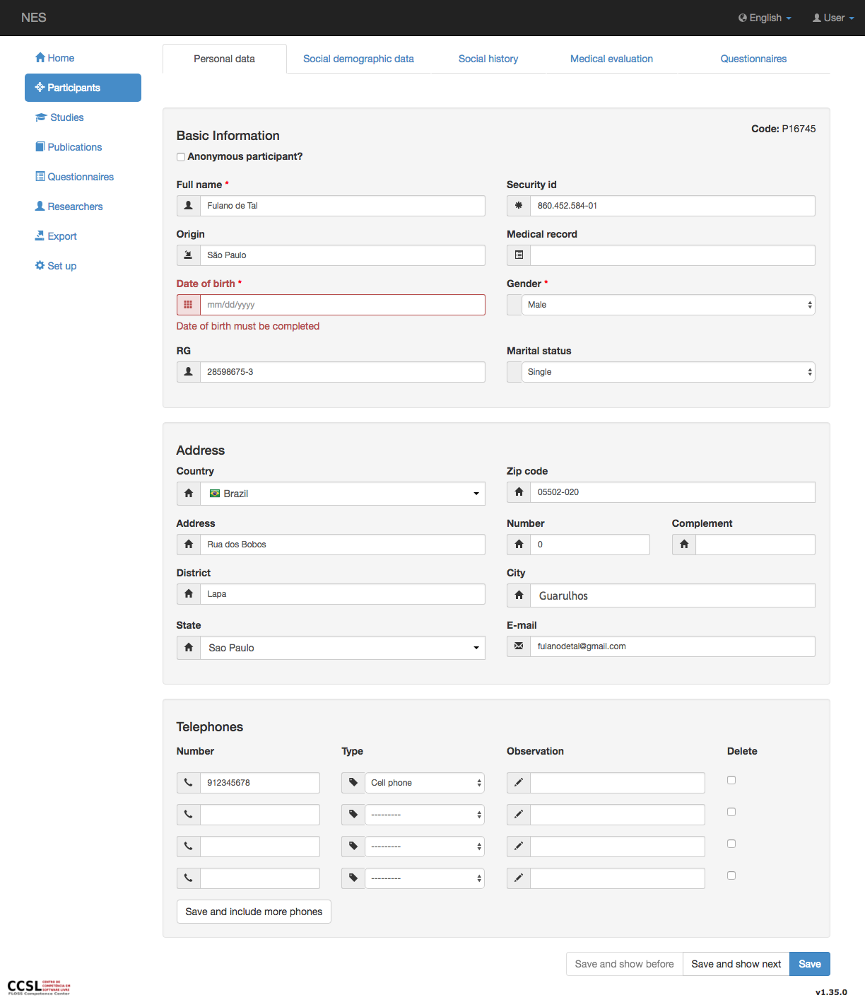

.. _participants:

Participantes
============

Participante es una persona que participa en :ref:`experiments`.

.. _searching-a-participant:

Buscando un Participante
-----------------------

Para acceder a los participantes registrados en NES, haga clic en el item de menu  `Participants`  y la pantalla de `Search Participant` aparecerá. La mejor manera de encontrar un participante es escribir parte del nombre o el número de ID y elegir un nombre / ID de la lista que aparece.

También puede insertar un nuevo participante, si tiene permiso para ello (consulte :ref:`permissions` para obtener más información), haciendo clic en el boton `Insert new` . 

.. _viewing-a-participant:

Visualización de un participante
---------------------

Después de seleccionar un participante de la lista de resultados de búsqueda, se muestra la información personal del participante.

.. image:: ../../_img/participant_personal_data.png

Puede eliminar al participante si tiene el permiso correcto. El boton `Delete`  aparecerá en este caso (en rojo, en la parte inferior de la página), pero no aparecerá si se encuentra en el :ref:`edition mode <creating-and-editing-a-participant>`.

La información del participante se divide en las siguientes pestañas:

* :ref:`personal-data`
* :ref:`social-demographic-data`
* :ref:`social-history`
* :ref:`medical-evaluation`
* :ref:`participant-questionnaires`

Puede cambiar de una pestaña a otra de dos maneras diferentes: haciendo clic en el nombre de la pestaña o utilizando los botones de navegación en la parte inferior derecha de la pantalla.

Con los permisos correctos, es posible eliminar al participante (botón rojo).

Haga clic en el botón `Edit` para cambiar la información del participante.

.. _creating-and-editing-a-participant:

Creación y edición de un participante
----------------------------------

Si hace clic en el botón `Insert new` de la pantalla :ref:`searching-a-participant`  o el boton `Edit` al ver a un participante, NES entra en el modo de edición.

Puede ver que los botones inferior derecho cambiaron sus descripciones para permitirle guardar nueva información, y que el `Delete` se eliminó el botón en la parte inferior izquierda:

A continuación, puede incluir nueva información o cambiar la información existente. Los errores encontrados se presentan para su corrección (en rojo).

Después de ingresar nuevas informaciones, puede hacer clic en el botón *Guardar* para guardarlas y salir del modo de edición.

.. toctree::
   :maxdepth: 1
   :titlesonly:
   :hidden:

   personaldata
   socialdemographicdata
   socialhistory
   medicalevaluation