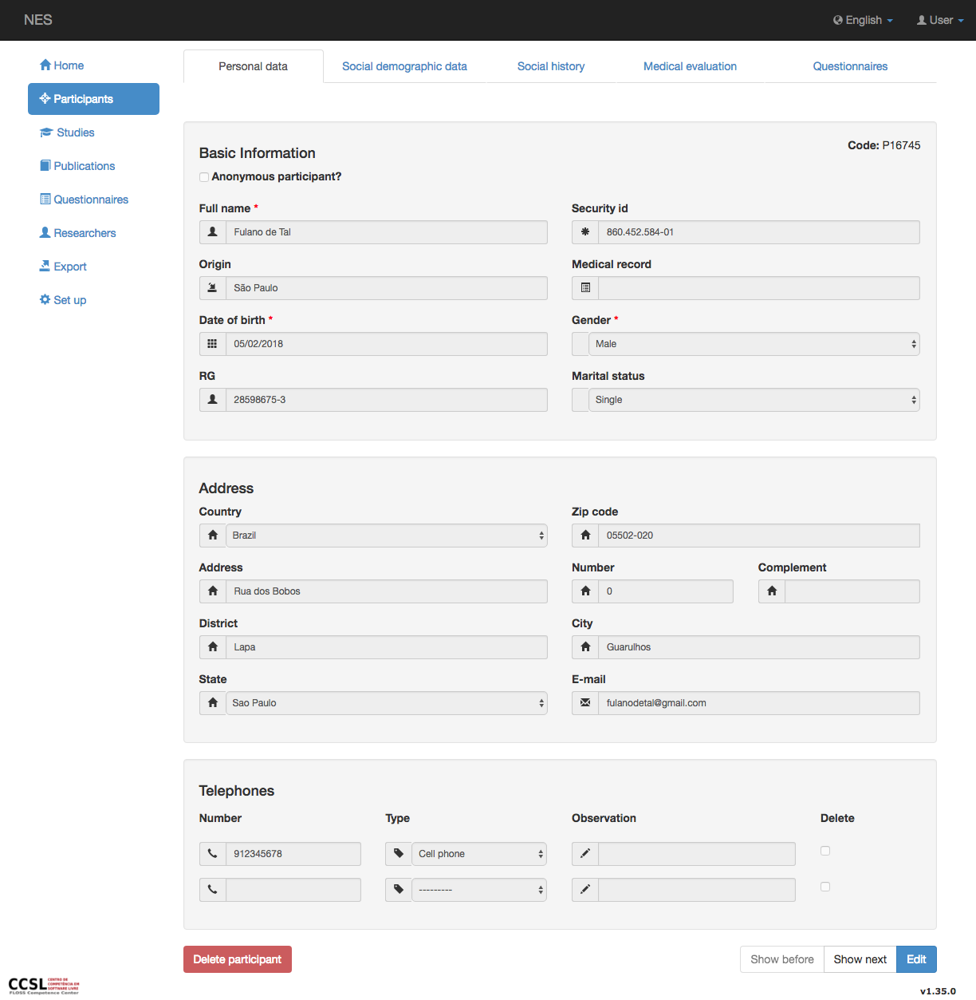
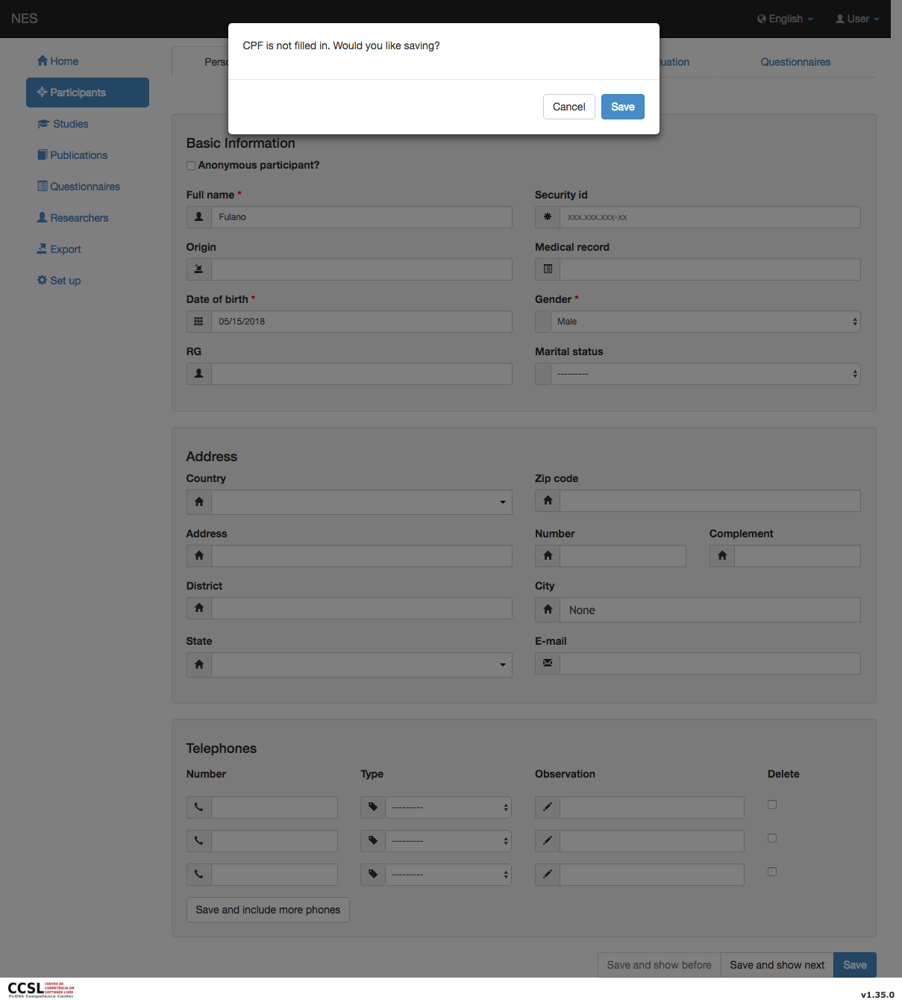
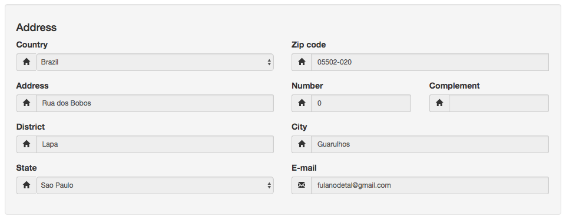
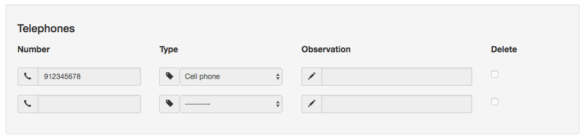
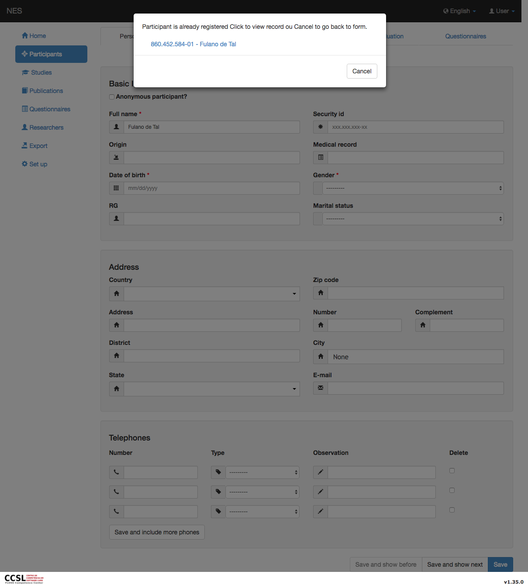

.. _personal-data:

Datos Personales
=============

Datos personales es la pestaña donde puede ver o actualizar la información básica, la dirección y los números de teléfono del participante.

Pestaña Datos personales
-----------------
Puedes visitar el :ref:`participants` para comprender cómo navegar entre pestañas.



Información basica
`````````````````

En esta sección, puede visualizar/editar la información básica del participante:

* Nombre completo (obligatorio);
* ID (no obligatorio, pero recomendado);
* Origen;
* Registro médico;
* Fecha de nacimiento (obligatoria);
* Género (obligatorio);
* IDENTIFICACIÓN; y
* Estado civil.



Dirección 
```````

La sección de dirección contiene (toda la información es opcional):

* País;
* Código postal;
* Dirección;
* Número;
* Complemento;
* Distrito;
* Ciudad;
* Estado; y
* Correo electrónico.



El campo de código postal tiene una máscara que obliga al campo a aceptar solo números con 8 dígitos.

Teléfonos
``````````

La sección de teléfonos contiene:

* Número;
* Tipo;
* Observación; y
* Eliminar - es posible eliminar teléfonos específicos.



Tienes que hacer clic en el botón `Save and include more telephones`  (:ref:`only in edition mode <creating-and-editing-a-participant>`) si necesita más espacio para ingresar nuevos teléfonos. Si desea eliminar un número de teléfono, marque la casilla de eliminación del mismo y haga clic en este botón también.

.. _participant-homonym:

Participante Homónimo
```````````````````

Cuando crea un nuevo participante, NES busca homónimos por el nombre completo o el número CPF que se registró previamente en el sistema.

Si esto ocurre, se presenta un mensaje de advertencia:



Puede continuar insertando un nuevo participante (haga clic en `Cancel` ) o haga clic en el enlace del nombre del ID del participante para ver el registrado.