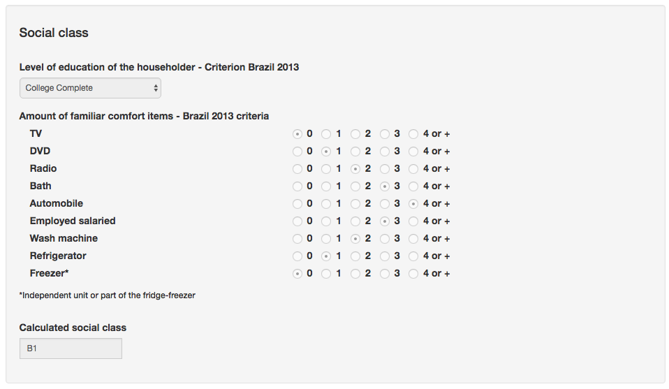

.. _social-demographic-data:

Social Demographic Data
=======================

Social Demographic data is the tab where you can view or update, among other things, participant's place of birth, profession, religion, race, and social class.

Social Demographic Data Tab
---------------------------

You can visit the :ref:`participants` page to understand how to navigate between tabs.

.. image:: ../../_img/participant_socialdemographic_data.png

Social demographic data tab is divided into the following sections:

Basic Information
`````````````````

In this section, you can see or edit some social demographic data of the participant:

* Natural of;
* Citizenship;
* Profession;
* Occupation;
* Indication if the participant receives a benefit from government;
* Payment method;
* Religion; and
* Skin tone.

.. image:: ../../_img/participant_socialdemographic_basic_info.png

Social Class 
````````````

The address section contains (all information is optional):

* Schooling;
* Amount of comfort items; and
* Social class.

This section calculates the social class of the participant according to the `Critério Brasil 2013` classification. For that, you have to inform the amount comfort items that the participant's family has, like TV, DVD, Radio, number of bathrooms in the house, Automobile, number of housekeeping employees, Wash machine, Refrigerator and Freezer. You can select from the options the quantities for each item. The resulting social class is shown in the `Calculated social class` field.

