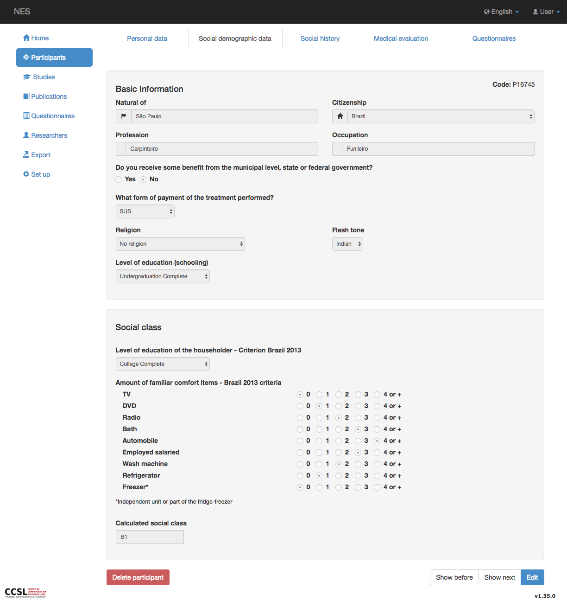
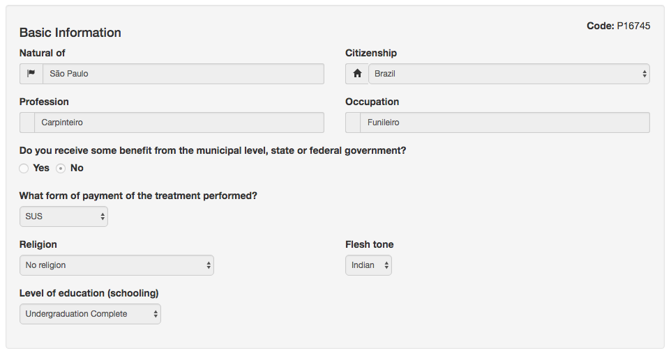

.. _social-demographic-data:

Datos demográficos sociales
=======================

Los datos demográficos sociales son la pestaña donde puede ver o actualizar, entre otras cosas, el lugar de nacimiento, la profesión, la religión, la raza y la clase social del participante.

Pestaña Datos demográficos sociales
---------------------------

Puedes visitar la pagina :ref:`participants` para comprender cómo navegar entre pestañas.



La pestaña de datos demográficos sociales se divide en las siguientes secciones:

Información básica
`````````````````

En esta sección, puede ver o editar algunos datos demográficos sociales del participante:

* Natural de;
* Ciudadanía;
* Profesión;
* Ocupación;
* Indicación si el participante recibe un beneficio del gobierno;
* Forma de pago;
* Religión; y
* Tono de piel.



Clase social 
````````````

La sección de dirección contiene (toda la información es opcional):

* Escolarización;
* Cantidad de artículos de confort; y
* Clase social.
