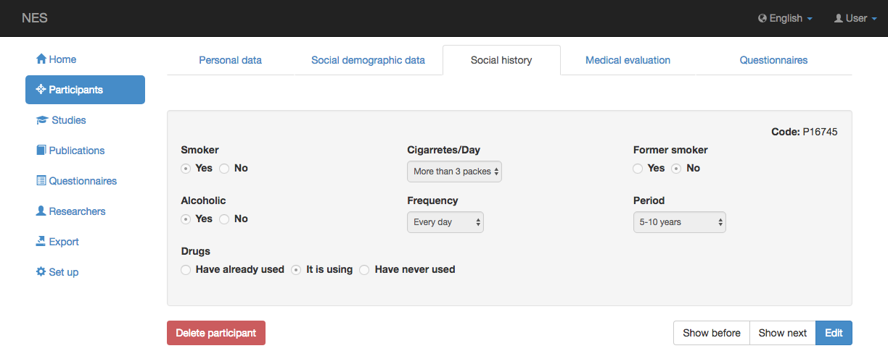

.. _social-history:

História Social
==============

Historial social es la pestaña donde puede ver o actualizar el historial de consumo de alcohol, cigarros y otras drogas de los participantes.

Pestaña Historial social
------------------

Puedes visitar el :ref:`participantes` para comprender cómo navegar entre pestañas.

La pestaña Historial social tiene una sola sección, con los siguientes campos de información:

- **Fumador**, sí o no
 - Cantidad de cigarrillos por día que el participante fuma actualmente; y
 - Una indicación si el participante es un ex fumador.

- **Alcohólico**, sí o no
 - Frecuencia actual de uso (todos los días, a veces, fines de semana); y
 - El tiempo transcurrido desde el inicio del uso (menos de 1 año, 1-5 años, 5-10 años, más de 10 años).

- **Drogas**
 - Una indicación de si el participante nunca ha usado, actualmente usa o ha usado otras drogas en algún momento de la vida.