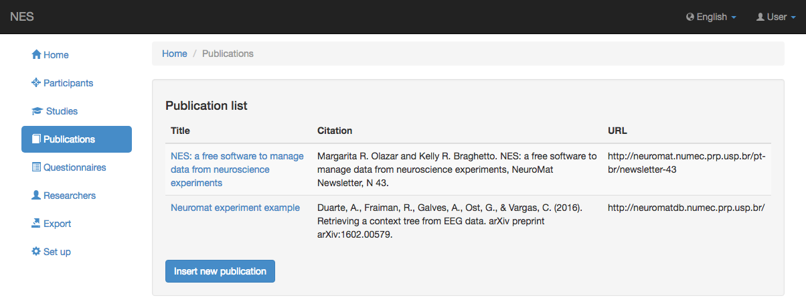

.. _publications:

Publicaciones
============

Los artículos, trabajos, resúmenes y/o cualquier material relacionado con los estudios realizados por el laboratorio pueden ser registrados en NES. Esta funcionalidad se rellenará con la siguiente información:

* **Título:** el título del artículo, artículo, resumen o material.
* **Citación:** este campo se refiere a cómo funciona la publicación debe ser citada por otros.
* **URL:** la URL del sitio web donde se asienta la publicación.

