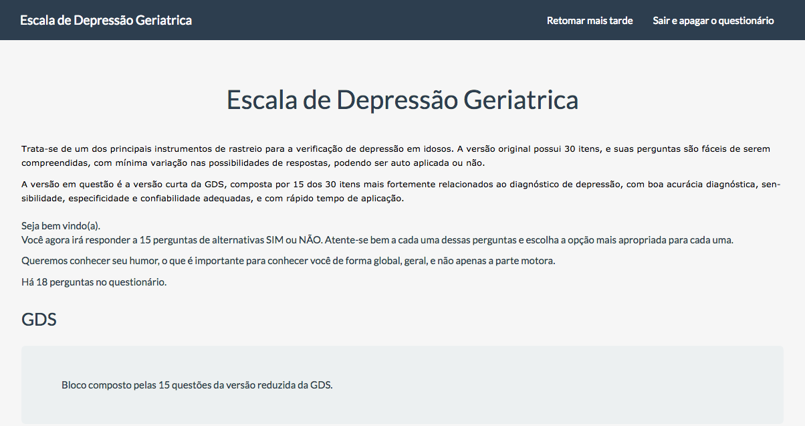
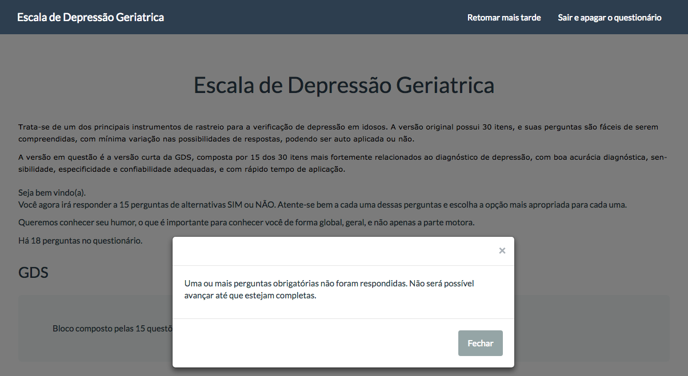
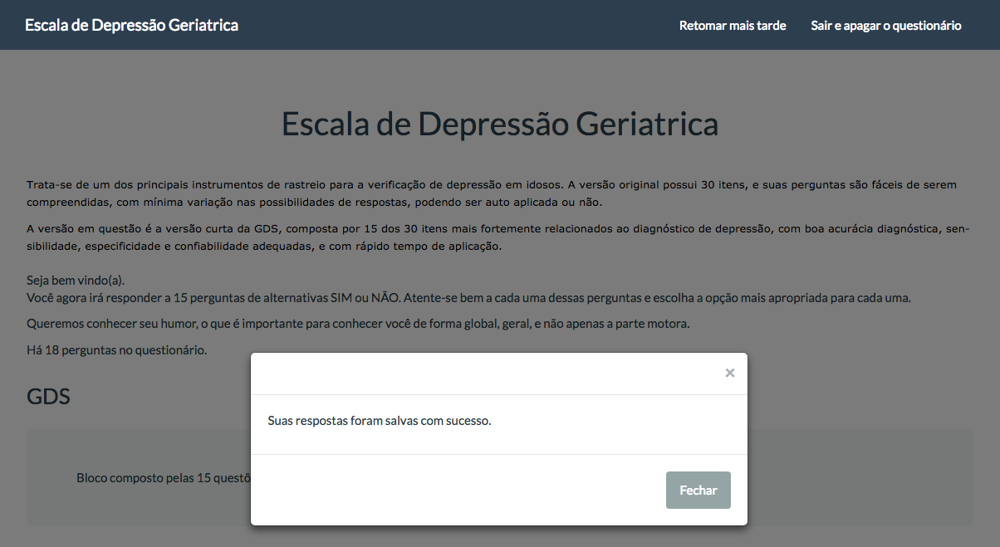
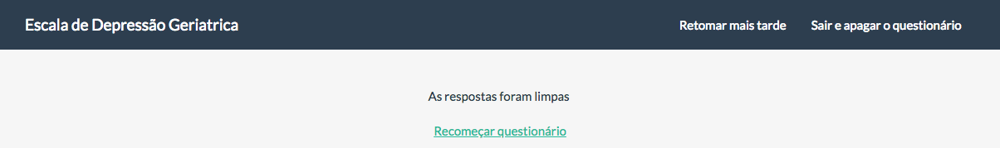
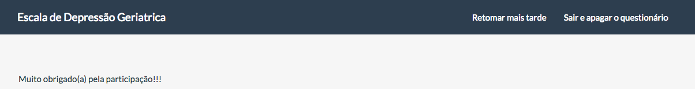

.. _answering-a-limesurvey-questionnaire:

Responder a un cuestionario de LimeSurvey
====================================

NES interactúa con LimeSurvey para admitir los cuestionarios de llenado o experimento requeridos (consulte :ref:`questionnaires`, :ref:`participant-questionnaires`, y :ref:`questionnaires-of-the-experimental-protocol` para más informacion).

.. _answering-a-questionnaire-at-limesurvey:

Responder a un cuestionario en LimeSurvey
---------------------------------------

Este es un ejemplo de un cuestionario de LimeSurvey:

Al principio, LimeSurvey presenta la cantidad de preguntas presentadas en el cuestionario.

Cada cuestionario está construido de una manera diferente, por lo que puede desplazarse hacia abajo a través de la ventana o si hay un boton `Next` , puede hacer clic en él para comenzar a responder el cuestionario en LimeSurvey.

De acuerdo con cada tipo diferente de cuestionario, usted informa la(s) respuesta(s) deseada(s) y elige uno de los botones que se describen a continuación, con el fin de tomar la acción correcta:

* **Anterior, Siguiente:** Navegue por los grupos de preguntas mostrando la página anterior o siguiente;
* **Enviar (Enviar):** Indica que terminó de responder el cuestionario (algunos cuestionarios no presentan este botón);
* **Reanudar más tarde (Retomar mais tarde):** Le permite dejar de responder y continuar más tarde;
* **Encuesta de salida y borrado (Sair e apagar o questionário):** Elimina todas las respuestas ya dadas.

.. _correcting-questionnaire:

Cuestionario de corrección
------------------------

A menos que responda a todas las preguntas obligatorias (indicadas con un "*" rojo), no puede continuar a la página siguiente ni enviar el cuestionario.

.. _answering-question-later:

Responder preguntas más tarde
-------------------------

Si decide dejar de responder al cuestionario haciendo clic en el botón `Resume later` , LimeSurvey guarda las respuestas ya dadas.

Podrá regresar más tarde y continuar completando el cuestionario desde el punto en que se detuvo la última vez. Si hace clic en esta opción, NES indica que su cuestionario no se ha respondido completamente.

.. _exiting-and-clearing-questionnaires:

Cuestionarios de salida y compensación
-----------------------------------

Click en el boton `Exit and clear survey` si desea salir de LimeSurvey descartando las respuestas ya dadas. Es importante tener en cuenta que esto no va a eliminar el relleno en NES, tendrá efecto solo en LimeSurvey.

.. _finishing-questionnaire:

Cuestionario de finalización
-----------------------

Cuando finaliza el proceso, se guardan las preguntas y se presenta un mensaje para indicarlo.

Algunos cuestionarios presentarán un boton `Submit` que se debe hacer clic para terminar el cuestionario, pero otros no lo harán; en este caso, cuando se llega a la última página, se presenta la pantalla de arriba.