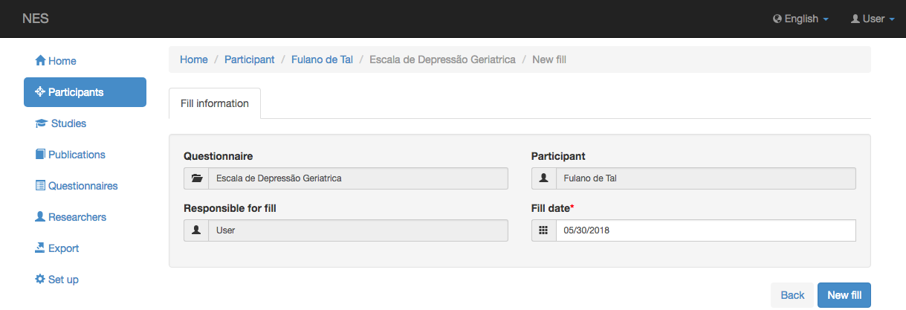
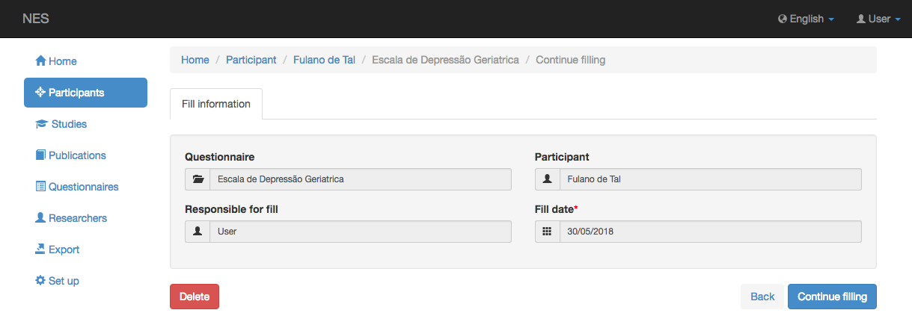
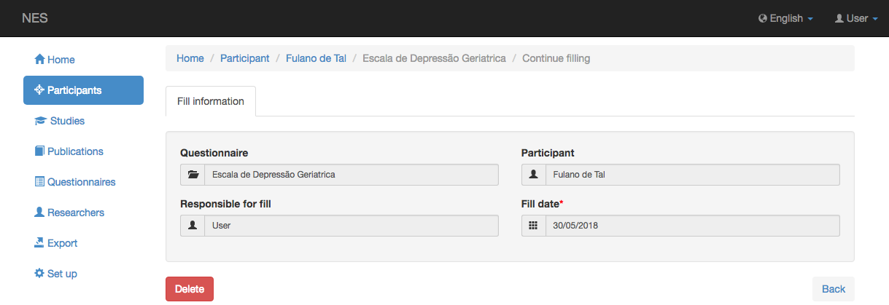

.. _managing-a-questionnaire-fill:

Administración de un relleno de cuestionario
=============================

Esta página ilustra los pasos que implican rellenar un cuestionario:

* `Starting a New Fill`_
* `Continuing a Fill`_
* `After Leaving LimeSurvey`_

Esta página está referenciada por 2 páginas diferentes de esta documentación:

* :ref:`participant-questionnaires`
* :ref:`questionnaires-of-the-experimental-protocol`

.. _starting-a-new-fill:

Inicio de un nuevo relleno
-------------------

Si hace clic en el boton `New fill` , se muestra la siguiente información:

* Nombre del cuestionario (solo lectura);
* Nombre del participante (solo lectura);
* Usuario responsable (solo lectura);
* Fecha de cumplimentación del cuestionario

De forma predeterminada, la fecha se rellena con la fecha actual, pero puede cambiarla.

Si hace clic en `New fill` en esta pantalla, será redirigido a :ref:`limesurvey` cuestionario, que puede ser respondido por el participante (ver :ref:`answering-a-limesurvey-questionnaire`, para detalles).

Cuando termine de responder el cuestionario en LimeSurvey, puede ir a `After Leaving LimeSurvey`_.

.. _continuing-a-fill:

Continuar un relleno
-----------------

Si en algún momento desea continuar completando un cuestionario en LimeSurvey, haga clic en el botón `Continue fill` botón. Se le redirigirá al cuestionario de LimeSurvey ( ver :ref:`answering-a-limesurvey-questionnaire`, para detalles).

Cuando termine de responder el cuestionario en LimeSurvey, puede ir a `After Leaving LimeSurvey`_.

.. _after-leaving-limesurvey:

Después de salir de LimeSurvey
------------------------

Una vez que haya cerrado la pestaña LimeSurvey, ya sea porque terminó de responder el cuestionario o porque desea continuar más tarde, la pestaña NES mostrará un boton `Back` .

Click en el boton `Back` para ver la pantalla de donde vienes.