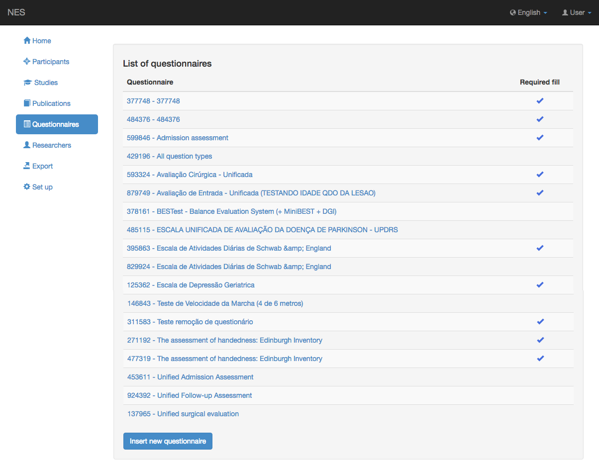
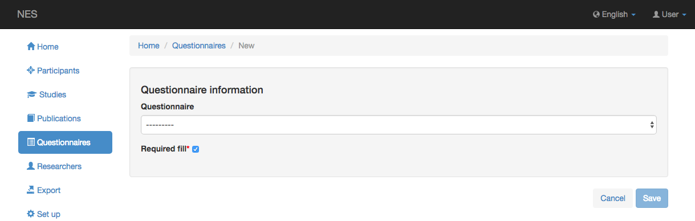
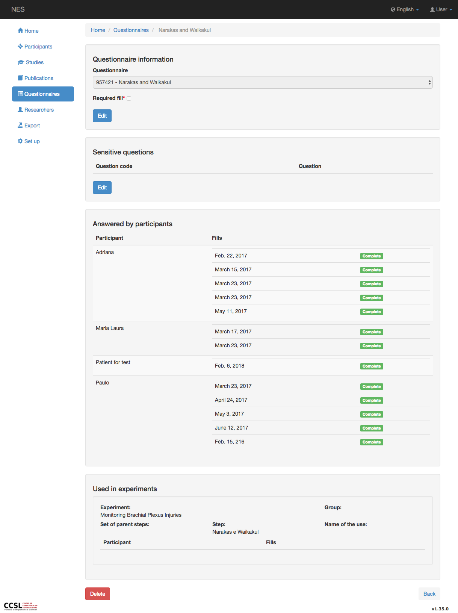
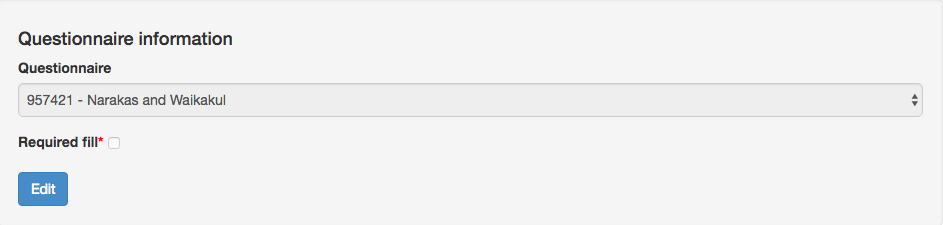
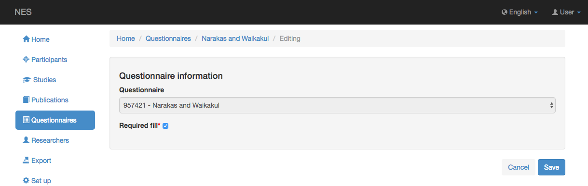
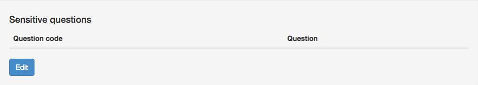
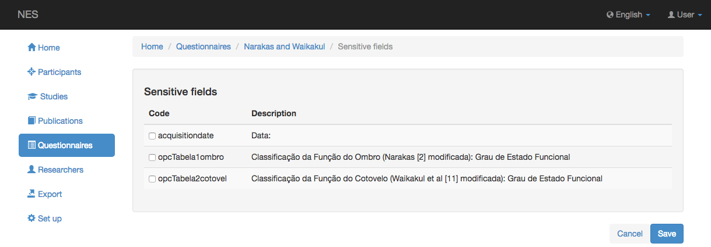
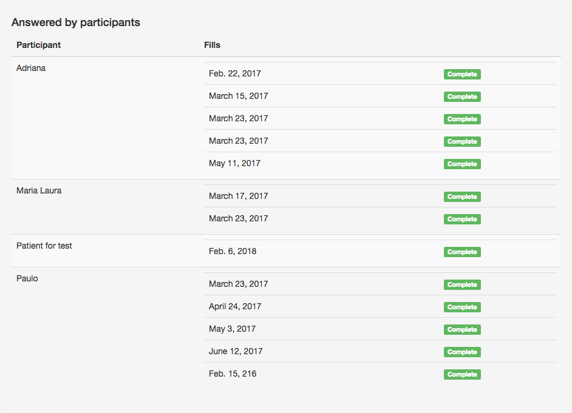
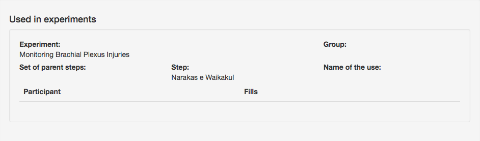
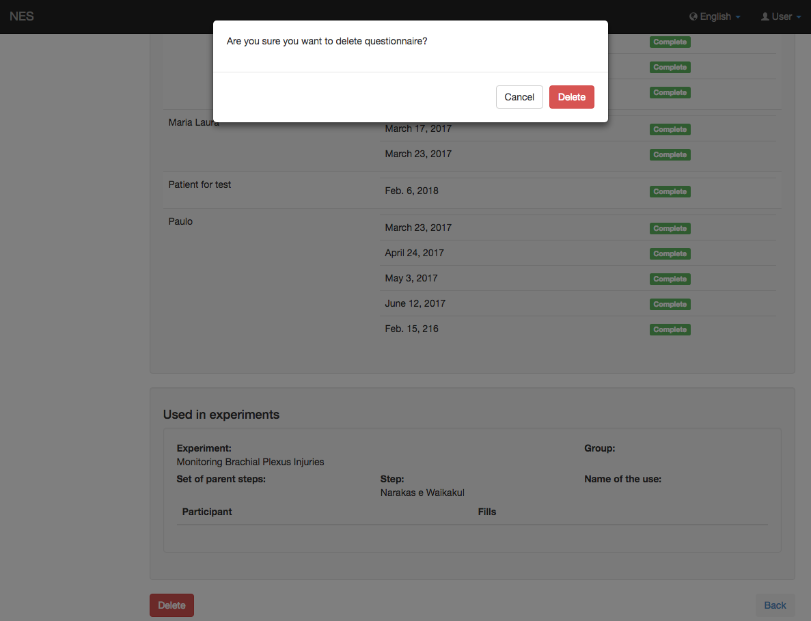

.. _questionnaires:

Cuestionarios
==============

Los cuestionarios son una forma muy flexible de recopilar datos de un participante. En NES, un cuestionario puede o no haber requerido llenado. Los cuestionarios de experimento se configuran como un paso en el protocolo experimental de un :ref:`group <group-of-participants>`. Los cuestionarios que no han requerido llenado son útiles para recopilar datos que no están previstos en el :ref:`participant's section <participants>`. Cualquier cuestionario puede tener ambas funciones.

.. _questionnaires-list:

Lista de cuestionarios
-------------------

Para acceder a todos los cuestionarios registrados en NES, haga clic en el menu `Questionnaires` y en  `Questionnaire List` aparecerá mostrando la información sobre cada cuestionario, a saber: `limesurvey ID`, `title`, si esto `fill is required` y si el `questionnaire is or isn’t active` en LimeSurvey. Ahora, como esta es una llamada costosa a la API de LimeSurvey, la información se guarda en la base de datos en el momento de su registro en NES. Si desea actualizar la información de esa lista, deberá hacer clic en el botón `Update` en la parte inferior de la página. Esto puede tomar un tiempo dependiendo de cuántos cuestionarios haya registrado.



Esta pantalla le permite:

* :ref:`Insert a New Questionnaire <inserting-a-new-questionnaire>`
* :ref:`View a Questionnaire <viewing-a-questionnaire>`

.. _inserting-a-new-questionnaire:

Inserción de un nuevo cuestionario
-----------------------------

Click en el boton `Insert new questionnaire` para incluir un nuevo cuestionario.



En la lista de cuestionarios, seleccione el cuestionario que desea registrar. Los cuestionarios de esta lista se crearon previamente en LimeSurvey (véase :ref:`limesurvey` para aprender a crear un nuevo cuestionario).

Si este cuestionario ha requerido ser llenado, debe hacer clic en el checkbox `Required fill` .

Click en `Save` para incluir el cuestionario, o `Cancel` para volver a la página anterior sin guardar.

.. _viewing-a-questionnaire:

Visualización de un cuestionario
-----------------------

Para ver más información sobre un cuestionario específico, haga clic en el enlace del cuestionario.



Estás viendo 4 secciones:

* `Questionnaire Information`_
* `Sensitive Questions`_
* `Answered by Participants`_
* `Used in Experiments`_

.. _questionnaire-information:

Información del cuestionario
`````````````````````````



Si se dá click en el boton `Edit` , puede cambiar el tipo de cuestionario. Marque la casilla de verificación para indicar que este cuestionario debe ser respondido por todos los participantes registrados en NES. Desmarque la casilla de verificación si este cuestionario solo se puede responder desde dentro de un experimento. Los cuestionarios que han requerido llenado también se pueden usar dentro de un experimento.



.. _sensitive-questions:

Preguntas delicadas
```````````````````



Si le dá click en el boton `Edit` , puede elegir qué preguntas son sobre información confidencial. Marque la casilla de verificación para indicar que la pregunta debe marcarse como sensible. Desmarque la casilla de verificación de lo contrario. Haga clic en el boton `Save` para marcar las preguntas delicadas, o `Cancel` Para volver a la página anterior sin guardar.



.. _answered-by-participants:

Contestado por los participantes
````````````````````````

Esta sección muestra todos los participantes que han rellenado el cuestionario. Incluso si el cuestionario ya no tiene el llenado requerido, los rellenos realizados mientras se requería también se enumeran aquí. Si ha requerido relleno, también verá a todos los participantes que deben responder a este cuestionario.



No puedes comenzar o continuar un relleno aquí. Si quieres llenarlo, mira la sección :ref:`answering-a-questionnaire` en la página Cuestionarios de los participantes.

.. _used-in-experiments:

Utilizado en experimentos
```````````````````

Esta sección muestra en qué protocolos experimentales se utiliza este cuestionario y el nombre del participante que respondió en él.



Esta es solo una sección informativa. Para poder iniciar o continuar un relleno o para obtener más información sobre los campos ver :ref:`questionnaires-of-the-experimental-protocol`.

.. _deleting-a-questionnaire:

Eliminación de un cuestionario
````````````````````````

Si tiene derecho :ref:`permissions`, Puede dejar de utilizar este cuestionario en NES haciendo clic en el botón `Delete` .



Se mostrará una ventana emergente de confirmación. Haga clic en el botón `Delete`  para confirmar la eliminación o el botón `Cancelar` si no desea eliminar el cuestionario.

.. toctree::
   :maxdepth: 1
   :titlesonly:
   :hidden:

   managingaquestionnairefill
   answeringalimesurveyquestionnaire