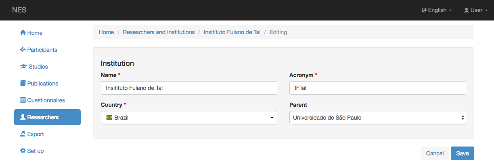
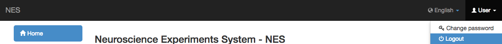
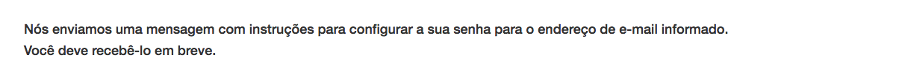
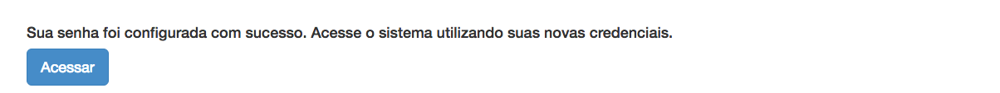

.. _researchers:

Investigadores
===========

Si tiene derecho :ref:`permissions`, NES le permite registrar a los investigadores que están trabajando en sus estudios. Mientras registra al investigador, puede elegir si ese investigador puede o no acceder al estudio en NES. Si es así, se requerirá un nombre de usuario, una contraseña y un perfil. NES también le permite registrar las instituciones involucradas en sus estudios. Las instrucciones de estas funcionalidades se presentan a continuación.

.. _list-of-researchers:

Lista de investigadores e instituciones
------------------------------------

Para acceder a la lista de investigadores e instituciones registradas en el sistema, haga clic en el item de menu  `Researchers` . Esta pantalla permite la creación de un nuevo investigador o institución o la visualización de los existentes.

.. image:: ../_img/list_of_researchers.png

Los investigadores están organizados en una lista que muestra sus nombres, correos electrónicos, institución a la que pertenecen y sus nombres de usuario si tienen acceso a NES (si no tienen acceso, el campo de nombre de usuario se rellena con "---").

Creación y edición de un usuario
---------------------------
Un registro de investigadores contiene:

* Un nombre de pila (obligatorio);
* Un apellido (obligatorio);
* Un correo electrónico (obligatorio);
* Una institución.

Si el investigador debe tener acceso al sistema, hay que elegir `Yes, a username and password must be configured` en el campo `Can this researcher access the system?` . La opción predeterminada para esa pregunta es `No`. 

Clickando `Yes, a username and password must be configured` aparecen dos secciones, la primera para configurar el nombre de usuario y la contraseña y la segunda para que elijas el perfil del investigador. Ver :ref:`script-for-creating-initial-data` para conocer los permisos que tiene cada perfil.

Todos estos campos se pueden establecer al crear o actualizar un usuario. Siempre tiene que informar la contraseña dos veces, y debe tener al menos 8 caracteres, incluyendo al menos una letra mayúscula, dígito o un carácter especial. Una explicación sobre los roles se da en :ref:`group-of-users-roles`. Solo los usuarios autorizados pueden actualizar un usuario (consulte :ref:`permissions` para más información).

.. image:: ../_img/create_researcher.png

Registro de instituciones
--------------------

Cada institución tiene un nombre, está establecida en un país, tiene un acrónimo y puede tener una institución matriz. Las informaciones que se pueden registrar en este ítem son:

* Nombre: el nombre oficial de la institución (obligatorio);
* Acrónimo: la palabra (s) o nombre formado como una abreviatura del nombre de la institución (obligatorio);
* País: el país al que pertenece la institución (obligatorio); y
* Padre: la institución matriz a la que pertenece la institución, si existe.

Iniciar y cerrar sesión
------------------
Después de escribir la url de NES, la primera pantalla que ve es la pantalla de inicio de sesión. Esto permite al sistema controlar el acceso a la información gestionada por NES. Se le pide solo su nombre de usuario y contraseña.

.. image:: ../_img/login.png

Para cerrar sesión, debe hacer clic en su nombre de usuario en la parte superior derecha de la página y elegir la opción `Exit`.

Cambiar la contraseña
---------------------
En el mismo menú donde se encuentra la opción de cerrar sesión, puede acceder a la pantalla para cambiar su contraseña. Debe informar su contraseña actual una vez y la nueva contraseña dos veces. Las reglas para crear la contraseña son las mismas que se indican en la sección sobre `Creating and Editing a User`_.

.. image:: ../_img/change_password.png

Después de confirmar, se le redirige a la pantalla de inicio.

Restablecimiento de la contraseña
----------------------

Si olvidó su contraseña y ya no puede iniciar sesión, puede restablecerla. En la pantalla de inicio de sesión, haga clic en el link `Forgot my password` . Se le pedirá su correo electrónico registrado, para que se le pueda enviar un mensaje con un enlace que le permita configurar una nueva contraseña.

.. image:: ../_img/reset_password_email_form.png

Después de escribir su dirección de correo electrónico, verá un mensaje explicando sobre el correo electrónico con instrucciones sobre cómo proceder. Incluso si escribió una dirección de correo electrónico incorrecta, verá el mismo mensaje, sin embargo, no se enviará ningún correo electrónico.

Después de hacer clic en el enlace en el correo electrónico que recibió, verá una pantalla donde se le pedirá que escriba su nueva contraseña dos veces. Las reglas para crear una contraseña en esta pantalla son más restrictivas. Cuanto más compleja sea su nueva contraseña, mayores serán las posibilidades de que sea aceptada. Una posible contraseña tiene al menos 8 caracteres, incluidas letras mayúsculas y dígitos o caracteres especiales.

Luego, verá una pantalla de éxito con un botón que lo lleva de regreso a la pantalla de inicio de sesión.

