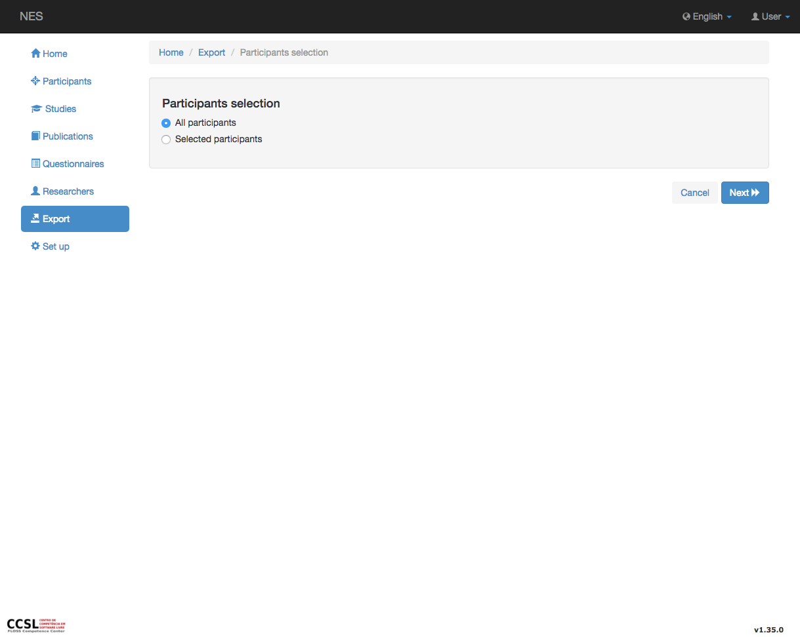
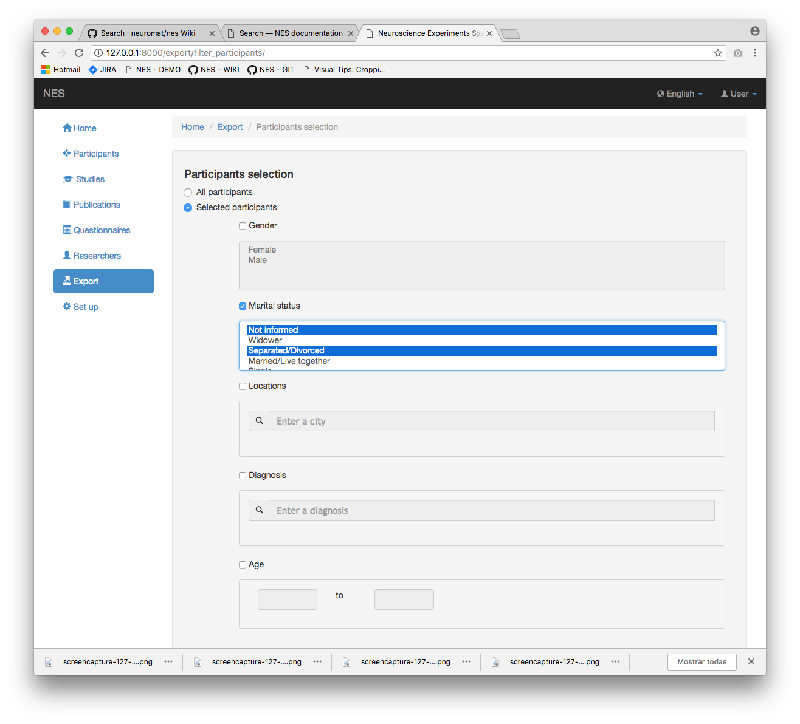
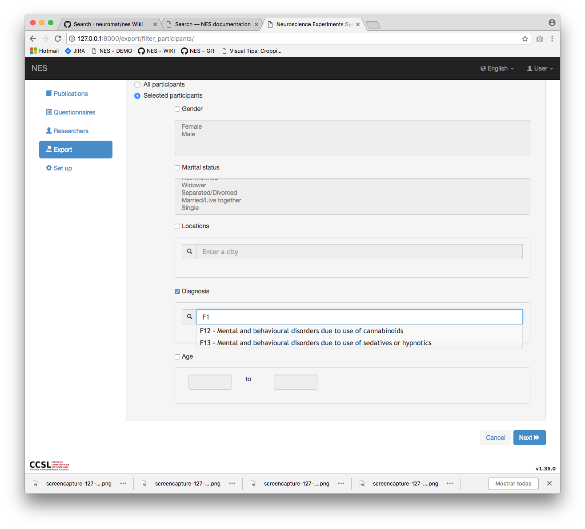
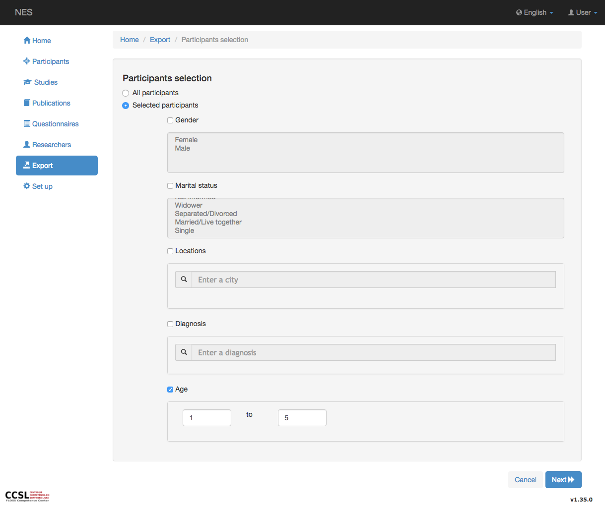
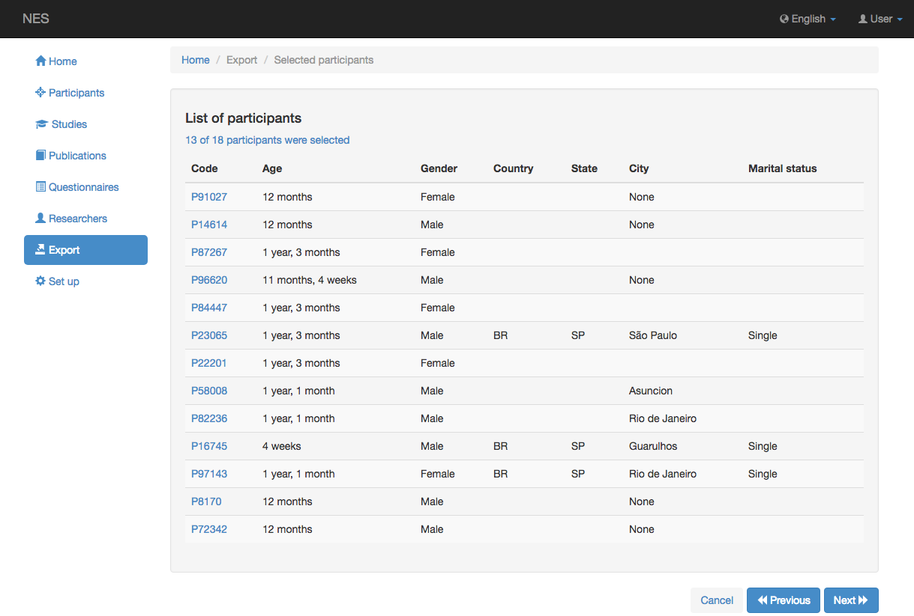

.. _search:

Buscar
======

La búsqueda es una funcionalidad, ofrecida en muchas situaciones dentro de NES, para filtrar información.

Introducción
------------

Con la búsqueda, es posible filtrar la información de los participantes, como el sexo, el estado civil, la ubicación, el diagnóstico y la edad.

En esta versión de NES, sólo :ref:`export` utiliza esta funcionalidad, pero otros pueden usarla en el futuro.

Para comenzar a buscar, primero debe llamar a la funcionalidad que necesita la información de los participantes. Por ejemplo, debe hacer clic en el menu `Export`  para seleccionar los participantes que se utilizarán en la funcionalidad de exportación, como se explica en la página Exportar.

Puede seleccionar todos los participantes o seleccionar filtros específicos de los participantes.

Si selecciona el `Selected participants` , se debe seleccionar al menos uno de los filtros.  

Selección de todos los participantes
--------------------------

Elegir `All participants` Si no desea filtrar participantes y haga clic en el botón `Next` para continuar con la funcionalidad, como se informa en la sección `Concluding the filtering process`_ .

Filtrado de género
----------------

Para filtrar el género, elija `Selected participants` y se mostrará nueva información sobre los filtros. Haga clic en el checkbox `Gender`  y se habilitará la selección de información sobre cuestiones de género. Puede seleccionar una o más opciones mediante una de las opciones:

* haga clic en un campo y arrastre hacia arriba o hacia abajo para seleccionar muchos campos continuos;
* elija más de un campo manteniendo presionada la tecla control (Windows / Linux) / comando (Mac) y haciendo clic en cada campo. También puede anular la selección del campo haciendo clic en un campo seleccionado una vez más.

.. image:: ../_img/gender_selection.png

Puede continuar seleccionando otras opciones o simplemente ir al boton `Next` , como explicado en la sección `Concluding the filtering process`_ .

Filtrado del estado civil
------------------------

El mismo procedimiento que `Filtering Gender`_ se utiliza para filtrar el estado civil.

Puede continuar seleccionando otras opciones o simplemente hacer clic en el botón `Next` , como explicado en la sección `Concluding the filtering process`_ .

Filtrar ubicaciones
-------------------

Para filtrar ubicaciones, haga clic en el checkbox  `Locations` y se habilitará un campo para que escriba el nombre de la ciudad. Las sugerencias aparecerán en una lista desplegable, originadas a partir de las direcciones de los participantes rellenadas cuando se insertaron en la base de datos. Puede seleccionar una ubicación a la vez; Una vez que seleccione uno de ellos, aparecerá un cuadro con el nombre de la ubicación justo encima del campo de búsqueda, con un `X` en la que puede hacer clic si desea quitar la ubicación del filtrado.

.. image:: ../_img/locations_selection.png

Puede continuar seleccionando otras opciones o simplemente hacer clic en el botón `Next` , como explicado en la sección `Concluding the filtering process`_ .

Diagnóstico de filtrado
-------------------

El mismo procedimiento que `Filtering Locations`_ se utiliza para filtrar el diagnóstico.

Puede continuar seleccionando otras opciones o simplemente hacer clic en el botón `Next` , como explicado en la sección `Concluding the filtering process`_ .

Edad de filtrado
-------------

Si elige filtrar la edad de los participantes, primero haga clic en el checkbox `Age`  para habilitar el filtro. En la secuencia, vaya a los campos de intervalos de edad y complete el campo "edad desde" (primer campo) y el campo "edad para" (segundo campo). Ambos deben contener datos.

Conclusión del proceso de filtrado
--------------------------------

Si se filtraron los datos de los participantes, se mostrará una pantalla con los participantes seleccionados (si eligió la opción `All participants` , Esta pantalla no aparecerá). 

Puede clickar en el boton `Next` para volver a la funcionalidad que llamaba Buscar o puede hacer clic en el botón `Previous`  para seleccionar datos una vez más. El `Cancel` dejará la funcionalidad que llamó Buscar y será redirigido a `Home`.