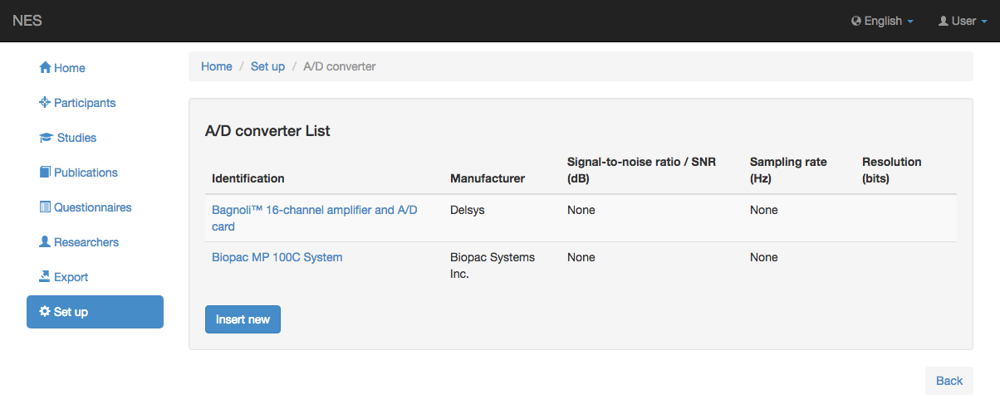
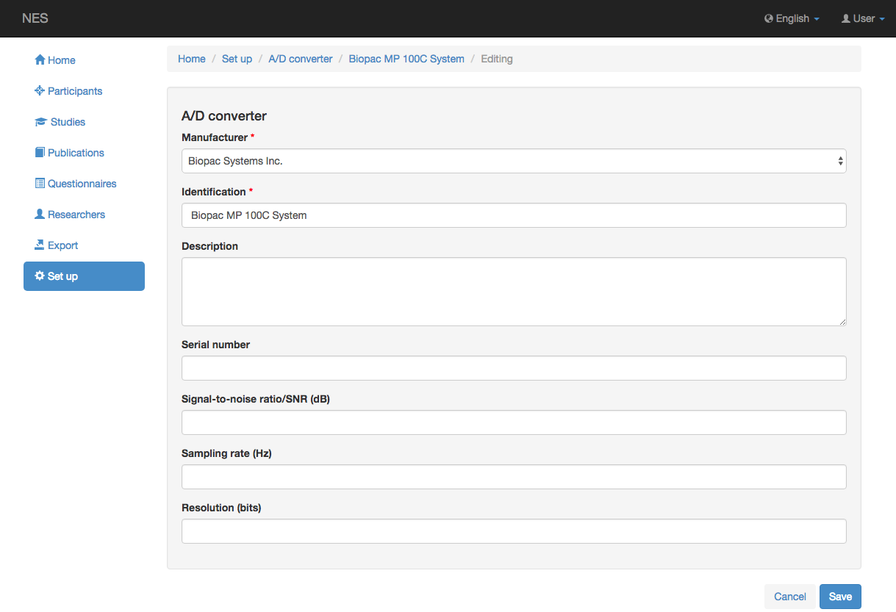

.. _a-d-converter:

Convertidor A/D
=============

La conversión de analógico a digital (A/D) realiza la conversión de la forma de onda en una serie de valores numéricos. NES permite configurar el instrumento A/D utilizado en el experimento EMG.

.. _view-the-list-of-a-d:

Ver la lista de A/D
--------------------

La siguiente imagen muestra la lista de A/D convertidos registrados en NES. Al hacer clic en un elemento de la lista, puede editar este elemento.

.. _add-new-a-d:

Agregar nuevo A/D
-----------

Los valores generados por el A/D pueden almacenarse en la memoria del ordenador, manipularse y luego volver a mostrarse como formas de onda en la pantalla de un ordenador. La información que se debe registrar cuando se agrega un nuevo convertidor A / D se muestra en la siguiente pantalla:

* **:ref:`manufacturer`:** el nombre del fabricante del convertidor A/D. Esta información es obligatoria.
* **Identificación:** el nombre del modelo del convertidor A/D. Esta información es obligatoria.
* **Descripción:** alguna información sobre el convertidor A/D.
* **Número de serie:** el número de serie del equipo.
* **Relación señal-ruido (SNR):** es una medida utilizada en ciencia e ingeniería que compara el nivel de una señal deseada con el nivel de ruido de fondo. Se define como la relación entre la potencia de la señal y la potencia del ruido, a menudo expresada en decibelios. Una relación superior a 1:1 (superior a 0 dB) indica más señal que ruido. 
* **Frecuencia de muestreo:** el muestreo es la reducción de una señal continua a una señal discreta. La velocidad a la que se muestrean los datos de forma de onda para convertirlos a un formato numérico se conoce como frecuencia de muestreo. La frecuencia de muestreo generalmente se expresa en Hz, por ejemplo, 240 Hz es 240 veces por segundo. 
* **Resolución:** La resolución del convertidor indica el número de valores discretos que puede producir en el rango de valores analógicos. La resolución determina la magnitud del error de cuantización y, por lo tanto, determina la relación media máxima posible entre señal y ruido para un ADC ideal sin el uso de sobremuestreo. Los valores generalmente se almacenan electrónicamente en forma binaria, por lo que la resolución generalmente se expresa en bits.

:ref:`Back to Set Up <set-up>`