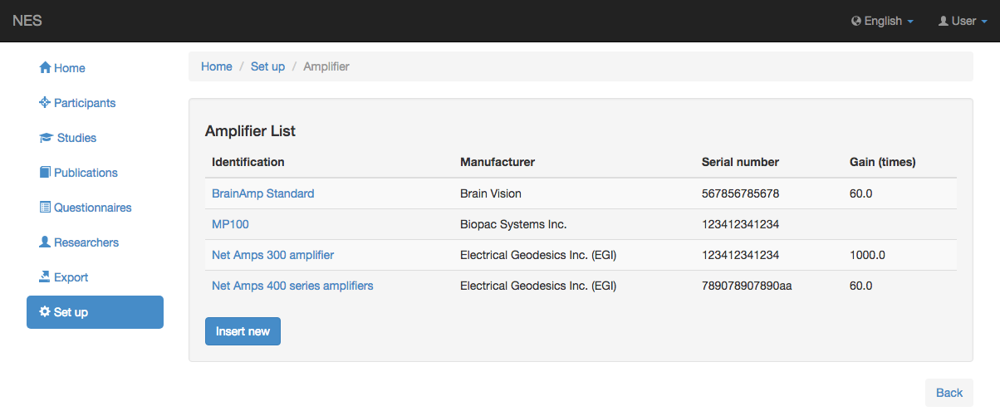
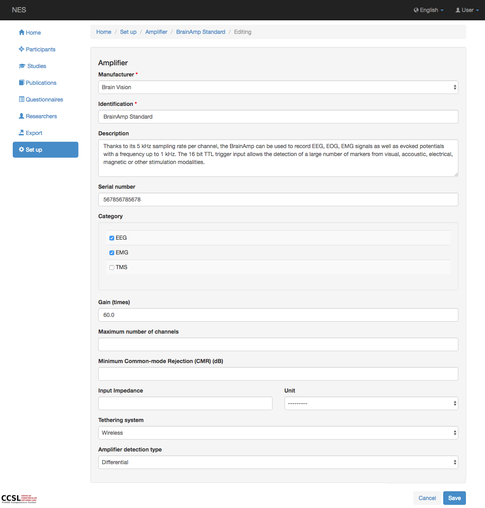

.. _amplifier:

Amplificador
=========

En esta página se puede registrar información sobre el amplificador utilizado en cualquier experimento.

.. _view la lista del amplificador:

Ver la lista de amplificadores
--------------------------

Esta página muestra la lista de amplificadores registrados en NES. Al hacer clic en un elemento de la lista, puede editar este elemento.

.. _add-amplifier:

Añadir amplificador
-------------

Para agregar un nuevo amplificador, es necesario registrar la siguiente información:

* :ref:`manufacturer`: el nombre del fabricante del amplificador. Esta información es obligatoria.
* Identificación: el nombre del modelo del amplificador. Esta información es obligatoria.
* Descripción: alguna información sobre el amplificador.
* Número de serie: el número de serie del equipo.
* Categoría: esta información indica si el amplificador se puede utilizar en experimentos EEG y/o EMG y/o TMS.
* Ganancia: en este campo se registra la ganancia por defecto utilizada por este amplificador.
* Número máximo de canales;
* Rechazo mínimo en modo común;
* Impedancia de entrada: la impedancia inicial del modelo de electrodo registrado;
* Unidad: la unidad de la impedancia registrada;
* Sistema de anclaje; y
* Tipo de detección de amplificador.

:ref:`Back to Set Up <set-up>`