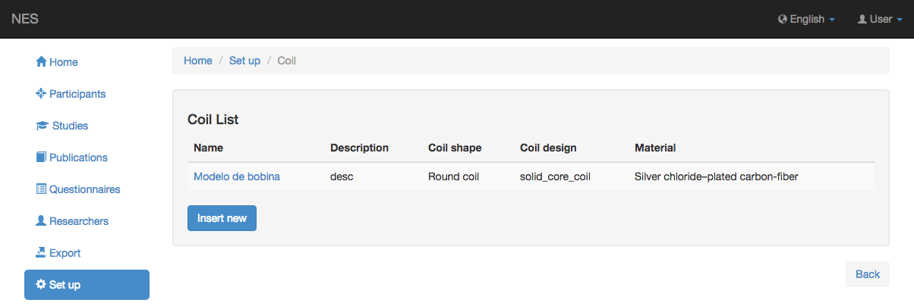
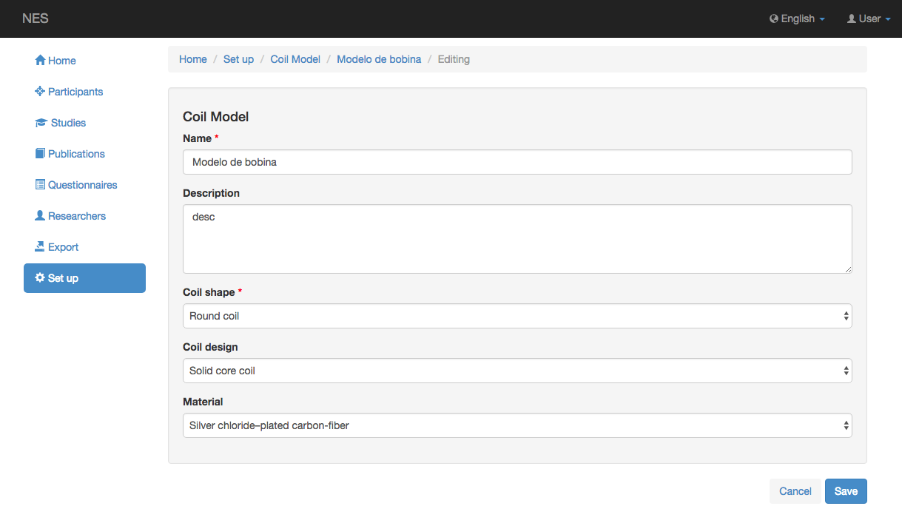

.. _coil-model:

Modelo de bobina
==========

NES permite registrar el modelo de bobina del equipo TMS.

.. _view la lista de bobinas:

Ver la lista de bobinas
----------------------

Esta página muestra la lista de modelos de bobinas registrados en NES. Al hacer clic en un elemento de la lista, puede editar este elemento.

.. _add-a-coil-model:

Agregar un modelo de bobina
----------------

Para agregar un nuevo modelo de bobina, debe insertar el nombre de la bobina que se registrará y la forma de la bobina; opcionalmente una descripción, el diseño de la bobina y el material de la bobina. La siguiente imagen muestra un ejemplo de esta pantalla:

:ref:`Back to Set Up <set-up>`