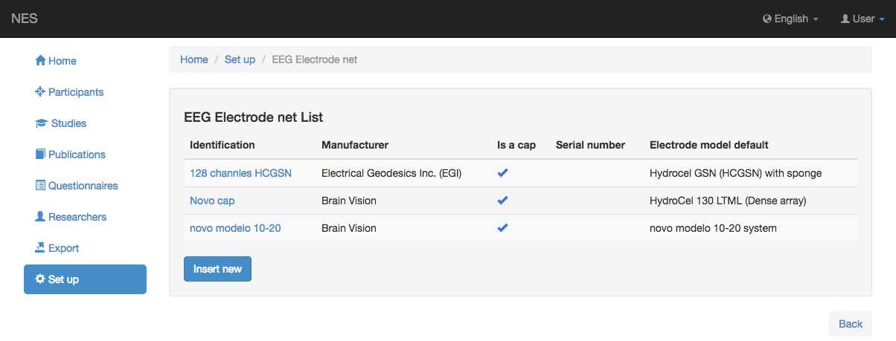
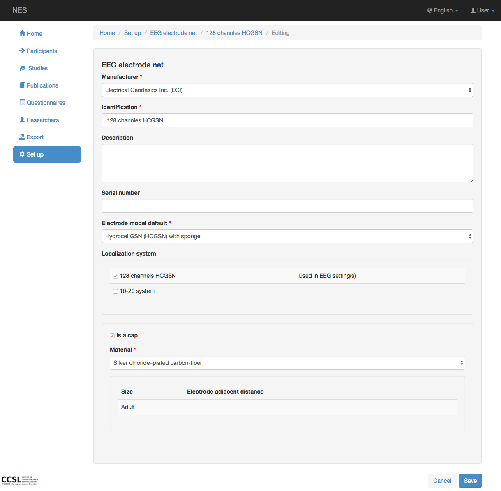

.. _eeg-electrode-net-cap:

Tapa de red de electrodo EEG
=====================
NES permite registrar información sobre los electrodos o conjunto de electrodos utilizados en la adquisición de datos brutos de EEG. En esta página es posible registrar para cada tipo de electrodo (individual o tapa) su identificacion :ref:`manufacturer`, descripción, número de serie, el tipo o :ref:`model of the electrode <electrode-model>`, el :ref:`system localization <eeg-electrode-localization-system>` se utiliza y si se utiliza una tapa.

.. _view-the-list-of-electrode-net:

Ver la lista de redes de electrodos
------------------------------

Esta página muestra la lista de la red de electrodos contemplada por NES. Al hacer clic en un elemento de la lista, puede editar este elemento.

.. _add-electrode-net:

Añadir red de electrodos
-----------------

Para agregar una nueva red de electrodos, debe registrar la siguiente información:

* :ref:`manufacturer`: el nombre del fabricante de la red de electrodos; (obligatorio)
* Identificación: el nombre del modelo de la red de electrodos registrada; (obligatorio)
* Descripción: alguna descripción sobre la red de electrodos registrada;
* Número de serie: número de serie de la red de electrodos;
* :ref:`Electrode Model Default <electrode-model>`: el modelo de electrodo por defecto de la red de electrodos registrada; (obligatorio)
* :ref:`Localization system <eeg-electrode-localization-system>`: el nombre del sistema de localización utilizado por esta red de electrodos.
* Es una tapa: información sobre si la red de electrodos registrada es una tapa (verificada) o un conjunto de electrodos individuales (no verificada).
* :ref:`material`: esta información aparece si se selecciona 'Es un tope'. Aquí se añade el material en el que está hecha la tapa.

:ref:`Back to Set Up <set-up>`