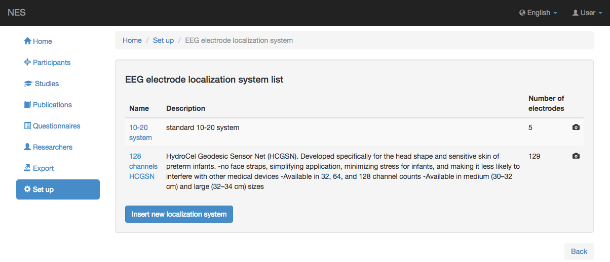
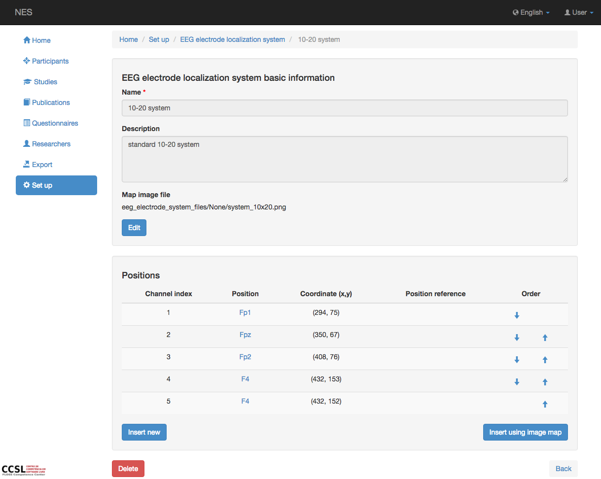
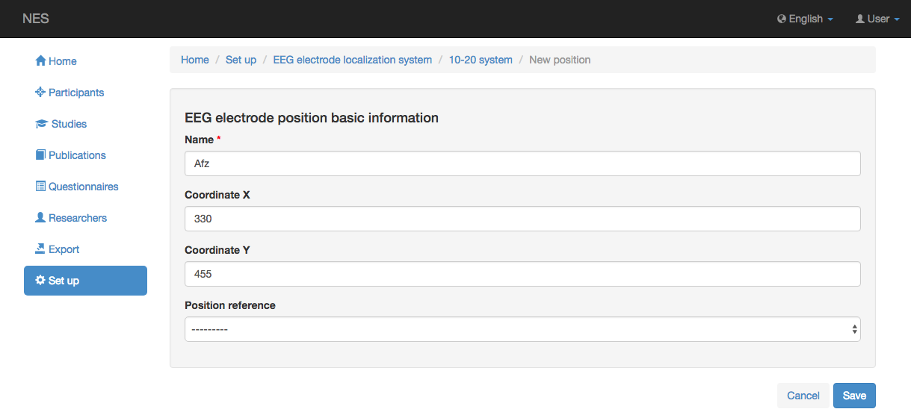
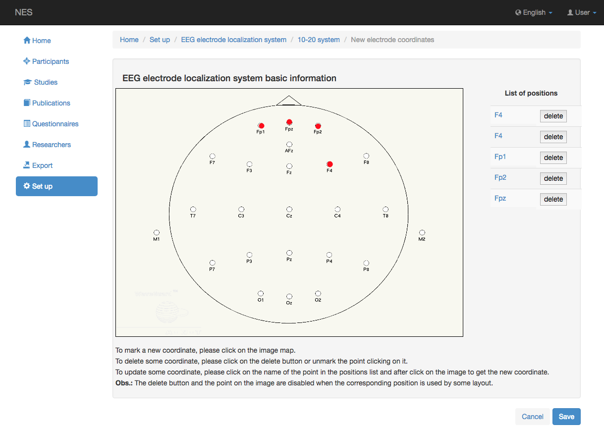

.. _eeg-electrode-localization-system:

Sistema de localización de electrodos EEG
=================================

NES permite registrar el sistema de la colocación donde se localizan los electrodos. El sistema puede ser estandarizado o diseñado específicamente por un fabricante.
En esta página se puede registrar información sobre el Sistema de Localización de Electrodos utilizado en la adquisición de datos brutos de EEG.

Ver la lista de sistemas de localización de electrodos
----------------------------------------------

Esta página muestra la lista del sistema de localización de electrodos contemplado por NES. Al hacer clic en un elemento de la lista, puede editar este elemento.

Agregar sistema de localización de electrodos
---------------------------------

Para agregar un nuevo sistema de localización de electrodos, debe registrar la siguiente información:

* Nombre: el nombre del sistema de localización. Esta información es obligatoria.
* Descripción: alguna descripción sobre el sistema registrado.
* Archivo de imagen de mapa: un archivo con la imagen de la localización de electrodos utilizada por el sistema registrado.

.. image:: ../../_img/eeg_electrode_localization_system_edit.png

Insertar las coordenadas de los electrodos
----------------------------------------

Después de agregar un sistema de localización de electrodos, NES muestra una tabla con las posiciones y coordenadas de cada electrodo en el sistema. Esta tabla debe rellenarse con las coordenadas de cada electrodo en el archivo de imagen registrado. La siguiente imagen muestra un ejemplo de esta pantalla:

NES ofrece dos formas de registrar estas coordenadas: usando un formulario y usando una imagen. 
La siguiente imagen muestra la pantalla con el formulario que se debe rellenar.

La siguiente imagen muestra la pantalla para registrar la nueva coordenada con una imagen

:ref:`Back to Set Up <set-up>`