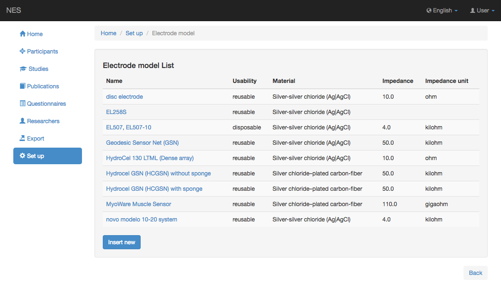
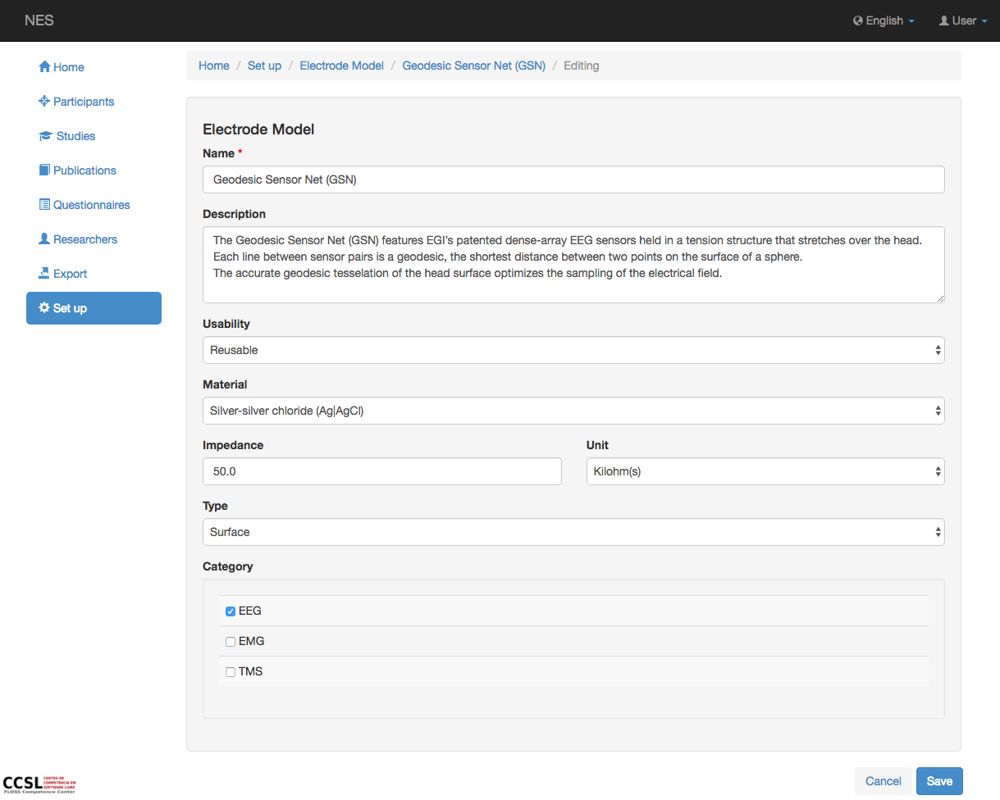

.. _electrode-model:

Modelo de electrodo
===============

NES permite registrar información sobre el modelo del electrodo o conjunto de electrodos utilizados en la adquisición de datos brutos de EEG.
En esta página se puede registrar información sobre el Modelo de Electrodo utilizado en la adquisición de datos brutos de EEG.

.. _view-the-list-of-electrode-model:

Ver la lista de modelos de electrodos
--------------------------------

Esta página muestra la lista del modelo de electrodo contemplado por NES. Al hacer clic en un elemento de la lista, puede editar este elemento.

.. _add-electrode-model:

Agregar modelo de electrodo
-------------------

Para agregar un nuevo modelo de electrodo, debe registrar la siguiente información:

* **Nombre:** el nombre del modelo de electrodo. Esta información es obligatoria.
* **Descripción:** alguna descripción sobre el modelo de electrodo registrado.
* **Usabilidad:** si el modelo de electrodo es reutilizable o desechable.
* **:ref:`material`:** el tipo de material del modelo de electrodo.
* **Impedancia:** la impedancia predeterminada del modelo de electrodo registrado.
* **Unidad:** la unidad de la impedancia registrada.
* **Tipo:** el tipo de electrodo, que puede ser: superficie, intramuscular o aguja.
* **Categoría:** esta información indica si el electrodo se puede utilizar en experimentos de EEG y/o EMG y/o TMS.

La siguiente imagen muestra la pantalla para agregar un modelo de electrodo:

:ref:`Back to Set Up <set-up>`