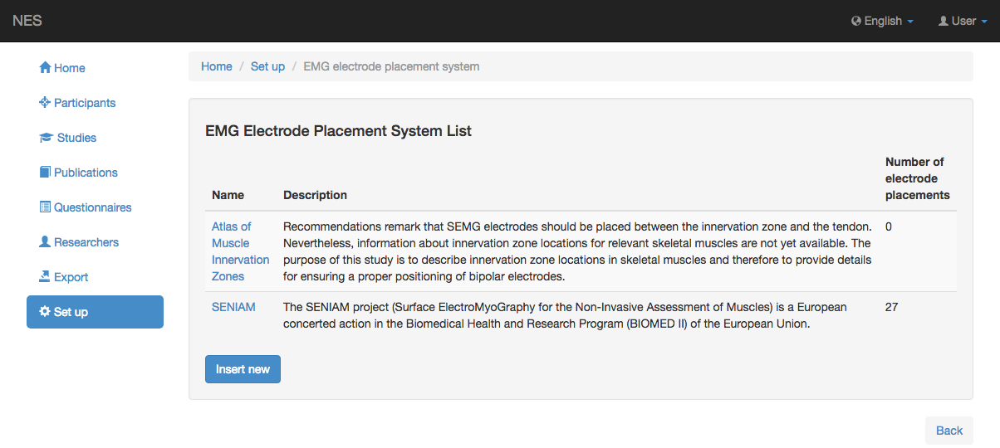
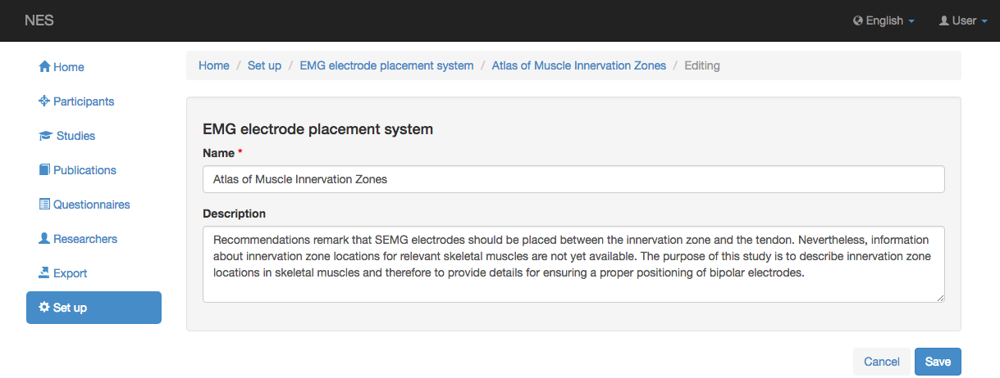
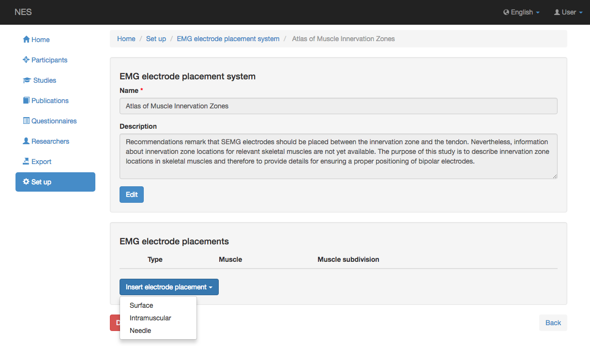
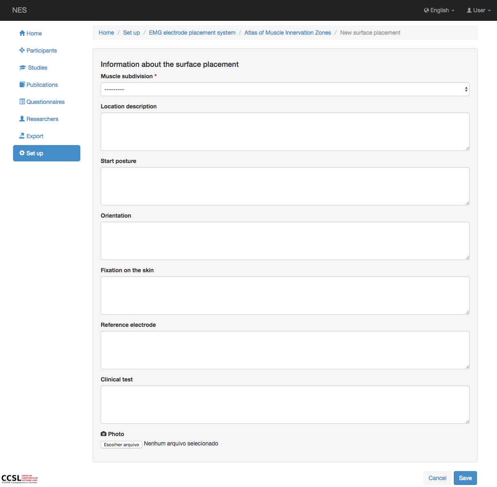
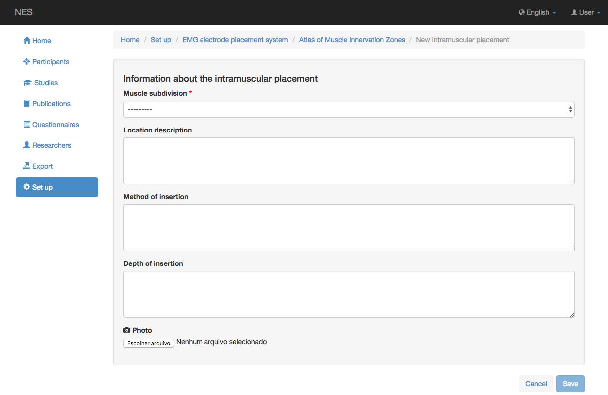
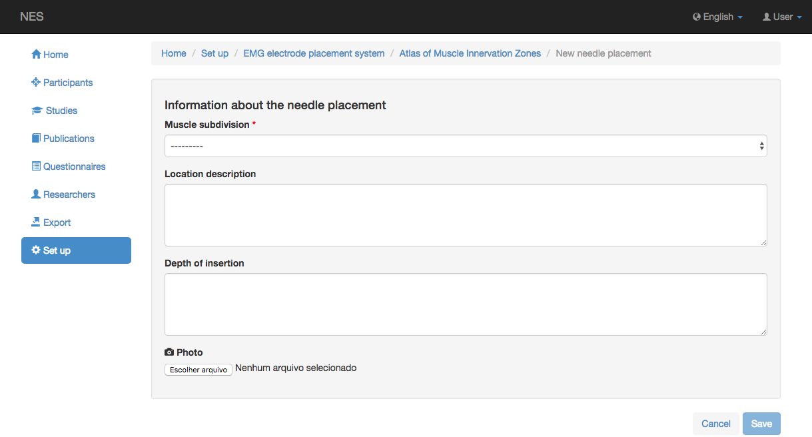

.. _emg-placement-system:

Sistema de colocación EMG
====================

NES permite registrar un sistema para colocar los electrodos en los experimentos EMG. SENIAM es un ejemplo de un sistema de colocación.

.. _view-the-list-of-emg-electrode-placement-system:

Ver la lista de sistemas de colocación de electrodos EMG
-----------------------------------------------

Esta página muestra la lista del sistema de colocación de electrodos EMG registrado en NES. Al hacer clic en un elemento de la lista, puede editar este elemento.

.. _add-a-emg-placement-system:

Agregar un sistema de colocación EMG
--------------------------

Para agregar un nuevo sistema de colocación EMG, debe insertar el nombre del sistema registrado y tal vez una descripción.
La siguiente imagen muestra un ejemplo de esta pantalla:

Después de guardar un nuevo sistema de colocación EMG, puede insertar una colocación de electrodos. Hay tres categorías de colocación de electrodos: superficie, intramuscular y aguja. Debe elegir uno de ellos, como se muestra en el ejemplo de la siguiente imagen.

.. _add-a-surface-emg-electrode-placement:

Agregar una colocación de electrodo EMG de superficie
-------------------------------------

Las informaciones que se deben registrar al insertar una colocación de electrodo de superficie son las siguientes:
* Subdivisión muscular: seleccione la subdivisión del músculo que se descrerá. 
* Descripción de la ubicación: la descripción de la localización donde se debe colocar el electrodo.
* Postura de inicio: esta información indica la postura del participante en el inicio del experimento.
* Orientación: esta información indica la orientación del electrodo sobre la piel del participante.
* Fijación en la piel: esto indica cómo se fijará el electrodo en la piel.
* Electrodo de referencia: el electrodo que se configurará como referencia.
* Prueba clínica: la descripción de la prueba que se realizará durante el experimento.
* Foto: una foto del músculo descrito.

.. _add-a-intramuscular-emg-electrode-placement:

Agregue una colocación de electrodo EMG intramuscular
-------------------------------------------

Las informaciones que se deben registrar al insertar la colocación de un electrodo intramuscular son las siguientes:
* Subdivisión muscular: la subdivisión del músculo a describir. 
* Descripción de la ubicación: la descripción de la localización donde se debe colocar el electrodo.
* Método de inserción: la descripción del método que se utilizará para la inserción del electrodo intramuscular.
* Profundidad de inserción: indicación de la profundidad de la inserción del electrodo intramuscular.
* Foto: una foto del músculo descrito.

.. _add-a-needle-emg-electrode-placement:

Agregue una colocación de electrodo EMG de aguja
------------------------------------

Las informaciones que se deben registrar al insertar una colocación de electrodo de aguja son las siguientes:
* Subdivisión muscular: seleccione la subdivisión del músculo que se describirá. 
* Descripción de la ubicación: la descripción de la localización donde se debe colocar el electrodo.
* Profundidad de inserción: esta información indica cuál será la profundidad de la inserción del electrodo de la aguja.
* Foto: una foto del músculo descrito.

:ref:`Back to Set Up <set-up>`