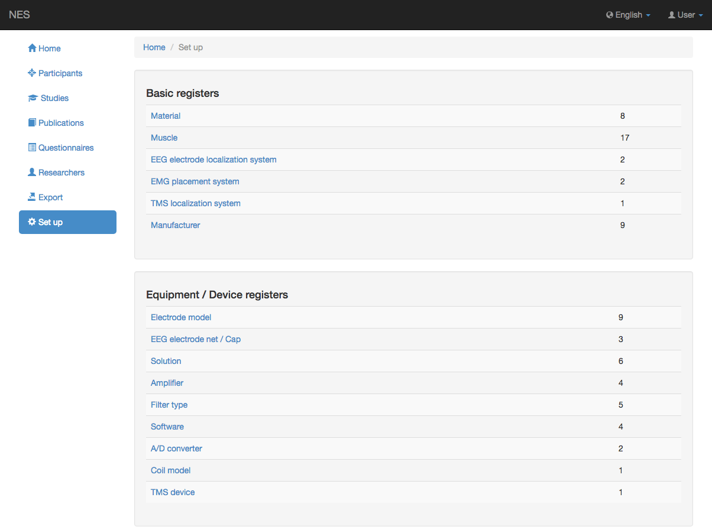

.. _set-up:

Construir
======

Este módulo permite registrar todos los equipos y materiales que intervienen en los experimentos EEG, EMG y TMS. Las informaciones que se pueden registrar se dividen en 2 secciones, a saber: `Basic registers`_ y `Equipment/Device registers`_.

.. _basic-registers:

Registros Basicos
---------------

* :ref:`material`
* :ref:`muscle`
* :ref:`eeg-electrode-localization-system`
* :ref:`emg-placement-system`
* :ref:`tms-localization-system`
* :ref:`manufacturer`

.. _equipment-device-registers:

Registros de equipos/dispositivos
--------------------------

* :ref:`electrode-model`
* :ref:`eeg-electrode-net-cap`
* :ref:`solution`
* :ref:`amplifier`
* :ref:`filter-type`
* :ref:`software`
* :ref:`a-d-converter`
* :ref:`coil-model`
* :ref:`tms-device`
