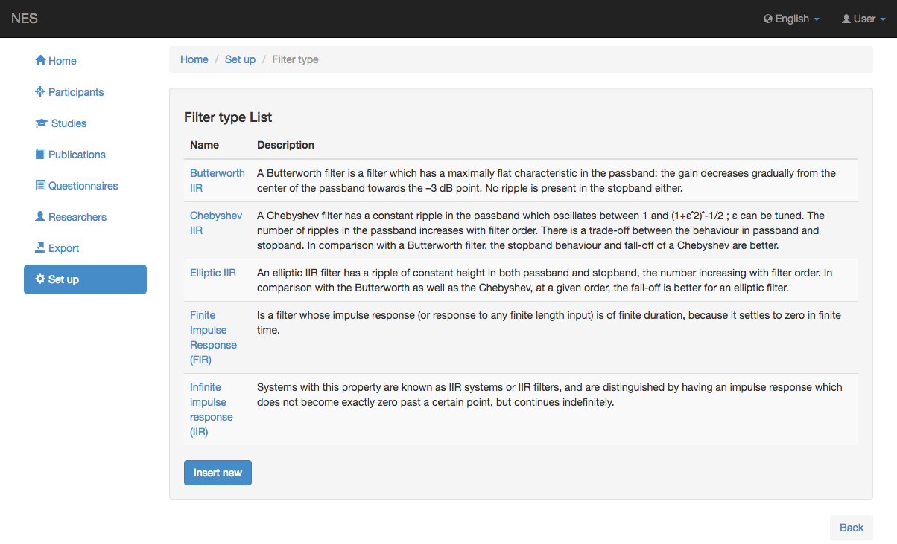
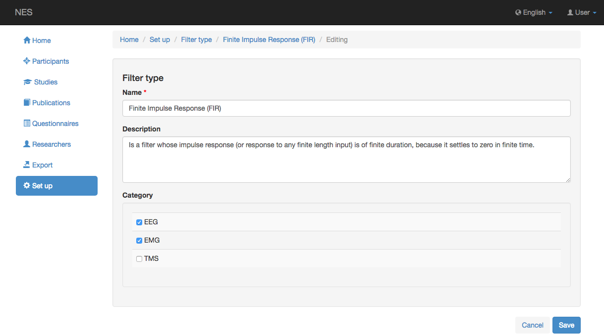

.. _filter-type:

Tipo de filtro
===========

En esta página se puede registrar información sobre el tipo de filtro utilizado en la adquisición de datos sin procesar de EEG.

.. _view-the-list-of-filters-type:

Ver la lista de tipos de filtros
-----------------------------

La siguiente imagen muestra un ejemplo de la pantalla que la lista de filtros tipo disponible. Al hacer clic en un elemento de la lista, puede editar este elemento.

.. _add-filter-type:

Agregar tipo de filtro
---------------

Para agregar un nuevo tipo de filtro, debe registrar la siguiente información:

* **Nombre:** nombre del tipo de filtro. Esta información es obligatoria.
* **Descripción:** alguna información sobre el tipo de filtro registrado.
* **Categoría:** esta información indica si el filtro se puede utilizar en experimentos EEG y/o EMG.

:ref:`Back to Set Up <set-up>`