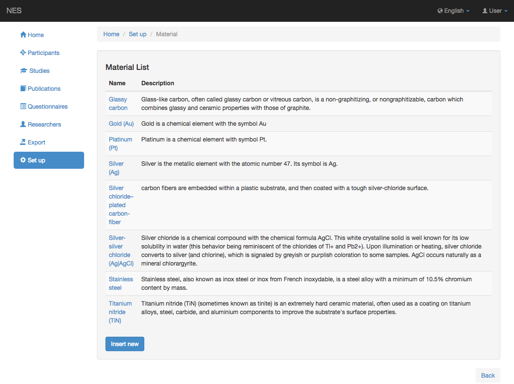
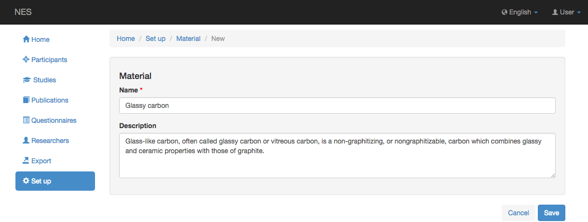

.. _material:

Material
========

NES permite registrar información sobre el material del electrodo utilizado en experimentos.
En esta página puede registrar el material del que está hecho el electrodo.

.. _view-the-list-of-materials:

Ver la lista de materiales
--------------------------

Esta página muestra la lista de materiales contemplados por NES. Al hacer clic en un elemento de la lista, puede editar este elemento.

.. _add-material:

Añadir material
------------

Para agregar un nuevo material, debe registrar la siguiente información:

* Nombre: el nombre del material. Esta información es obligatoria.
* Descripción: alguna descripción sobre el material registrado.

:ref:`Back to Set Up <set-up>`