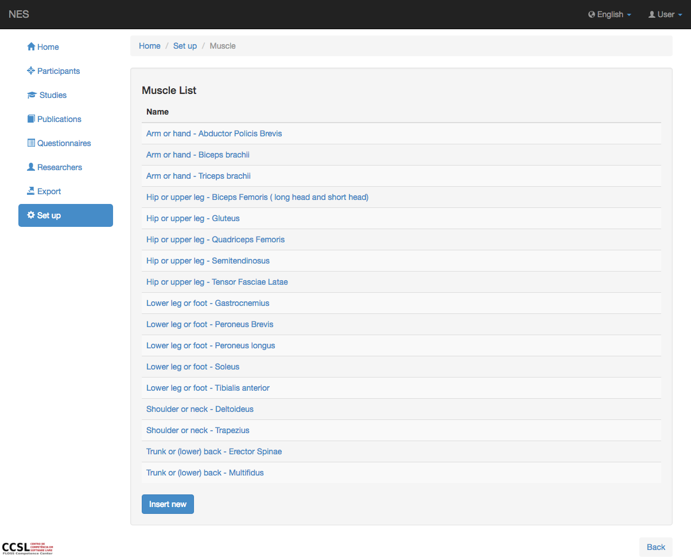
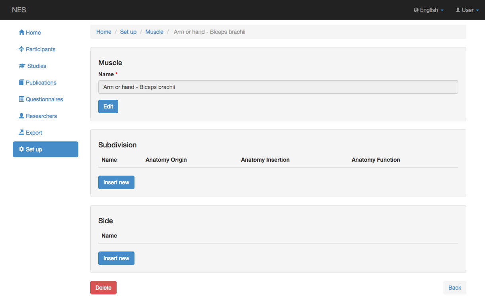
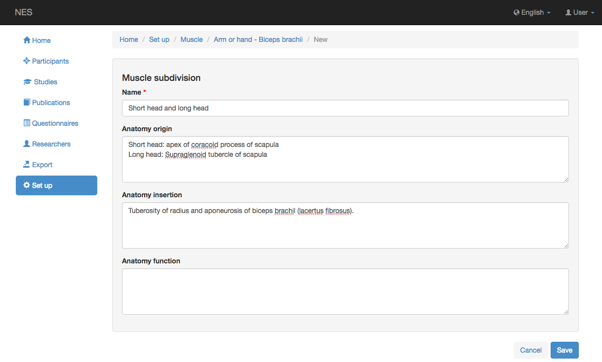
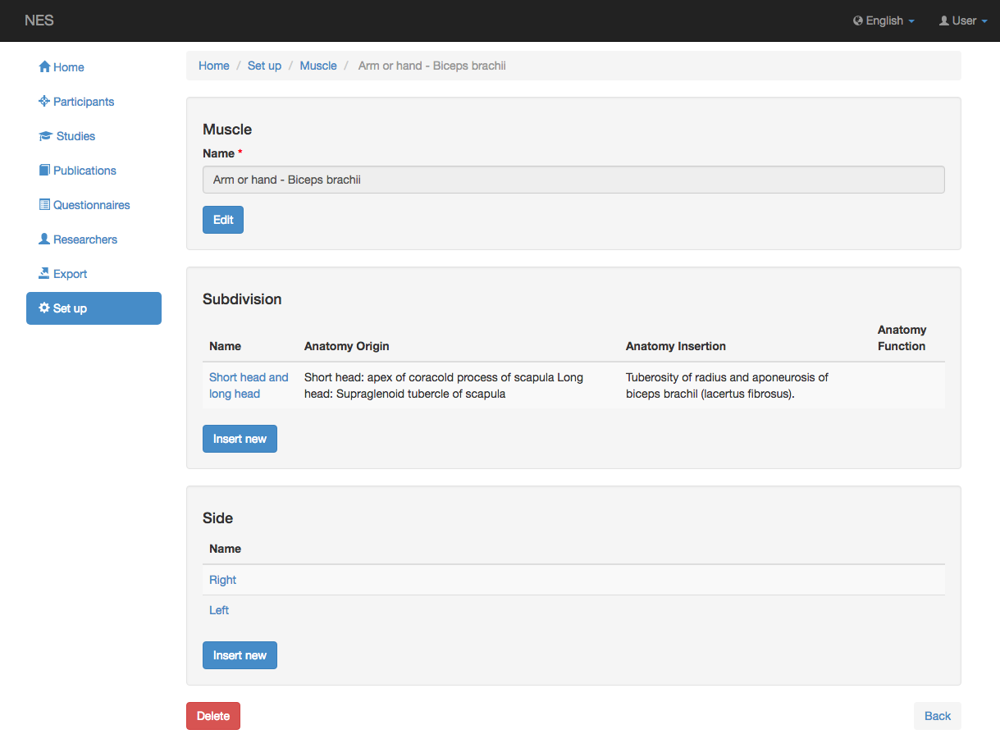

.. _muscle:

Músculo
========

NES permite registrar el músculo y la subdivisión del músculo donde se colocarán los electrodos. Esta información ayudará en la descripción de la configuración del experimento.

.. _view-the-list-of-muscles:

Ver la lista de músculos
------------------------

Esta página muestra un ejemplo de la lista de músculos disponibles para seleccionar. Al hacer clic en un elemento de la lista, puede editar este elemento.

.. _add-a-muscle:

Añadir un músculo
------------

Para agregar un nuevo músculo, debe insertar el nombre del músculo y guardarlo.
Después de guardar un nuevo músculo, puede insertar la subdivisión del músculo y su lado. La siguiente imagen muestra un ejemplo de esta pantalla.

.. _add-a-subdivision-of-the-muscle:

Añadir una subdivisión del músculo
-------------------------------

Para agregar una subdivisión del músculo, debe insertar la siguiente información:

* **Nombre:** el nombre de la subdivisión del músculo; (obligatorio)
* **Origen de la anatomía:** La descripción del origen de la subdivisión del músculo registrado; y
* **Inserción de anatomía:** la localización de la inserción de la subdivisión del músculo; y
* **Función de anatomía:** la función de la subdivisión del músculo.

La siguiente imagen muestra un ejemplo de la pantalla para agregar una subdivisión del músculo.

Si es necesario, puede registrar el lado del músculo. La siguiente imagen muestra un ejemplo de una vista del músculo, la subdivisión y el lado muscular.

:ref:`Back to Set Up <set-up>`