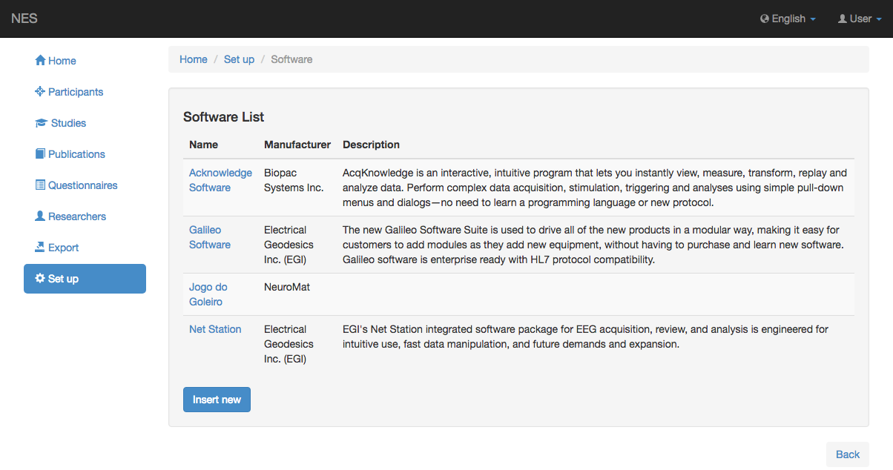

.. _software:

Software
========

NES permite registrar diferentes tipos de software y sus descripciones utilizadas en los Experimentos.

.. _view-the-list-of-softwares:

Ver la lista de softwares
--------------------------

La siguiente imagen muestra un ejemplo de la pantalla que enumera los softwares disponibles. Al hacer clic en un elemento de la lista, puede editar este elemento.

.. _add-software:

Añadir software
------------

Para agregar un nuevo software, debe registrar la siguiente información:

* **:ref:`manufacturer`:** el nombre del fabricante del software; (obligatorio)
* **Nombre:** el nombre del software; (obligatorio)
* **Descripción:** alguna información sobre el software.

Una vez guardada esta información, aparecerá una nueva sección donde puede agregar la versión del software haciendo clic en el botón `Insert new` .

La siguiente imagen muestra un ejemplo de un software registrado.

.. image:: ../../_img/software_view.png

:ref:`Back to Set Up <set-up>`