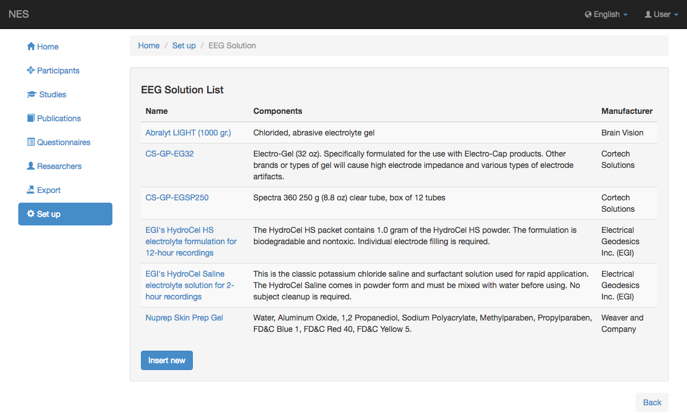
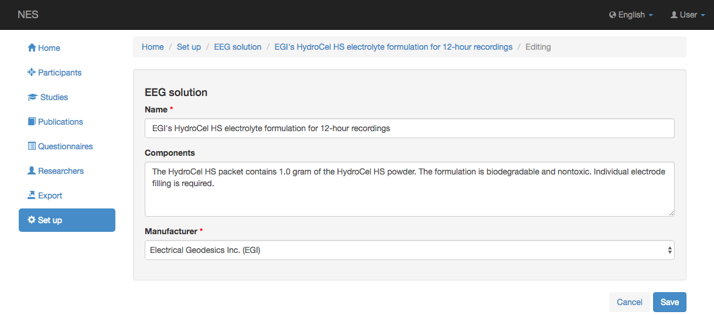

.. _solution:

Solución
========

NES permite registrar información sobre la solución utilizada en el experimento EEG.
En esta página se puede registrar información sobre las soluciones utilizadas en cualquier experimento. Esta página ofrece las siguientes funcionalidades:

.. _view-the-list-of-solutions:

Ver la lista de soluciones
--------------------------

Esta página muestra la lista de soluciones contempladas por NES. Al hacer clic en un elemento de la lista, puede editar este elemento.

.. _add-solution:

Agregar solución
------------

Para agregar una nueva solución, debe registrar la siguiente información:

* **Nombre:** el nombre de la solución; (obligatorio)
* **Componentes:** la información sobre los componentes de la solución; y
* **:ref:`manufacturer`:** el nombre del fabricante de la solución. (obligatorio)

:ref:`Back to Set Up <set-up>`