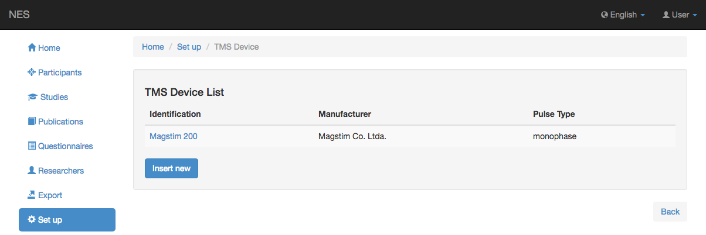

.. _tms-device:

Dispositivo TMS
==========

NES permite registrar los dispositivos TMS utilizados en los experimentos. `Magstim 200` es un ejemplo de un sistema de localización.

.. _view-the-list-of-tms-devices:

Ver la lista de dispositivos TMS
----------------------------

Esta página muestra la lista de dispositivos TMS registrados en NES. Al hacer clic en un elemento de la lista, puede editar este elemento.

.. _add-a-tms-devices:

Agregar un dispositivo TMS
----------------

Para agregar un nuevo dispositivo TMS, debe insertar el fabricante y la identificación del dispositivo; opcionalmente, una descripción, el tipo de pulso y el número de serie.
La siguiente imagen muestra un ejemplo de esta pantalla:

.. image:: ../../_img/tms_device_add.png

:ref:`Back to Set Up <set-up>`