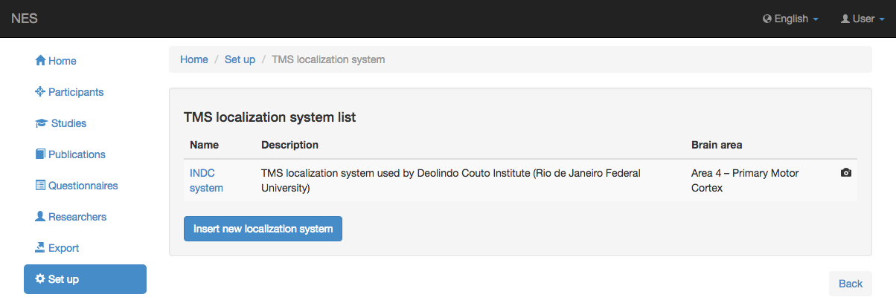
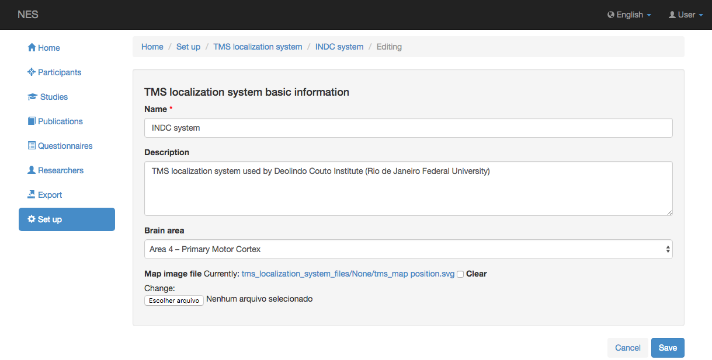

.. _tms-localization-system:

Sistema de localización TMS
=======================

NES permite registrar el sistema de localización para experimentos TMS. INDC es un ejemplo de un sistema de localización.

Vea la lista de sistemas de localización TMS.
-----------------------------------------

Esta página muestra la lista de sistemas de localización TMS registrados en NES. Al hacer clic en un elemento de la lista, puede editar este elemento.

Agregar un sistema de localización TMS
-----------------------------

Para añadir un nuevo sistema de localización TMS, hay que insertar el nombre del sistema a registrar, el área cerebral y opcionalmente una descripción y un archivo de imagen de mapa.
La siguiente imagen muestra un ejemplo de esta pantalla:

:ref:`Back to Set Up <set-up>`