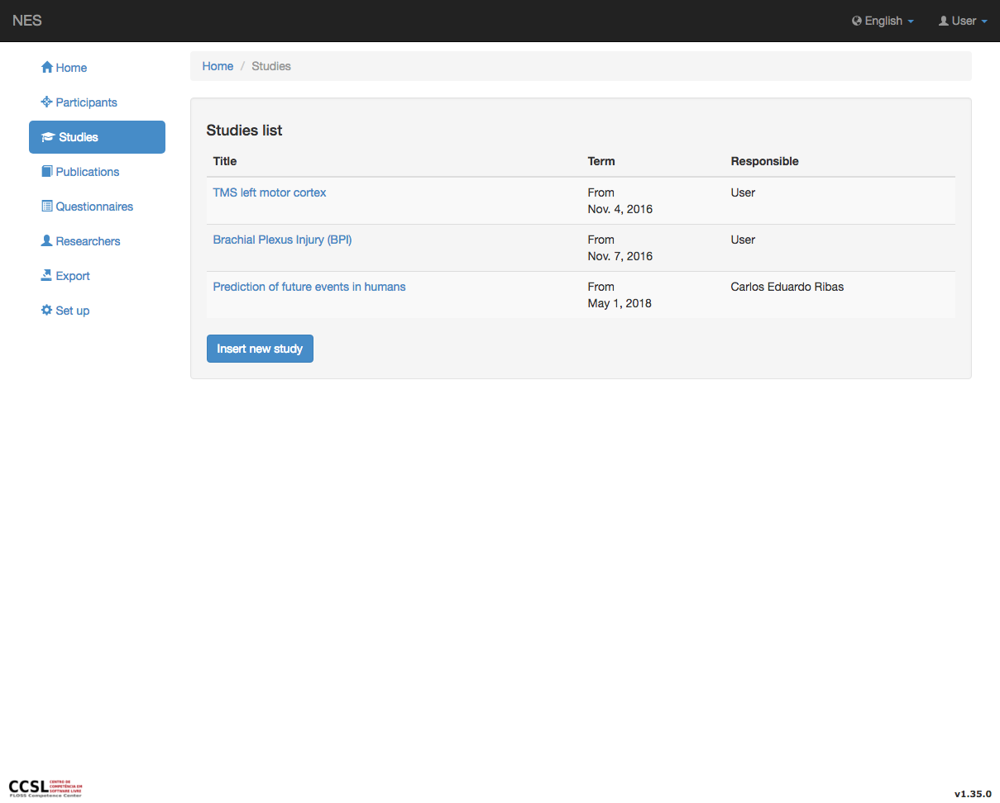
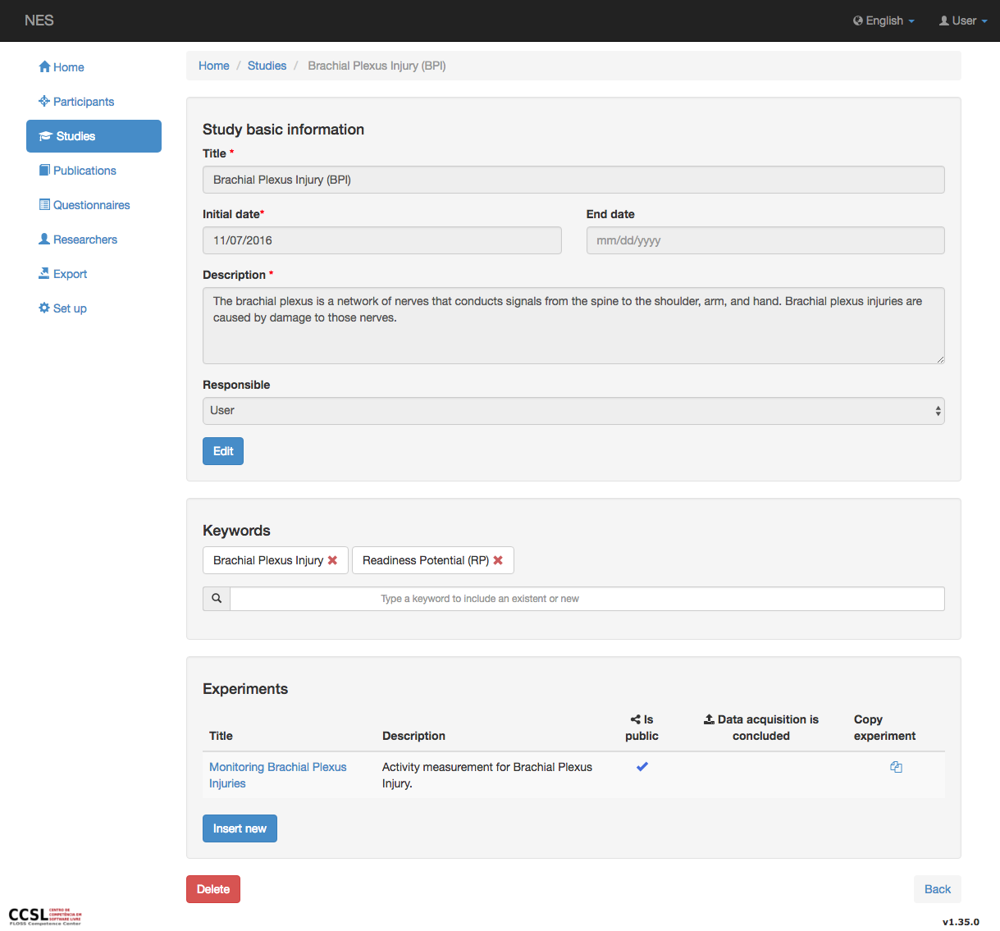
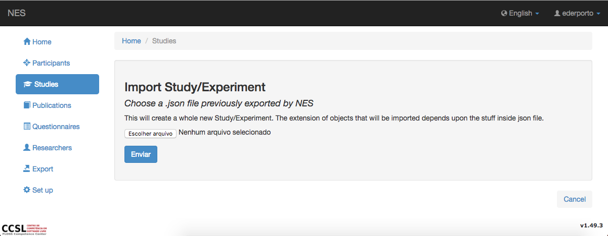
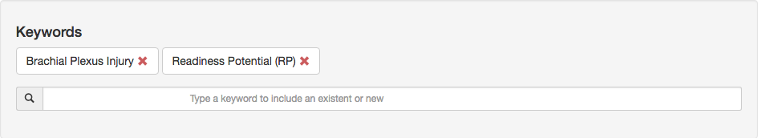
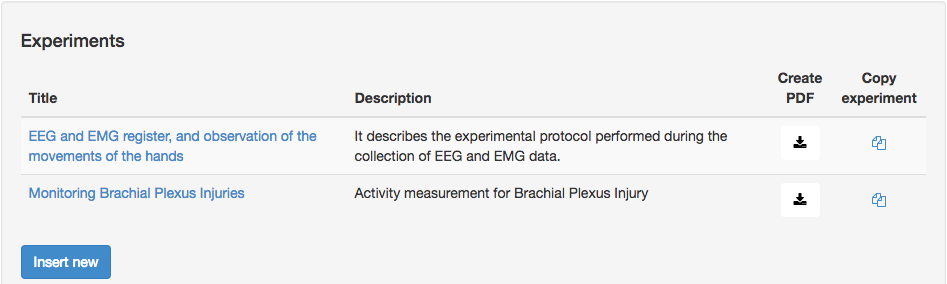
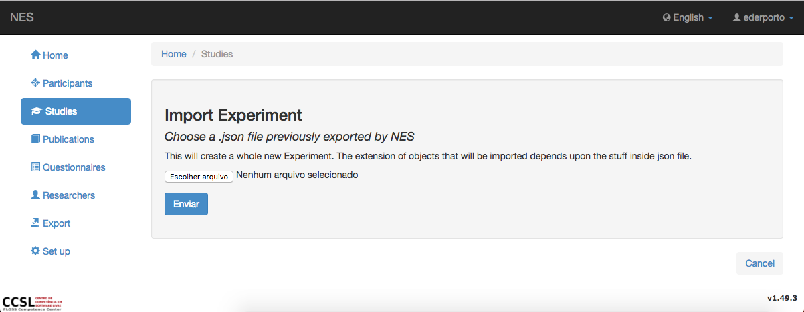
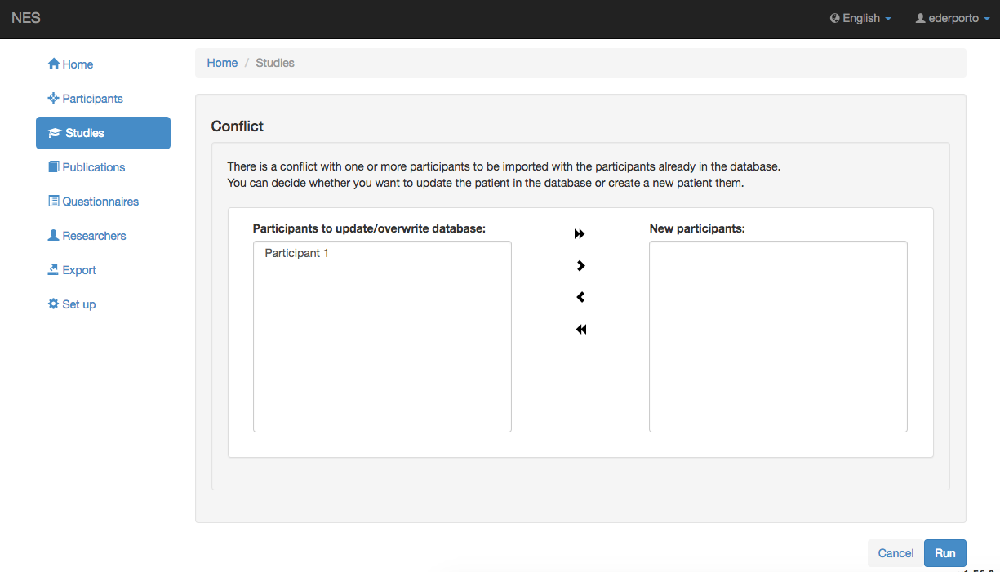

.. _studies:

Estudios
===========
NES ofrece la posibilidad de crear estudios.

Lista de estudios
---------------
Para acceder a la lista de estudios ya registrados en el sistema, haga clic en el item de menu  `Study` . Esta pantalla permite la creación de un nuevo estudio, la importación de un estudio (previamente exportado por NES) o la visualización de un estudio existente.

Creación y edición de un estudio
----------------------------
Un estudio contiene:

* Un título (obligatorio);
* Una descripción (obligatoria);
* Una fecha de inicio (obligatoria);
* Una fecha de finalización;
* Una lista de palabras clave;
* Una lista de colaboradores;
* Una lista de experimentos; y
* Un propietario (obligatorio).

Sin embargo, al crear un nuevo estudio, la pantalla solo solicita el título, la descripción y el plazo de un estudio. Esos son también los campos que se pueden actualizar si hace clic en el botón `Edit` en la pantalla de visualización. Se pueden agregar palabras clave y experimentos mientras se visualiza un estudio. Durante la creación, el usuario registrado se convierte en el propietario del estudio. El propietario no se puede cambiar. Solo los usuarios autorizados pueden actualizar un estudio, lo que significa que el propietario del estudio o los usuarios con permiso para cambiar el estudio (Ver :ref:`permissions` para más información).

Visualización de un estudio
-------------------
Puede ver más información sobre un estudio existente haciendo clic en su título en la lista de estudios. Mientras visualiza un estudio, puede eliminarlo haciendo clic en el botón `Delete` . Sin embargo, este botón solo es visible para los usuarios que tienen permiso para actualizar un estudio.

Importación de un estudio
------------------
Puede importar un estudio con un experimento en la página de listado de estudios a través del boton `Import Study/Experiment` . Se cargará una página pidiendo el archivo .zip con todos los datos necesarios para crear un nuevo estudio y experimento. Este archivo de .zip se puede generar exportando un experimento en la lista de experimentos del estudio (vea más detalles sobre esta lista a continuación).

Palabras clave de un estudio
-------------------
Puede administrar palabras clave mientras ve la información sobre un estudio. Para agregar una nueva palabra clave, simplemente escriba la palabra clave deseada en el campo de texto en la sección `Keywords` . El sistema sugiere palabras clave ya en uso por otros estudios que aún no están en uso en el estudio actual, o la creación de uno nuevo. A continuación, debe seleccionar una de las opciones de la lista. No es posible incluir más de una palabra clave al mismo tiempo. Para eliminar una palabra clave, simplemente haga clic en el botón :x: asociado a ella. Una vez más, solo los usuarios que tienen permiso para actualizar un estudio pueden agregar o eliminar palabras clave. Los usuarios no autorizados no pueden ver el campo de texto.

.. _exporting-importing-an-experiment-of-a-study
Experimentos de un estudio
----------------------
Un estudio puede tener múltiples :ref:`experiments`. De nuevo, solo los usuarios que tienen :ref:`permissions` para actualizar un estudio se pueden añadir experimentos. Los usuarios no autorizados no pueden ver el boton `Insert new` .

Se mostrará una lista con todos los experimentos que pertenecen al estudio. Puede hacer una copia de un experimento haciendo clic en el icono `Copy experiment` . Aparecerá un modal y tendrás que elegir si quieres copiar el experimento con o sin datos. También puede obtener una versión en PDF del experimento haciendo clic en el icono `Create PDF`  y puede exportar un experimento haciendo clic en el icono `Export experiment` . Esto generará un archivo .zip con toda la estructura necesaria del experimento que luego se puede importar en otro estudio o instalación de NES junto con colecciones de datos de los participantes del experimento si hay alguna. Y finalmente, si puede importar un experimento desde un archivo .zip previamente exportado por NES al estudio que está visualizando si tiene los permisos adecuados para ello.

Exportación/importación de un experimento de un estudio
-------------------------------------------

En la lista de experimentos de un estudio (ver imagen de arriba), puede hacer clic en el botón `Export experiment` de un experimento y generar un archivo .zip con todos los datos necesarios para crear una copia de este experimento en otro estudio o instalación de NES junto con los datos personales de los participantes y las recopilaciones de datos, si los hay.

Todavía en esta página, puede importar un experimento a este estudio haciendo clic en el botón `Import experiment` . Se cargará una nueva página donde tienes que subir el archivo .zip del experimento exportado por NES. Una vez que lo cargue y lo envíe, si hay algún conflicto entre los participantes en la base de datos, se le pedirá que elija si desea actualizar los participantes en la base de datos o crear otros nuevos. Después de eso, se creará un nuevo estudio, con nuevos grupos, protocolos experimentales y recopilaciones de datos.

.. toctree::
   :maxdepth: 1
   :titlesonly:
   :hidden:

   experiments/experiments