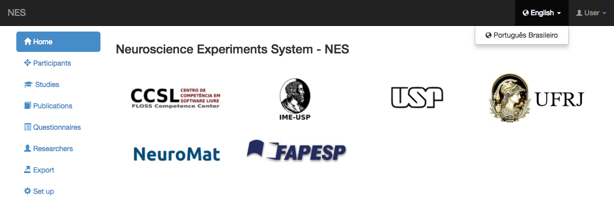

.. _translation:

Translation
===========

NES offers the  possibility of translating data and interface from Portuguese into English and vice-versa. 

Introduction
------------
Translation is offered from NES system to all users. This version allows translation from English into Portuguese and from Portuguese into English.

Other languages can be installed, but a translation procedure must be created.

In order to switch between one language and another, you access the language menu on top-right and click to see the other languages available.

Once you selected the language, every translatable information will be translated and showed in the screen.

.. image:: ../_img/translation_menu_portuguese.png